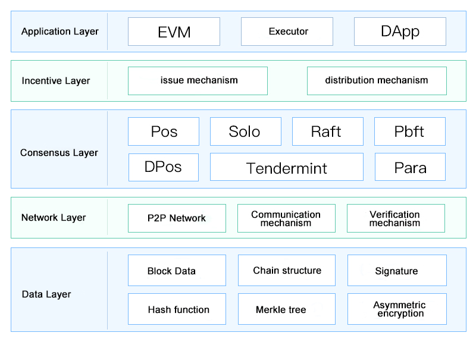
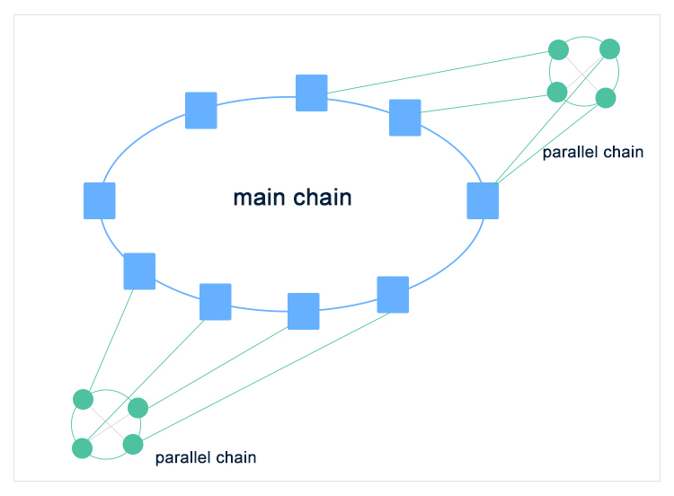

# Technical Architecture

>Based on the underlying architecture of Chain33 blockchain, BitYuan is the first public chain project in the world that has realized a multi-chain (parallel public chain) architecture. Chain33 is a modular plug-in design, while creatively realizing the layered architecture of "main chain + parallel public chain".
## Overall Architecture

Chain33 is a blockchain underlying development platform, supporting consensus, database, executor and other modules pluggable and easily upgradeable blockchain architecture.

The module plug-in design has many benefits, it can strip the extended functionality from the system framework, reduce the complexity of the framework, and make the framework easier to implement. Chain33 provides several functional modules that are collected to form a module plug-in repository.

The design architecture of module plug-in is to be able to build blockchain more easily. A single module does not show its advantages. If there are different modules, it is possible to build chains with different attributes and provide customers with personalized choices for building chains. Such an approach allows customers to devote more energy to their business rather than to the development of the underlying blockchain technology.

**Module introduction**

Chain33 adopts a layered module plug-in design, the modules are pluggable, adapt to a variety of scenarios, and help customers to quickly change the chain. The core modules includes:

- **DApplication layer:** Used to implement business logic on the blockchain.
- **Smart contracts layer:** Intelligent execution of pre-agreed contract terms, along with support for EVM, WASM and go language for smart contract writing, enables Turing-complete computational operations. Among them, EVM is responsible for parsing and executing contract operations, while RPC provides external access capabilities.
- **Core layer:** It is divided into blockchain protocol, consensus algorithm, mining management, and distributed network core components, of which the consensus algorithm uses Chain33's self-developed SPOS.

**Core layer introduction**

- Blockchain protocol: Used for read and write support to the state database and local database during block execution (including data such as blocks, transactions and state), as well as responding to query operations on the data.
- Consensus algorithm: Running the SPOS consensus protocol.
- Mining management: Manage the life cycle of tickets, support agent mining, and improve mining security.
- Distributed network management: Enables data interaction with other blockchain nodes, including broadcasting and receiving transaction, block and shatding data, as well as proactively requesting data from other nodes.
- underlying: Including p2p, encryption, database and other basic modules.
	- P2P module: Gossip protocol and dht protocol are both supported.
	- Encryption module: Compatible with international standards and national secret standards (SM2、SM3、SM4、SECP256K1、ED25519).
	- Data storage module: The data storage method supports scalability and storage sharding, and currently supports MPT, MAVL, KVDB, MVCCKVDB, among which MVCCKVDB can avoid the problem of performance degradation due to state tree expansion, and supports LevelDB, ES and other back-end storage.

**Performance Enhancement**

To improve the overall performance of the system, Chain33 has been optimized in two areas: 

- **Calculation fragmentation**: Chain33 adopts the architecture of "main chain + parallel public chain", the main chain is responsible for transaction clearing and deposition, smart contracts and virtual machines are separated from the main chain and put on parallel chains for independent execution, multiple parallel chains co-exist and execute transactions belonging to their respective parallel chains independently to achieve parallel execution of transactions, thus improving the transaction processing capacity of the system and increasing tps. The parallel chains are interconnected by the main chain.

- **Storage fragmentation**: Storage sharding is mainly based on kad network. The sharding algorithm can ensure that the data is relatively evenly distributed on each node of the blockchain, and each node only needs to keep a part of the data, which is ideal for the scenario of massive data storage, and the machine can be added at any time to realize dynamic expansion. Distributed storage after data packaging reduces the amount of data and avoids too much data fragmentation to increase the network load.

## "Main chain + Parallel public chain" Architecture ##
Parallel chain, known as parallel public chain, is an independent public chain that share the BitYuan consensus network and are connected to the main chain node through a grpc interface. Theoretically, there are countless parallel public chains that can be mounted on the BitYuan main chain.  

The main chain is very stable and is responsible for consensus and storage, as well as running the core blockchain contract; the data between parallel public chains is isolated and does not interfere with each other, and each parallel public chain only runs its own data. Multiple parallel public chains coexist to achieve parallel execution of transactions.

Transactions on the parallel chain are sent to the main chain to be packaged by consensus, then synchronized to the parallel chain to be executed, and finally the execution results are written back to the main chain for deposition, so as to achieve shared network security while separating consensus and transaction execution, realizing parallel execution of transactions and improving TPS.

**Parallel public chain advantages**

- Low cost: The minimum requirement for a parallel chain node server is one and the specifications are not high.
- Fast development: Creating a parallel chain requires only modifying the configuration file and executing a few CLI commands, which is not technically demanding and efficient to build.
- High compatibility: Supports deployment of smart contracts in multiple programming languages, including Solidity, Java, C++ and Golang, and other mature languages.
- Stable and secure: Even if the parallel chain is damaged or under attack, the data can be quickly synchronized from the main chain to ensure data security.
- Parallel execution of transactions: data isolation between parallel public chains, no interference with each other, multiple parallel public chains coexist and transactions are executed in parallel.

**Parallel public chain application areas**

Parallel Chain has its own blockchain ecology with a wide range of application areas, including different scenarios such as stable coins, social networks, e-commerce, asset digitization, debt on the chain, data deposition, contract games and so on.

Developers can freely build parallel public chains and support R&D testing work based on parallel chains such as issuing digital assets, customizing smart contracts, creating super nodes, and docking external blockchain applications.

**Parallel public chain cross-chain transactions**

The "Main chain + Parallel public chain" layered architecture of BitYuan naturally supports cross-chain transactions between the main chain and parallel chains, and between parallel chains and parallel chains; through a variety of cross-chain solutions combined with parallel chains, the value transfer between BitYuan's main chain and external heterogeneous public chains is realized.

Parallel chains and main chains belong to isomorphic chains, only the titles and forks are different. Parallel chains can only complete the transfer of assets across chains by creating consensus account groups, i.e. transferring assets from main chains to parallel chains or from parallel chains to main chains.
