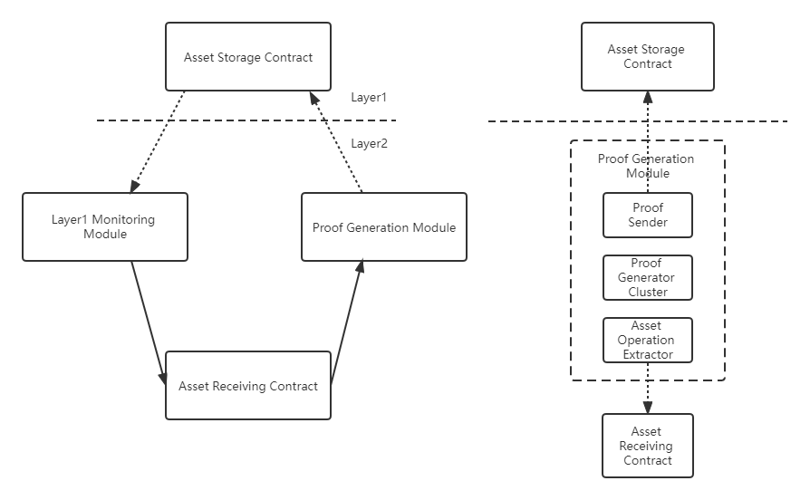

# Zero-Knowledge Proof

> It adopts the zkSync solution to realize cross-chain and asset transfer. The overall structure is shown in the figure below, including the four modules: asset storage contract, asset receiving contract, Layer 1 monitoring module, and proof generation module. In the scheme, the chain where the asset is located is called Layer 1, and the asset receiving chain and the cross-chain module are called Layer 2.

## Module Function Introduction

### 1. Asset storage contract

Deploying smart contract on Layer 1 to record assets transferred to Layer 2.

### 2. Asset receiving contract

Deploying the smart contract on the Layer 2 blockchain to receive the assets transferred out of Layer 1, as well as operation records, such as asset transfer on Layer 2.

### 3. Cross-chain module

-   Layer 1 monitoring module, monitoring the transaction of Layer 1’s assets deposited into the asset storage contract, and initiating the transaction of assets deposited into the asset receiving contract on Layer 2.
-   Proof generation module, monitoring all operational transactions of assets in the asset receiving contract on Layer 2, using the zero-knowledge proof algorithm to generate compressed proof data, and submitting the compressed proof data to Layer 1's asset storage contract. That is, to synchronize Layer 2’s asset status to Layer 1’s asset storage contract.

### 4. Asset Storage Contract

-   Contract events, realizing the deposit and transfer of assets.
-   Contract events, verifying the proof submitted by the cross-chain module, and updating the asset status.
-   Contract events, realizing the forced retrieval of Layer 2 assets in the event of Layer 2 exceptions.
-   Contract docking, realizing docking with the asset contracts.

### 5. Asset Receiving Contract

-   Contract events, realizing the deposit of Layer 1 assets.
-   Contract events, realizing the return of assets to Layer 1.
-   Contract docking, authorizing business contracts to process assets.

### 6. Layer 1 Monitoring Module

-   Integrating the Layer 1 blockchain and managing the asset storage contracts docked on Layer 1 through configuration.
-   Event processing, monitoring the assets operation of the Layer 1 asset storage contract, producing the transaction of the Layer 2 asset receiving contract, and monitoring the correct execution of the transaction.

### 7. Proof Generation Module

-   The calculation of the zero-knowledge proof is large, and the proof generation module will be divided into three sub-modules, which include the asset operation extractor, proof generator, and proof sender.
-   The asset operation extractor extracts asset-related operations from the asset receiving contract extracted on the Layer 2 blockchain, processes them into the data format received by the proof generator, and sends them to the proof generator cluster.
-   The proof generator is designed as a cluster due to a large amount of calculation. It receives the data sent by the asset operation extractor, performs zero-knowledge proof verification off the chain, and produces proof. It produces data suitable for asset storage contracts to verify on the chain and sends the data to the proof sender.
-   The proof sender receives the verification data generated by the proof generator cluster and submits the data to Layer 1's asset storage contract in the form of transactions.
