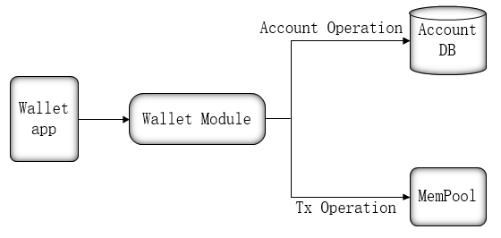

# System Module
>BitYuan blockchain underlying technology, Chain33, is a modular plug-in blockchain underlying development framework, which retains the core functions of blockchain and extensible functions in the form of plug-ins. Such as consensus module, storage module, actuator module (smart contract), etc., all can be plugged in and out on demand.
>This article introduces the definition and role of each module to help users understand.

## P2P Module ##

P2P network is a peer-to-peer network in which each node in the network participates and shares the storage capacity, broadcast capacity, and network connectivity that it possesses. Nodes in the network can be accessed directly by peer nodes, and each node is both a consumer and a provider of resources and services.

P2P network is a decentralized network where there is no central node for the whole network, unlike traditional central networks where all nodes depend on a central node.

P2P module is the component that handles nodes' communication with each other, including nodes discovering and establishing connections, broadcasting blocks and transactions, and synchronizing blocks.

## Storage Module ##

BitYuan underlying technology, Chain33, uses high-performance and highly reliable KV database for blockchain data storage, supporting goleveldb, gobadgerdb, gomemdb, gossdb and other KV database types.

The storage format of the state data in the blockchain is configurable and pluggable, and can support the storage formats of mavl, mpt, and kvmvcc.

## Blockchain Module ##

The Blockchain module is a component that handles blocks, including storing block information, adding blocks to the main chain or parallel public chain, and synchronizing blocks; it also provides an interface for querying block and blockchain status information to the outside world.

## Mempool Module ##
Mempool module, i.e. transaction cache pool, is mainly intended to solve the problem that the consensus module may be slower than the RPC module.

The Mempool module is responsible for doing initial legitimacy checks on incoming transactions and filtering out some illegal transactions; at the same time, it does traffic restrictions on the sender of transactions to prevent the same address from sending too often.

## Consensus Module ##

The module that implements the blockchain consensus mechanism is the most important component of the blockchain technology. The purpose of the blockchain consensus mechanism is to make all nodes in the blockchain network agree on which node generates a new block through a consensus algorithm, thus ensuring a consistent block state for the whole system.

The consensus algorithm of the BitYuan mainnet is SPOS, a secure POS algorithm that supports tens of thousands of people mining together for consensus. Parallel public chains in the BitYuan ecosystem can also have their own independent antecedent consensus, using the strongly consistent Byzantine consensus algorithm, and introducing the concept of DPOS voting rights, where super nodes must pack transaction information into blocks and then broadcast the block information to other nodes, storing the transaction information on the blocks to function as a shared governance community.

## Wallet Module ##

The Wallet module provides two main services for the BitYuan Wallet App.

- One is blockchain account management, including account creation, management of public and private keys and address information. The wallet client can create and manage accounts, export and import private keys, etc. through these service interfaces.
- The other is transaction signing and sending, for bty transfer and smart contract transaction sending.

## Actuator Module ##

The actuator module is the logical processing center of the blockchain and is used to execute specific business logic.

An executor is usually understood as a container that supports the operation of various contracts (including system contracts as well as various extension contracts); receives transactions and assigns them to the corresponding contracts for specific execution; and responds to various events on the blockchain (transaction checks, query requests, executed transactions, added blocks, rolled back blocks) and dispatches the events to specific contract logic.

Take a smart contract, all the logic contained in the contract is the logic to be executed by the executor; only, the contract is just a specific logic, while the executor is a container that can execute several contracts without needing to know the specific content of the contract.

## Queue Module ##

Queue module, i.e. message queue module, the main purpose of this module is to reduce the coupling of various modules in the Chain33 system of the blockchain.

With the introduction of Queue module, communication between modules is not through interface calls, but through messages, each module is relatively independent, reducing the coupling of each module in the chain33 system, which also facilitates the splitting of chain33 by module and paves the way for the microservicing of each module later.

## RPC Module ##

RPC, i.e. Remote Procedure Call, the RPC module mainly provides external programs with transaction construction and sending, block, transaction and other information query interfaces.

The RPC module supports both grpc and jsonrpc interfaces, other processes can call both grpc and jrpc interfaces, in general, if a process can access the internal data structure of chain33 to construct data, the grpc interface is preferred, and vice versa, the jrpc interface is recommended.
