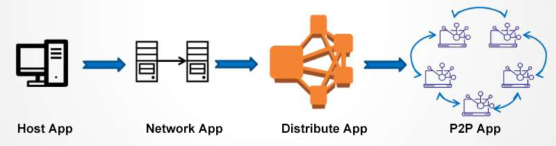

# Decentralized Application

>DAPP is an application built on a decentralized network, relatived to a traditional centralized application. Traditional centralized applications are deployed on centralized servers and the data is owned by one company or organization; decentralized applications run on decentralized blockchain networks and the data is not controlled by anyone and cannot be deleted or tampered with.

## Generation of DAPP

Application, in the limited decades since the birth of computers, has also undergone several generations of evolution, which can be briefly summarized as follows.

- **Stand-alone APP**

     All the elements that make up an App are stored in a separate node and can be used without a network, which is the earliest form of App existence, such as DOS systems, single-player mini-games, etc.

- **Network APP**

    Can be simply understood as the classic Client/Server model, APP consists of these two parts, can exist on top of more than 1 different nodes, the absence of one; such as CS, Red Alert these traditional online games.

- **Distributed APP**

    The constituent elements of the App are scattered to N nodes, and the normal use of the App is not affected even if a few nodes hang; such as WeChat, Taobao, etc.

- **P2P APP**

    P2P network-based applications, the composition or content of the APP is dispersed to N nodes, and the nodes communicate directly with each other; currently, there are common models such as BitYuan downloads and blockchain applications.

Comparative analysis of the background of each stage of APP generation and its advantages and disadvantages.

||Advantage|Disadvantage|Background|
|--------|--------|--------|--------|
|Stand-alone APP|Easy to use No networking required|Restricted use and limited media distribution Information isolation and inability to share|No Internet Limited network Simple logic|
|Network APP|Low threshold, easy to get started Easy to spread with the help of network Information sharing, attract users|Single network with low reliability A single point of bottleneck High expansion cost|Low-speed network High data volume Low reliability|
|Distributed APP|Fast dissemination Full connectivity of data Low expansion costs High reliability|Data monopoly Mechanism is not transparent Credibility relies heavily on third parties|High-speed network Massive data High reliability Corporate or industry monopoly|
|P2P APP|Network-wide connectivity Transparent processing mechanisms Open and trustworthy data Self-governing, not dependent on third parties|Early development, immature Low processing performance Small amount of processed data|High-speed network Massive data High reliability Open and trustworthy data|

**Definition of DAPP**

DAPP（Decentralized Application）, in essence, is a "smart contract", but with a layer of interface wrapped around it to make it easy for end users to use.

Traditional APP composition can be simply understood as: **APP = Frontend + Server**

Then the DAPP can be simply understood as: **DAPP = Frontend + Contracts**

The Server of traditional APP can be a single node/distributed/service node in the cloud, which is characterized by centralized control, owned by one or more companies/organizations/individuals, and belongs to centralized mode, and its owner can control the whole logic of the application, so it is called "centralized application".

Contracts (smart contracts) in DAPP are program logic deployed in the blockchain network, which runs in all nodes in the blockchain network, the logic of each node is identical, and the node owner can be anyone, once the contract is deployed, its behavior is not controlled by any particular person, so it is called "decentralized application".

## Features of DAPP ##
Compared with traditional centralized APP, DAPP have the following characteristics.

- **No registration required:** Decentralized applications do not require user registration and can directly access all DAPPs in all public chain networks using the wallet address (which can also be understood as the account address).
- **Operation requires authorization or signature:** Each step in a decentralized application requires a signature from the user's address and requires a certain on-chain transaction fee, and if the fee is insufficient the transaction will fail.
- **Smart Contract Technology:** The DAPP may contain one or more smart contracts, which will be executed automatically when the conditions are met.
- **Zero falsification of data disclosure:** Every transaction on the chain is recorded and transparent, cannot be deleted or tampered with, and any user can access the transaction records without any restrictions.