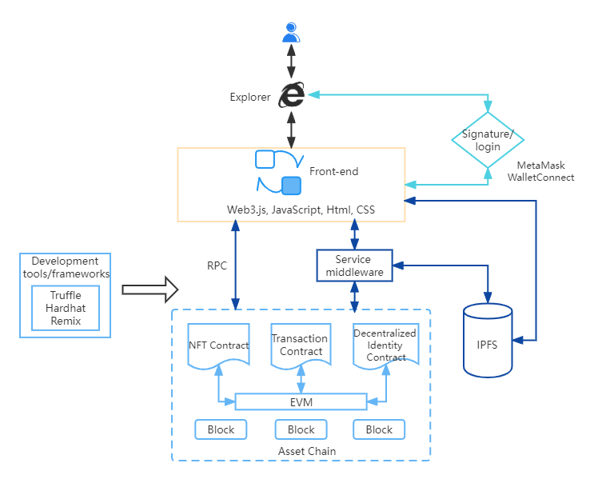

# Compatible with Ethereum EVM

> Chain33 is fully compatible with Ethereum, supports addresses in the format of Ethereum, and uses the signature method of Ethereum. It can be traded with Chain33 nodes through the web3.js libraries. Developers in the Chain33 ecosystem can seamlessly cooperate with those in the Ethereum ecosystem.

> The blockchain has opened up a new direction for Web3.0 applications. Web3.0 eliminates the concept of middlemen, does not require a database to store the state of the App, and does not require a centralized network server to store the core back-end logic. The following is a Web3 dApp architecture diagram based on Chain33.

1. The front-end defines the user interface logic, and the front-end will interact with the application logic defined in the smart contract. The communication between the front-end and the blockchain is via JSON-RPC.

2. Users on Chain33 can manage their own private key and transaction signatures through MetaMask or WalletConnect. When a user needs to sign a transaction to log in to the platform or send a transaction, MetaMask will be called or WallectConnect will be used to sign.

3. To save the storage cost of the blockchain, a decentralized off-chain storage solution, such as IPFS, is used for large files (picture, audio, video).

4. Use the web3.js libraries to query and monitor smart contract events. Specific events can be monitored and a callback will be specified each time the event is triggered to realize the event interaction between the front-end and the blockchain smart contract.

5. The smart contract is fully compatible with the EVM and supports the seamless migration of contracts on the Ethereum (or Ethereum ecosystem) chain.

6. Support tools of the Ethereum ecosystem to develop on Chain33. For example, it is easier to build, deploy and test smart contracts through development frameworks or tools, such as HardHat, Truffle, and Remix.
