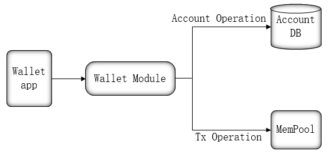
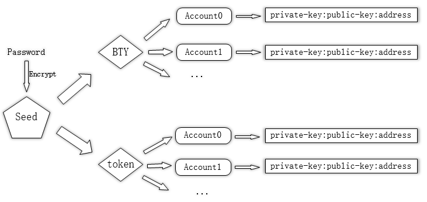
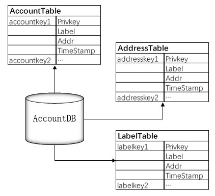

# Wallet Module

## Module Introduction
Wallet module mainly provides two major services for wallet app. 

- One is the account management of blockchain, including the creation of accounts and the management of public and private key and address information. Wallet clients can create and manage accounts, export and import private keys through these service interfaces.
- The other is the signing and sending of transactions for bty transfers and the sending of smart contract transactions.



## Wallet Module Structure

### BIP44 Wallet Structure 
Chain33 wallet module is defined using BIP44 and manages multiple currencies through a set of seed, which supports Chinese and English characters. Meanwhile, the user sets a password to the wallet to encrypt seed information, which is specified and saved by the user.



### Private Key, Address, Public Key Information Management
Wallet module should have an AccountDB to store account information created by the user, including private keys, addresses, public keys, and so on. The configuration information for AccountDB is available in the chain33 configuration file.

The primary three tables stored in AccountDB are as follows:




- The AccountTable, with timestamp and Account address as key, is mainly used to list output of all Account accounts.
- AddressTable takes account address as key, which is mainly used to query account information through address address.
- LabelTable takes label as key, which is mainly used to query account information through label.


The account information is stored in a `WalletAccountStore` format, and the main structure is as follows:

```go
type WalletAccountStore struct {
    Privkey   string //private key corresponding to the account address
    Label     string //label corresponding to the account address
    Addr      string //account address
    TimeStamp string //timestamp for creating an account
}
```
### Account Structure
Account fund information is stored through the account, and the structure is as follows:
```go
type Account struct {
    Currency int32  //Coins identifies，there is only one value of 0 temporarily
    Balance  int64  //Available balance in account
    Frozen   int64  //Frozen account balance
    Addr     string //Account address
}
```
### Signature
The wallet module signs transactions with chain33 signature framework, supports secp256k1 signature.

### Transaction Sending
Wallet module is the entry point for ordinary transaction sending, provides the WalletSendToAddress interface.

## Service Interface
### Account Related
```go
/**
* Create an account
* @param： param *types.ReqNewAccount  Create account parameters that contain account label "label"
* @return：Return account
*/
NewAccount(param *types.ReqNewAccount) (*types.WalletAccount, error)
/**
* Get account list
* @param： req *types.ReqAccountList  Get the account request parameter, including WithoutBalance
* @return：Return account list
*/
WalletGetAccountList(req *types.ReqAccountList) (*types.WalletAccounts, error)
/**
* Import the account with the private key
* @param： param *types.ReqWalletImportPrivkey  Account address to be imported
* @return：Return account
*/
WalletImportprivkey(param *types.ReqWalletImportPrivkey) (*types.WalletAccount, error)
/**
* Export account private key
* @param： param *types.ReqString  Account address to be exported
* @return：Return private key
*/
DumpPrivkey(param *types.ReqString) (*types.ReplyString, error)
/**
* Lock wallet
* @return：Return operating status
*/
WalletLock() (*types.Reply, error)
/**
* Unlock wallet
* @param： param *types.WalletUnLock  Wallet unlock parameters
* @return：Return operating status
*/
WalletUnLock(param *types.WalletUnLock) (*types.Reply, error)
/**
* Set wallet password
* @param： param *types.ReqWalletSetPasswd  The old and new password
* @return：Return operating status
*/
WalletSetPasswd(param *types.ReqWalletSetPasswd) (*types.Reply, error)
/**
* Set wallet label
* @param： param *types.ReqWalletSetLabel  Wallet address and label to be set
* @return：Return wallet account
*/
WalletSetLabel(param *types.ReqWalletSetLabel) (*types.WalletAccount, error)
/**
* Get wallet status
* @return：Return wallet status
*/
GetWalletStatus() (*types.WalletStatus, error)
/**
* Generate wallet seed
* @param： param *types.GenSeedLang seed  Character languages (0:English, 1: simplified Chinese)
* @return：Return the seed generated
*/
GenSeed(param *types.GenSeedLang) (*types.ReplySeed, error)
/**
* Get the wallet seed by password
* @param： param *types.GetSeedByPw seed  Get parameter, including the password
* @return：Return seed
*/
GetSeed(param *types.GetSeedByPw) (*types.ReplySeed, error)
/**
* Save wallet seed
* @param： param *types.SaveSeedByPw  Save seed parameters, including the password and seed string
* @return：Return seed
*/
SaveSeed(param *types.SaveSeedByPw) (*types.Reply, error)
/**
* Consolidate all account balances in wallet to the specified address
* @param： param *types.ReqWalletMergeBalance  Merge parameters, containing the specified address
* @return：Return transaction hash
*/
WalletMergeBalance(param *types.ReqWalletMergeBalance) (*types.ReplyHashes, error)
```
### Transaction Related
```go
/**
* Get transaction records for all wallets
* @param： param *types.ReqWalletTransactionList  Get parameters, including start get tx, get quantity and order
* @return：Return transaction list
*/
WalletTransactionList(param *types.ReqWalletTransactionList) (*types.WalletTxDetails, error)
/**
* Send a transaction to the specified address
* @param： param *types.ReqWalletSendToAddress  Transaction senT parameters, containing transaction information such as from,to,amount, etc
* @return：Return transaction hash
*/
WalletSendToAddress(param *types.ReqWalletSendToAddress) (*types.ReplyHash, error)
/**
* Set default handling fees for wallet
* @param： param *types.ReqWalletSetFee  With setting fee parameters
* @return：Return operating status
*/
WalletSetFee(param *types.ReqWalletSetFee) (*types.Reply, error)
```

### Signature Related
```go
/**
* Signature transaction
* @param： param *types.ReqSignRawTx  Transaction information of proxy signature
* @return：Return the signed transaction
*/
SignRawTx(param *types.ReqSignRawTx) (*types.ReplySignRawTx, error)
```