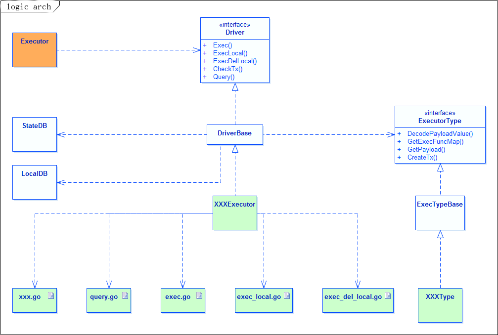
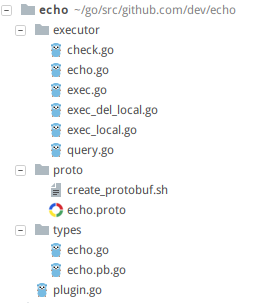

# Executor Module

##  Module Introduction
As the name implies, an executor module is primarily used to execute logic. In the blockchain, all data are generated by transactions. These data are assembled into blocks according to certain rules, and finally form a complete blockchain.

In a complete blockchain system, the execution of transactions is the core. For example, in transfer transaction from A to B, the balance of A account will be reduced, while the balance of B account will be increased. The logic of changing the balance of this account is the content to be executed by the executor.

Take intelligent contract for example, all the logic contained in the contract is the logic to be executed by the executor.However, a contract is just a concrete logic, while an executor is a container that can execute several contracts without knowing the exact contents of the contract.

Therefore, the executor module is a container, which supports the operation of various contracts (including system contracts and various extension contracts), receives the transactions, and assigns the transactions to the corresponding contracts for specific execution.

## Executor Module Structure ##


The external capability of the executor is reflected in 5 interfaces: 

Two read-only interfaces:

- **Transaction Check**: Check the validity of the transaction via EventCheckTx event, request is from the Mempool module.
- **Query Request**: Query operation, query specified information from the transaction generated data. Specific query content is not fixed, depending on the query method called, the general request comes from Wallet/Client/Consensus module.

Three write interfaces:

- **Transaction Execute**: Triggered by EventExecTxList event, execute each transaction in the transaction list and return the execution result. The request comes from Blockchain module.
- **Block Adding**: Through EventAddBlock event trigger, perform the post-processing operation of block write chain, generate some local data and return, the request comes from Blockchain module;
- **Block Rollback**: Through EventDelBlock event trigger, perform the post-processing operation of block rollback in the chain, generate some local data and return, the request comes from Blockchain module.

## Internal logic structure of the executor ##



As shown in the figure above, the executor is a container framework that contains some generic scheduling logic, distributes requests to specific executor contracts for execution and collects the results back.

Each concrete executor (in this case, the contract, which can be thought of as equivalent) implements several core methods in Driver, and the container calls a specific XXXExecutor to execute the logic based on the executor information attached to the transaction.

Each specific executor is divided into two parts during implementation:

- **Executor Object(XXXExecutor)**：

    mplement Driver interface, inherit DriverBase base class;

    The main body of the executor, which contains the main execution logic of the executor. Generally, it is divided into several program files according to functions and execute corresponding logic respectively.

- **Executor Object Type(XXXType)**：

    Implement ExecutorType interface, inherit ExecTypeBase base class;

    Some common capabilities related to the packaging executor type, such as method list, Payload structure, etc. The auxiliary executor framework completes the customized processing logic.

## Processing Logic
> The five major capability interfaces implemented by the executor are described above, and the specific functions and implementation logic of each interface are described below.

### Transaction Check
#### Interface Definition
```go
type Driver interface {
    CheckTx(tx *types.Transaction, index int) error
}
```
This interface contains two parameters:
- `tx *types.Transaction`: The object of this transaction, which contains all the information of the transaction.
- `index int`: It is the index location of the transaction in the packaged block

> **Function realization**: Check the business legitimacy of this transaction (the legitimacy of the transaction itself, such as signature verification, does not need to be checked, which has been filtered in the Mempool module). Only transactions that meet the requirements of this executor are allowed to execute, otherwise specific error information is returned.

#### General Processing Logic

```go
//By default, the tx.To address points to the contract address.
func (d *DriverBase) CheckTx(tx *types.Transaction, index int) error {
    execer := string(tx.Execer)
    if ExecAddress(execer) != tx.To {
        return types.ErrToAddrNotSameToExecAddr
    }
    return nil
}
```

In the DriverBase base class, only the most basic verification logic is implemented, which checks whether the target address of the transaction is the address of the local executor contract, where:

- `ExecAddress(execer)`：ExecAddress(execer) implement the ability to get the executor contract address from the executor name;
- `tx.To`：x.To is the target address of this transaction.

#### Executor Implementation
When implementing specific executor transaction validation logic, you need to determine what content to check according to your own business scenarios, and try to ensure that all transactions through validation can be executed correctly.

If only the target address needs to be checked, the executor may not implement this validation logic, and the system will automatically reuse the validation logic for DriverBase.

If this executor does not need to verify any content of the transaction, then override this method and simply return null, as follows:

```go
func (x *XXXExecutor) CheckTx(tx *types.Transaction, index int) error {
    // No validation logic needs to be executed
    return nil
}
```

> **caution : ** During the development of the executor, once a certain kind of validation rules are determined to be implemented, they cannot be arbitrarily changed otherwise the block chain may be forked. If changes are needed, the code needs to be forked to ensure consistency of block execution results.
> 
> In secondary development, if there is validation logic, a separate check.go implementation is recommended.

### Transaction Execution
#### Interface Definition

```go
type Driver interface {
	Exec(tx *types.Transaction, index int) (*types.Receipt, error)
}
```

This interface also contains two parameters, which have the same meaning as the method parameters of transaction validation, except that the return value is different:

- `tx *types.Transaction`: The object of this transaction, which contains all the information of the transaction.
- `index int`: The index location of the transaction in the packaged block.
- `*types.Receipt`: Return value, you can see the message structure definition of Receipt, where ty is used to fill in the result types of this transaction execution, such as success and failure types; KV is used to fill in the results of the execution of this transaction, and logs is the receipt information generated by the execution of this transaction.

```protobuf
message Receipt {
    int32    ty              = 1;
    repeated KeyValue KV     = 2;
    repeated ReceiptLog logs = 3;
}
```

> **Function realization： ** Transaction execution core logic, executor contracts the main logic here, it will parse transaction object to carry information, then according to the rules, design the contract to perform the business logic of the different branches, the end result will be reflected in the data returned, and these data will be finished within blocks all transactions execution, written to block chain.

#### General Processing Logic

The general processing logic for the DriverBase class is more complex and is represented here as pseudo-code annotated.

Where XXX represents a specific implementation of the executor, xxxType represents a specific executor type object.

```go
func (d *DriverBase) Exec(tx *types.Transaction, index int) (receipt *types.Receipt, err error) {
    if xxxType == nil {
        return nil, nil
    }
    // Get the message structure of the concrete executor
    if xxx.GetPayloadValue() == nil {
        return nil, nil
    }
    // Use type objects to resolve the contract-related request information carried in the transaction
    actionName, actionValue, err = xxxType.DecodePayloadValue(tx)
    // The convention method name structure is fixed prefix + contract request action
    funcName = "Exec_" + actionName
    // Get all the method object dictionaries implemented by this executor, in fact, the essence of the call is xxxType.GetExecFuncMap
    funcMap = xxx.GetFuncMap()
    // Locate to a concrete method object
    funcObj = funcMap[funcName]
    // Call this method object through reflection
    funcObj.Call(.....)
    // Get the result of the reflection call and returns
}
```

As can be seen from the pseudo-code logic above, in the DriverBase class, the implementation is a framework logic that delegates the resolution of the transaction carrier object to a specific executor type, assemble the method name according to the agreed rules, and finally invoke the specific execution method by reflection.

Therefore, in general, developers do not need to implement this method when developing the executor, but only need to implement several related methods that the framework logic depends on.

#### Executor Implementation
Based on the above analysis, there are several areas of transaction execution that need to be addressed by executor developers.

- Executor type method:

```go
type ExecutorType interface {
    // Parse the action name and action object from the transaction (the specific action information is known only by the concrete executor itself).
    DecodePayloadValue(tx *Transaction) (string, reflect.Value, error)
    // Get the method dictionary for this executor
    GetExecFuncMap() map[string]reflect.Method
}      
```

- Executor type method:

```go
type Driver interface {
    // Get the Payload definition structure corresponding to this executor.
    // The method is delegated to the ExecutorType.GetPayload().
    GetPayloadValue() types.Message
    // Get the method dictionary available to this executor.
    // The method is delegated to ExecutorType.GetExecFuncMap().
    GetFuncMap() map[string]reflect.Method
}   
```

- Signature of specific execution method:

```go
func (c *XXX) Exec_Transfer(transfer *types.XXXAction, tx *types.Transaction, index int) (*types.Receipt, error) 
```

> **caution: ** In the real executor development, when implementing the transaction logic, there is no need to implement the Exec method of the base class, only need to implement several peripheral dependent methods according to the above rules;
And according to your own contract logic to implement several Exec_XXX methods (method signature as above). Specific implementation, in the secondary development section will be described in detail.

> For secondary development, the transaction execution logic is better placed in a separate exec.go file.

### Query History
#### Interface Definition

```go
type Driver interface {
	Query(funcName string, params []byte) (types.Message, error)
}
```

This interface contains two parameters:

- `funcName string`: The specific method name of this query reques. The system will automatically route this request to the corresponding method implementation.
- `params []byte`: The specific parameter information of this query. The value received here is the serialized value. The query framework will deserialize and then call the specific query method.

> **Function realization: ** Implementation of any query operation (provided that the corresponding method exists), because it is a read-only query operation, not in the form of transactions, does not affect the block data, will not be wrote into block chain.

#### General Processing Logic
This logic implementation code, the following is in the form of pseudo-code. xxx represents the specific implementation of the executor.

```go
func (d *DriverBase) Query(funcname string, params []byte) (msg types.Message, err error) {
    // Get all the method object dictionaries implemented by this executor, in fact, the essence of the call is xxxType.GetExecFuncMap
    funcMap = xxx.GetFuncMap()
    // The convention method name structure is fixed prefix + request method name
    funcname = "Query_" + funcname
    // Locate to a concrete method object
    funcObj = funcMap[funcName]
    // Get the query method parameter type by funcObj and deserialize the params
    // Invoke method objects by reflection
    funcObj.Call(.....)
    // Get the result of the reflection call and returns    
}
```

Similar to the logic used to execute transactions, a set of framework logic is implemented in the DriverBase class, which points to a specific method object by method name and then reverse-serializes the incoming params parameters with the parameter type information defined in the method type. Finally, reflection is used to invoke the specific query method logic and return the result.

Therefore, in general, developers do not need to implement this method when developing the executor, but only need to implement several related methods that the framework logic depends on.

#### Executor Implementation
Based on the analysis above, there are several query related areas that concrete executor developers need to focus on.

- Executor type method:

```go
type ExecutorType interface {
    // Get the method dictionary for this executor
    GetExecFuncMap() map[string]reflect.Method
}       
```

- Executor object method:

```go
type Driver interface {
    // Get the method dictionary available to this executor
    // This method is also entrusted to ExecutorType.GetExecFuncMap () method of execution
    GetFuncMap() map[string]reflect.Method
}  
```

- Signature of specific query method:

```go
func (c *XXX) Query_XxxYyyZzz(in *types.XXXReq) (types.Message, error) 
```

> **caution: ** In real executor development, there is no need to implement the Query method of the base class when implementing the Query logic. Just implement a few peripheral dependency methods according to the rules above;
> And implement several Query_XXX methods based on your contract logic. Specific implementation, in the secondary development section will be described in detail.
> 
> For secondary development, it is suggest that the query logic be placed in a single query.go file.

### Add New Block
#### Interface Definition
After all the transactions within a block have been executed, the block will be packaged into the chain. Before that, the logic of the new block will be triggered. The system will traverse all the transactions within the block and call the corresponding ExecLocal logic one by one.

```go
type Driver interface {
	ExecLocal(tx *types.Transaction, receipt *types.ReceiptData, index int) (*types.LocalDBSet, error)
}
```

This interface contains three parameters:

- `x *types.Transaction`: The object of this transaction, which contains all the information of the transaction
- `receipt *types.ReceiptData`: The result information generated during the execution of this transaction, and its structure is defined as follows:

```protobuf
message ReceiptData {
    int32    ty              = 1;
    repeated ReceiptLog logs = 3;
}
```  

- `index int`: The index position of this transaction in this packaged block.

> **Function realization: ** Add your own logic based on the result information generated by the transaction execution, and generate some new data to assist the contract logic.These data can be considered as local data, not linked (but generated by each block node), generally used to do multiple indexes, save intermediate data, etc., depending on the contract logic.

#### General Process Logic
The general processing logic for the DriverBase class is relatively complex, which represented here as pseudo-code annotated. Where XXX represents a specific implementation of the executor, xxxType represents a specific executor type object.

```go
func (d *DriverBase) ExecLocal(tx *types.Transaction, receipt *types.ReceiptData, index int) (*types.LocalDBSet, error) {
    // Use type objects to resolve the contract-related request information carried in the transaction
    actionName, actionValue, err = xxxType.DecodePayloadValue(tx)
    // The convention method name structure is fixed prefix + request method name
    funcName = "ExecLocal_" + actionName
    // Get all the method object dictionaries implemented by this executor, in fact, the essence of the call is xxxType.GetExecFuncMap
    funcMap = xxx.GetFuncMap()
    // Locate to a concrete method object
    funcObj = funcMap[funcName]
    // Call this method object by reflection
    funcObj.Call(.....)
    // Get the result of the reflection call and return 
}
```

The main framework logic is basically similar to the previous trade execution, and the relevant methods used have been described before. The only difference is the method prefix, which is "ExecLocal_" here.

Similarly, in general, developers do not need to implement this method when developing the executor, but only need to implement several related methods that the framework logic depends on.

#### Executor implementation
Specific executor method and executor type method are same as the above that this operation involved, only the method signatures for ExecLocal_XXX are listed here.

- Signature of specific query method:

```go
func (c *XXX) ExecLocal_XYZ(action *types.XXXyz, tx *types.Transaction, receipt *types.ReceiptData, index int) (*types.LocalDBSet, error) 
```

> **caution: ** In real executor development, when implementing this logic, only several ExecLocal_XXX methods need to be implemented according to their own contract logic. Specific implementation, will be described in detail in the secondary development section.
> 
> or secondary development, this logic is recommended to be placed in a separate exec_local.go file.

### Block Rollback
#### Interface Definition

```go
type Driver interface {
	ExecDelLocal(tx *types.Transaction, receipt *types.ReceiptData, index int) (*types.LocalDBSet, error)
}
```
This interface is as same as the new block, so the method definition is not described in detail here.

> **Function realization: ** This logic and the new block just the opposite, this can be anti-operation, new block in the new data need to be deleted here; new block replaces the old value with the new value. Restore the data to its original state.

#### General process logic
The logic is the same as the new block, the only difference is the method prefix is different, here the method prefix is "ExecDelLocal_".

#### Executor implementation
Specific executor method and executor type method are same as the above that this operation involved, only the method signatures for ExecDelLocal_XXX are listed here.

- Signature of specific query method:

```go
func (c *XXX) ExecDelLocal_XYZ(action *types.XXXyz, tx *types.Transaction, receipt *types.ReceiptData, index int) (*types.LocalDBSet, error) 
```

> **caution: ** In real executor development, when implementing this logic, only several ExecLocal_XXX methods need to be implemented according to your own contract logic. Specific implementation will be described in detail in the secondary development section.
> 
> For secondary development, this logic is recommended to be placed in a separate exec_del_local.go file.

### The overall processing logic of the executor


## Secondary Development

This section will introduce the secondary development process of the executor with a simple example. The example implements a relatively simple function, but contains all the methods needed to implement an executor.

### Overview of Echo Executor
This executor implements a simple message corresponding function and supports two kinds of operations, Ping and Pang. When the transaction is executed, response data will be written to the block chain. When the local execution is executed, the times of the same message called will be recorded.

The executor directory structure is as follows: 



Three of these directories’s functions are as follows:

- executor

    The logical theme of the executor, including the transaction validation of the executor, transaction execution, block addition, block rollback, and the historical query of the logical body.

- proto

    The message structure definition used in this executor, the Protobuf format.

- types

    The executor type object definition, and the Protobuf-generated message structure definition.

#### Architectural Definition
The message structures used in the executor are uniformly defined using the protobuf format. The structures used by the executor are used as follows:
```protobuf
syntax = "proto3";
package types;
// Ping operation action
message Ping {
    string msg     = 1;
}
// Pang operation action
message Pang {
    string msg     = 1;
}
// Uniform Action structure of this executor
message EchoAction {
    oneof value {
        Ping       ping       = 1;
        Pang       pang       = 2;
    }
    int32 ty = 3;
}
// Log structure generated by Ping operation 
message PingLog {
    string msg     = 1;
    string echo    = 2;
    int32  count    = 3;
}
// Log structure generated by Pang operation 
message PangLog {
    string msg     = 1;
    string echo    = 2;
    int32  count    = 3;
}
// Query request structure
message Query {
    string msg     = 1;
}
// Query result structure
message QueryResult {
    string msg     = 1;
    int32  count   = 2;
}
```

Create_protobuf.sh in the same directory uses this file to generate the Go program and put it in the Types directory.
```bash
//!/bin/sh
protoc --go_out=plugins=grpc:../types ./*.proto --proto_path=.
```

####Executor Type and Executor Object

The executor type is used to define some information about the type. This example is implemented as follows:
```go
package types
import (
    "github.com/33cn/chain33/types"
    log "github.com/33cn/chain33/common/log/log15"
    "reflect"
)
// Define the type of Actions supported by this executor
const (
    ActionPing = iota
    ActionPang
)
// Define the log type generated by this executor
const (
    TyLogPing = 100001
    TyLogPang = 100002
)
var (
    // Name of this executor
    EchoX = "echo"
    // Define the Action correspondence supported by this executor
    actionName = map[string]int32{
        "Ping": ActionPing,
        "Pang": ActionPang,
    }
    // Define the Log receipt parsing structure of this executor
    logInfo = map[int64]*types.LogInfo{
        TyLogPing: {reflect.TypeOf(PingLog{}), "PingLog"},
        TyLogPang: {reflect.TypeOf(PangLog{}), "PangLog"},
    }
)
var elog = log.New("module", EchoX)
func init() {
    // Adds this executor to the system whitelist
    types.AllowUserExec = append(types.AllowUserExec, []byte(EchoX))
    // Register this executor type with the system
    types.RegistorExecutor(EchoX, NewType())
}
// Define type of this executor
type EchoType struct {
    types.ExecTypeBase
}
// Initialize type of this executor
func NewType() *EchoType {
    c := &EchoType{}
    c.SetChild(c)
    return c
}
// Return the load type of this executor
func (b *EchoType) GetPayload() types.Message {
    return &EchoAction{}
}
// Return the name of this executor
func (b *EchoType) GetName() string {
    return EchoX
}
// Return the action dictionary in this executor, which supports two-way lookups
func (b *EchoType) GetTypeMap() map[string]int32 {
    return actionName
}
// Return log type information of this executor for RPC parsing log data
func (b *EchoType) GetLogMap() map[int64]*types.LogInfo {
    return logInfo
}
```

> The executor object defines the main logic of the executor


```go
package executor
import (
    echotypes "github.com/33cn/plugin/plugin/dapp/echo/types"
    "github.com/33cn/chain33/system/dapp"
    "github.com/33cn/chain33/types"
)
var (
    // Data KEY generated by the transaction execution
    KeyPrefixPing = "mavl-echo-ping:%s"
    KeyPrefixPang = "mavl-echo-pang:%s"
    // Data KEY generated by locally execution KEY
    KeyPrefixPingLocal = "LODB-echo-ping:%s"
    KeyPrefixPangLocal = "LODB-echo-pang:%s"
)
// Get the list of methods for this executor at initialization by reflection
func init() {
    ety := types.LoadExecutorType(echotypes.EchoX)
    ety.InitFuncList(types.ListMethod(&Echo{}))
}
//Initializing action of this executor, register this executor to the system, here the effective height is temporarily written as 0
func Init(name string, sub []byte) {
    dapp.Register(echotypes.EchoX, newEcho, 0)
}
// Define the executor object
type Echo struct {
    dapp.DriverBase
}
// The executor object initializes the wrapper logic, and the next two steps are necessary to set the child object and executor type
func newEcho() dapp.Driver {
    c := &Echo{}
    c.SetChild(c)
    c.SetExecutorType(types.LoadExecutorType(echotypes.EchoX))
    return c
}
// Returns the name of the executor driver
func (h *Echo) GetDriverName() string {
    return echotypes.EchoX
}
```

As can be seen, the implementation logic of this executor object is basically code related to initialization, without real processing logic. These logic is distributed to various specific program files for implementation, which will be described in detail below.

### Transaction Check

> executor/check.go
> 
> This executor does not perform any check on transactions. The implementation logic is as follows:

```go
package executor
import "github.com/33cn/chain33/types"
// This executor does not perform any checks.
func (h *Echo) CheckTx(tx *types.Transaction, index int) error {
	return nil
}
```

###  Transaction Execution

> executor/exec.go
> 
> Execute the corresponding contract logic based on the information carried in the transaction. The implementation logic is as follows:
> 
> Exec_Ping, for example, receives the transaction that carries the ping operation, and the first parameter ping is the message Ping structure that we define in protobuf file. The logic implemented in this contract method is to generate the corresponding response message according to the ping message in the transaction. If the passed ping msg is “hello”, the generated response message is “hello, ping ping ping!”., and the corresponding message will be written to the block data with “mavl-echo-ping:hello” as the KEY, and generate the corresponding PingLog to write into the transaction receipt;

```go
package executor
import (
	echotypes "github.com/33cn/plugin/plugin/dapp/echo/types"
	"github.com/33cn/chain33/types"
	"fmt"
)
func (h *Echo) Exec_Ping(ping *echotypes.Ping, tx *types.Transaction, index int) (*types.Receipt, error) {
	msg := ping.Msg
	res := fmt.Sprintf("%s, ping ping ping!", msg)
	xx := &echotypes.PingLog{Msg:msg, Echo:res}
	logs := []*types.ReceiptLog{{echotypes.TyLogPing, types.Encode(xx)}}
	kv := []*types.KeyValue{{[]byte(fmt.Sprintf(KeyPrefixPing, msg)), []byte(res)}}
	receipt := &types.Receipt{types.ExecOk, kv, logs}
	return receipt, nil
}
func (h *Echo) Exec_Pang(ping *echotypes.Pang, tx *types.Transaction, index int) (*types.Receipt, error) {
	msg := ping.Msg
	res := fmt.Sprintf("%s, pang pang pang!", msg)
	xx := &echotypes.PangLog{Msg:msg, Echo:res}
	logs := []*types.ReceiptLog{{echotypes.TyLogPang, types.Encode(xx)}}
	kv := []*types.KeyValue{{[]byte(fmt.Sprintf(KeyPrefixPang, msg)), []byte(res)}}
	receipt := &types.Receipt{types.ExecOk, kv, logs}
	return receipt, nil
}
```

### Add New Block

> executor/exec_local.go
> 
> According to the receipt information generated by transaction execution, the corresponding local additional logic is executed. The implementation logic is as follows:
> 
> Take ExecLocal_Ping for example, which gets msg information (again, in the case of hello) based on the PingLog generated by the ping transaction, then assemble it into a fixed KEY “LODB-echo-ping:hello”，, and then read the KEY data from LocalDB, and increment the number of times the message is called by 1, and finally return the new KV information; the system will write the new KV in LocalDB;

```go
package executor
import (
    "fmt"
    echotypes "github.com/33cn/plugin/plugin/dapp/echo/types"
    "github.com/33cn/chain33/types"
)
// Transaction executed successfully, increment the value corresponding to this message by 1
func (h *Echo) ExecLocal_Ping(ping *echotypes.Ping, tx *types.Transaction, receipt *types.ReceiptData, index int) (*types.LocalDBSet, error) {
    // This simplifies the process and does not do the basic zero value or error checking
    var pingLog echotypes.PingLog
    types.Decode(receipt.Logs[0].Log, &pingLog)
    localKey := []byte(fmt.Sprintf(KeyPrefixPingLocal, pingLog.Msg))
    oldValue, err := h.GetLocalDB().Get(localKey)
    if err != nil && err != types.ErrNotFound {
        return nil, err
    }
    if err == nil {
        types.Decode(oldValue, &pingLog)
    }
    pingLog.Count += 1
    kv := []*types.KeyValue{{localKey, types.Encode(&pingLog)}}
    return &types.LocalDBSet{kv}, nil
}
// 
func (h *Echo) ExecLocal_Pang(ping *echotypes.Pang, tx *types.Transaction, receipt *types.ReceiptData, index int) (*types.LocalDBSet, error) {
    // This simplifies the process and does not do the basic zero value or error checking
    var pangLog echotypes.PangLog
    types.Decode(receipt.Logs[0].Log, &pangLog)
    localKey := []byte(fmt.Sprintf(KeyPrefixPangLocal, pangLog.Msg))
    oldValue, err := h.GetLocalDB().Get(localKey)
    if err != nil && err != types.ErrNotFound {
        return nil, err
    }
    if err == nil {
        types.Decode(oldValue, &pangLog)
    }
    pangLog.Count += 1
    kv := []*types.KeyValue{{localKey, types.Encode(&pangLog)}}
    return &types.LocalDBSet{kv}, nil
}
```


### Block Rollback

> executor/exec_del_local.go
> 
> According to the receipt information generated by transaction execution, the corresponding local additional logic is executed. The implementation logic is as follows:
> 
> Take ExecLocal_Ping as an example, in contrast to the new block logic above, it will subtract 1 from the call count of the message. If reduced to 0, the data will be deleted.

```go
package executor
import (
    "fmt"
    echotypes "github.com/33cn/plugin/plugin/dapp/echo/types"
    "github.com/33cn/chain33/types"
)
// Transaction executed successfully, subtract 1 from the value corresponding to this message
func (h *Echo) ExecDelLocal_Ping(ping *echotypes.Ping, tx *types.Transaction, receipt *types.ReceiptData, index int) (*types.LocalDBSet, error) {
    // This simplifies the process and does not do the basic zero value or error checking
    var pingLog echotypes.PingLog
    types.Decode(receipt.Logs[0].Log, &pingLog)
    localKey := []byte(fmt.Sprintf(KeyPrefixPingLocal, pingLog.Msg))
    oldValue, err := h.GetLocalDB().Get(localKey)
    if err != nil {
        return nil, err
    }
    types.Decode(oldValue, &pingLog)
    if pingLog.Count > 0 {
        pingLog.Count -= 1
    }
    val := types.Encode(&pingLog)
    if pingLog.Count == 0 {
        val = nil
    }
    kv := []*types.KeyValue{{localKey, val}}
    return &types.LocalDBSet{kv}, nil
}
// Transaction executed successfully, subtract 1 from the value corresponding to this message
func (h *Echo) ExecDelLocal_Pang(ping *echotypes.Pang, tx *types.Transaction, receipt *types.ReceiptData, index int) (*types.LocalDBSet, error) {
    // This simplifies the process and does not do the basic zero value or error checking
    var pangLog echotypes.PangLog
    types.Decode(receipt.Logs[0].Log, &pangLog)
    localKey := []byte(fmt.Sprintf(KeyPrefixPangLocal, pangLog.Msg))
    oldValue, err := h.GetLocalDB().Get(localKey)
    if err != nil {
        return nil, err
    }
    types.Decode(oldValue, &pangLog)
    if pangLog.Count > 0 {
        pangLog.Count -= 1
    }
    val := types.Encode(&pangLog)
    if pangLog.Count == 0 {
        val = nil
    }
    kv := []*types.KeyValue{{localKey, val}}
    return &types.LocalDBSet{kv}, nil
}
```

### Query History

> executor/query.go
> 
> To query the data generated by the transaction, this contract implements two query methods, ping operation and pang operation respectively. For the number of calls of a certain msg, the implementation logic is as follows:
> 
> Take Query_Ping as an example, according to the incoming msg of query request, use the same rule to assemble the KEY, and then query the data written when adding new block from LocalDB, and then return the call times information of this message.

```go
package executor
import (
	echotypes "github.com/33cn/plugin/plugin/dapp/echo/types"
	"github.com/33cn/chain33/types"
	"fmt"
)
func (h *Echo) Query_GetPing(in *echotypes.Query) (types.Message, error) {
	var pingLog echotypes.PingLog
	localKey := []byte(fmt.Sprintf(KeyPrefixPingLocal, in.Msg))
	value, err := h.GetLocalDB().Get(localKey)
	if err != nil {
		return nil, err
	}
	types.Decode(value, &pingLog)
	res := echotypes.QueryResult{Msg:in.Msg, Count:pingLog.Count}
	return &res, nil
}
func (h *Echo) Query_GetPang(in *echotypes.Query) (types.Message, error) {
	var pangLog echotypes.PangLog
	localKey := []byte(fmt.Sprintf(KeyPrefixPangLocal, in.Msg))
	value, err := h.GetLocalDB().Get(localKey)
	if err != nil {
		return nil, err
	}
	types.Decode(value, &pangLog)
	res := echotypes.QueryResult{Msg:in.Msg, Count: pangLog.Count}
	return &res, nil
}
```

### Create Transaction Logic
> types/echo.go
> 
> Most of the logic of the executor has been implemented, but if you want to call this executor on the blockchain, you need to create the transaction related to this executor contract. The logic of creating the transaction is implemented in the executor type object.
> 
> The CreateTx interface method needs to be implemented, for example:

```go
package types
import (
    "encoding/json"
    "math/rand"
    "strings"
    "time"
    "github.com/33cn/chain33/types"
    "github.com/33cn/chain33/common/address"
)
func (e EchoType) CreateTx(action string, message json.RawMessage) (*types.Transaction, error) {
    elog.Debug("echo.CreateTx", "action", action)
    // Only ping/pang two transaction operations are accepted
    if action == "ping" || action == "pang" {
        var param EchoTx
        err := json.Unmarshal(message, &param)
        if err != nil {
            elog.Error("CreateTx", "Error", err)
            return nil, types.ErrInvalidParam
        }
        return createPingTx(action, &param)
    } else {
        return nil, types.ErrNotSupport
    }
}
func createPingTx(op string, parm *EchoTx) (*types.Transaction, error) {
    var action *EchoAction
    var err error
    if strings.EqualFold(op, "ping") {
        action, err = getPingAction(parm)
    } else {
        action, err = getPangAction(parm)
    }
    if err != nil {
        return nil, err
    }
    tx := &types.Transaction{
        Execer:  []byte(types.ExecName(EchoX)),
        Payload: types.Encode(action),
        Nonce:   rand.New(rand.NewSource(time.Now().UnixNano())).Int63(),
        To:      address.ExecAddress(types.ExecName(EchoX)),
    }
    return tx, nil
}
func getPingAction(parm *EchoTx) (*EchoAction, error) {
    pingAction := &Ping{Msg: parm.Message}
    action := &EchoAction{
        Value: &EchoAction_Ping{Ping: pingAction},
        Ty:    ActionPing,
    }
    return action, nil
}
func getPangAction(parm *EchoTx) (*EchoAction, error) {
    pangAction := &Pang{Msg: parm.Message}
    action := &EchoAction{
        Value: &EchoAction_Pang{Pang: pangAction},
        Ty:    ActionPang,
    }
    return action, nil
}
```
> types/tx.go
> Define the message structure

```go
package types

type EchoTx struct {
	Message   string `json:"msg"`
}
```

### 注册执行器

> plugin.go
> 
> Register the dapp plug-in with the system. The implementation logic is as follows:
> 
> In general, a complete DApp should at least include the corresponding command line and RPC interface, which can be implemented by referring to the corresponding section;

```go
package echo

import (
	"github.com/33cn/chain33/pluginmgr"
	"github.com/33cn/plugin/plugin/dapp/echo/executor"
	echotypes  "github.com/33cn/plugin/plugin/dapp/echo/types"
)
func init() {
	pluginmgr.Register(&pluginmgr.PluginBase{
		Name:     "echo",
		ExecName: echotypes.EchoX,
		Exec:     executor.Init,
		Cmd:      nil,
		RPC:      nil,
	})
}
```

> plugin/init/init.go
> 
> Import this executor in init.go:

```go
	_ "github.com/33cn/plugin/plugin/dapp/echo"
```

### Test Executor
After a few steps above, the executor is built and deployed using the deployment tool that comes with chain33, we can test our developed executor to see how it works.

- Ping

```bash
curl --data-binary '{"jsonrpc":"2.0", "id": 1, "method":"Chain33.CreateTransaction","params":[{"execer":"echo", "actionName":"ping", "payload":{"msg": "hello"}}] }' \
    -H 'content-type:text/plain;' \
    http://localhost:8801
```
In this case, the msg property is the content of the ping message we want to send, which can be changed by ourselves.

The output results are as follows:
```json
{"id":2,"result":"0a046563686f12090a070a0568656c6c6f3081ec84bab6b28bbe6c3a223145414b6f7252777837426b51536e575155594b725558594e716f6d31473154366b","error":null}
```
Where the result content is the original unsigned transaction content.


- Sign the transaction

```bash
 curl --data-binary '{"jsonrpc":"2.0", "id": 1, "method":"Chain33.SignRawTx","params":[{"addr":"1KhZDqKCFWgmCnWzmYhfBkjnW1AZ1SEdDn", "expire":"2h", "txHex":"0a046563686f12090a070a0568656c6c6f3081ec84bab6b28bbe6c3a223145414b6f7252777837426b51536e575155594b725558594e716f6d31473154366b"}] }' \
    -H 'content-type:text/plain;' \
    http://localhost:8901
```
The txHex content is the output result of the previous step, the unsigned transaction content. Addr is the address to which this transaction was sent and can be changed to its own address information.

The output results are as follows:
```json
{"id":2,"result":"0a046563686f12090a070a0568656c6c6f1a6d0801122102114453cbc6043184f17c106a21d65898c844e0b10bac38d9097229f537d09d331a46304402204f64f315637bf7bcdf82ef321c4516f7e77582ca854b301d2374d9248fa373d502202f1f24d769636a006652a0e96eee4579b7b6ae74295f0b8b3a912521cd71c3a328a9e6ffde053081ec84bab6b28bbe6c3a223145414b6f7252777837426b51536e575155594b725558594e716f6d31473154366b","error":null}
```
Where result is the signed transaction content;

- Send Transaction

```bash
 curl --data-binary '{"jsonrpc":"2.0", "id": 1, "method":"Chain33.SendTransaction","params":[{"data":"0a046563686f12090a070a0568656c6c6f1a6d0801122102114453cbc6043184f17c106a21d65898c844e0b10bac38d9097229f537d09d331a46304402204f64f315637bf7bcdf82ef321c4516f7e77582ca854b301d2374d9248fa373d502202f1f24d769636a006652a0e96eee4579b7b6ae74295f0b8b3a912521cd71c3a328a9e6ffde053081ec84bab6b28bbe6c3a223145414b6f7252777837426b51536e575155594b725558594e716f6d31473154366b"}] }' \
    -H 'content-type:text/plain;' \
    http://localhost:8901 
```
Where data is the signed transaction content.

The output results are as follows:
```json
{"id":2,"result":"0xe912cdf7b7d132bf7915e0db80bad8be6ce2510c60c25b66fa96dff7cec89404","error":null}
```
Where result is the hash of sending the transaction. You can use the following command to view the specific transaction sending information:

```bash
./chain33-cli tx query -s 0xe912cdf7b7d132bf7915e0db80bad8be6ce2510c60c25b66fa96dff7cec89404
```

- Query historical data

Repeat steps a-c a few times, then invoke the following command to find out how many times ping with a hello message has been invoked:
```bash
 curl --data-binary '{"jsonrpc":"2.0", "id": 1, "method":"Chain33.Query","params":[{"execer":"echo", "funcName":"GetPing", "payload":{"msg": "hello"}}] }' \
    -H 'content-type:text/plain;' \
    http://localhost:8901
```

The output results are as follows:
```json
{"id":2,"result":{"msg":"hello","count":3},"error":null}
```