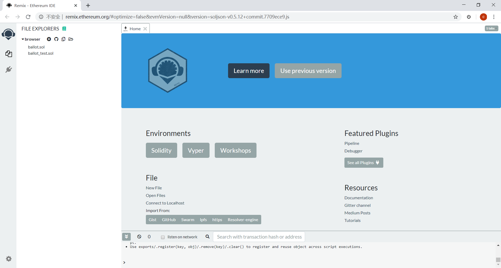
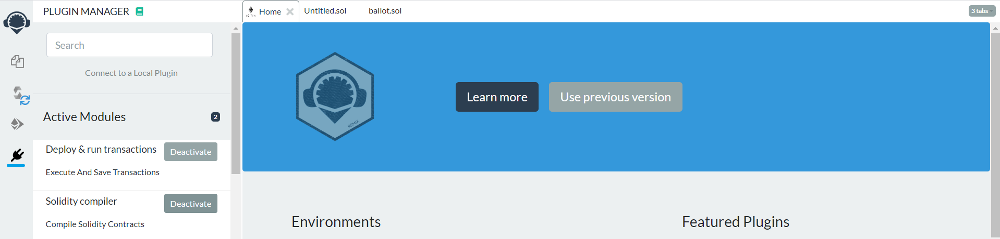
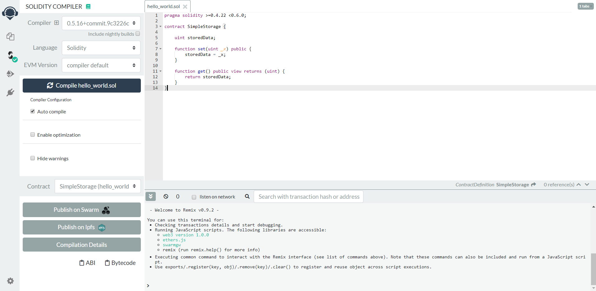
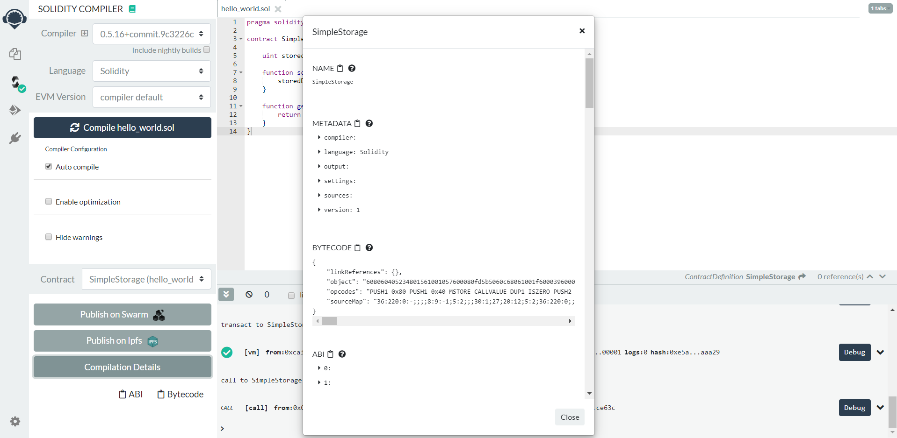

# DAPP development in Solidity language
>Remix is an open source Solidity development environment that provides basic functions such as compiling, deploying to local or test networks, and executing contracts. Solidity is the official programming language designed and supported by Ethereum to write smart contracts.


## Remix Environment Built

### use online environment  

<a href=" http://remix.ethereum.org/#optimize=false&evmVersion=null&version=soljson-v0.5.12+commit.7709ece9.js" target="_blank" title="Online Remix URL">Online Remix URL</a>：use online IDE to develop smart contract,it’s the simplest way if the network speed is ok.



### set up the offline environment locally

Download the official packaged <a href="https://github.com/ethereum/browser-solidity/blob/gh-pages/remix-7013ed1.zip" target="_blank" title="offline version">offline version</a>, after local decompression, use the browser open index.html


### set up the online environment locally

Install the local online environment using the following NPM command

**Installation command:**
Install the NPM and node.js（see [https://docs.npmjs.com/getting-started/installing-node](https://docs.npmjs.com/getting-started/installing-node)）,Remix-ide has been as a module of NPM:

```
npm install remix-ide -g
remix-ide
```

Or you can clone the entire github library (you need to install wget first) :
```
git clone https://github.com/ethereum/remix-ide.git
cd remix-ide
npm install
npm run setupremix  # this will clone https://github.com/ethereum/remix for you and link it to remix-ide. Only execute this step if you want to contribute on Remix development
npm start
```
Specific operation can refer to: [https://github.com/ethereum/remix-ide](https://github.com/ethereum/remix-ide)


## Example Introduction and Environment Use 


### Write Contract Code

1. Click the + sign in the upper left corner of online remix, Cteate New File in the Browser Storage Explorer, name does not matter, and extension is “xxx.sol”.

   
2.Here is a simple case code, which reads as follows:

```
pragma solidity >=0.4.22 <0.6.0;
contract SimpleStorage {
    uint storedData;
    function set(uint _x) public {
        storedData = _x;
    }
    function get() public view returns (uint) {
        return storedData;
    }
}
```
For more solidity contract development related content, please refer to: [https://solidity.readthedocs.io/en/v0.5.12/](https://solidity.readthedocs.io/en/v0.5.12/ "https://solidity.readthedocs.io/en/v0.5.12/")

3.Click on the plugin manager on the left side of the remix page to activate the Deploy&run transactions and Solidity compiler modules.



### Compiling and deploying smart contracts

1.Select the edited contract `hello_world.sol`, click on the activated compiled module and then click on the `Compile hello_world.sol` button.

If there are no errors, the following screenshot shows:



> Click the `Comliation Details` button in the bottom left corner to see the contract compilation information in the following screenshot, where the object in BYTECODE is needed to deploy the contract to chain33 later.



2.Click on the activated contract deployment module and then click `Deploy`, the contract is now deployed on the test environment provided by remix.

The contract was successfully deployed, as shown in the following screenshot:


### Call Contract Method

In this case, there are only two contract methods, set and get. 

f you want to call the set method of the contract, you just need to fill in the parameter value to the right, and then click on the method name to get the input code of the calling method.


## Deploy Smart Contracts Using Cli Debugging Tools

Cli is our debugging command, which makes it easy to use. Here’s how to use the cli command to deploy the smart contract on the Chain33 chain and invoke the methods in the smart contract.


1.Deploy the smart contract on chain of Chain33 using the cli command.

```
./chain33-cli evm create -i "contract code" -c "contract owner's address" -s "contract alias"
```
examole:

```
./chain33-cli evm create -i 608060405234801561001057600080fd5b5060c68061001f6000396000f3fe6080604052348015600f57600080fd5b506004361060325760003560e01c806360fe47b11460375780636d4ce63c146062575b600080fd5b606060048036036020811015604b57600080fd5b8101908080359060200190929190505050607e565b005b60686088565b6040518082815260200191505060405180910390f35b8060008190555050565b6000805490509056fea265627a7a72315820d4df27010b6a834bd33c5ffe98b8b9502bad314767b3e9afa5127dfa8272214364736f6c63430005100032 -c 1E1wEVbTmREYv8ehKD4kcqrETz6NdFE3zo   -s "hello_word"
```

2.The contract code above is the binary code generated by deploying in Remix. After successful command call, a transaction hash is generated and then used to query the transaction.
```./chain33-cli tx query -s "transaction hash""```
    
example:

```
./chain33-cli tx query -s 0x6343f4dfb6a4396fe50267e4d1803c63069ea1908241b89ff2b83630e451ff97
```
The results returned can be seen as follows: where the name contract name is used when contract transfer or retrieval operations are involved; addr contract address, to which all operations facing the contract are operations.

```
{
    "ty": 601,
    "tyName": "LogContractData",
    "log": {
        "creator": "1E1wEVbTmREYv8ehKD4kcqrETz6NdFE3zo",
        "name": "user.evm.0x6343f4dfb6a4396fe50267e4d1803c63069ea1908241b89ff2b83630e451ff97",
        "alias": "hello_word",
        "addr": "1Lva9isGc6fshvhfYEYX4XHkkKbSoJg8hW",
        "code": "0x6080604052348015600f57600080fd5b506004361060325760003560e01c806360fe47b11460375780636d4ce63c146062575b600080fd5b606060048036036020811015604b57600080fd5b8101908080359060200190929190505050607e565b005b60686088565b6040518082815260200191505060405180910390f35b8060008190555050565b6000805490509056fea265627a7a72315820d4df27010b6a834bd33c5ffe98b8b9502bad314767b3e9afa5127dfa8272214364736f6c63430005100032",
        "codeHash": "0x86caa23642eb6f934ff1592232a27b04caa8520accb42e19ffa089f01e895447",
        "abi": ""
    }
}
```

3.Call the contract method set
```
./chain33-cli evm call -i "Input generated in Remix" -e "name of the contract" -c "caller address"
```
example：

```
./chain33-cli evm call -i 0x60fe47b10000000000000000000000000000000000000000000000000000000000000021 -e "user.evm.0x6343f4dfb6a4396fe50267e4d1803c63069ea1908241b89ff2b83630e451ff97" -c 1E1wEVbTmREYv8ehKD4kcqrETz6NdFE3zo
```

4.When the call set is complete, the transaction hash is returned, and the result of the call using this hash query contains the following information: “caller”, who has consumed “usedGas”, and null, the initial value of storedData defined in solidity

```./chain33-cli tx query -s 0x443a8d81d6cc172aed9fd594ad86a9c8cec7500579ce4f81228c89b4644693b9
```
    
return
```
{
    "ty": 603,
    "tyName": "LogCallContract",
    "log": {
        "caller": "1E1wEVbTmREYv8ehKD4kcqrETz6NdFE3zo",
        "contractName": "",
        "contractAddr": "1Lva9isGc6fshvhfYEYX4XHkkKbSoJg8hW",
        "usedGas": "20220",
        "ret": null,
        "jsonRet": ""
     },
    "rawLog": "0x0a2231453177455662546d524559763865684b44346b63717245547a364e644645337a6f1a22314c7661396973476336667368766866594559583458486b6b4b62536f4a6738685720fc9d01"
}
    
```


5.Call the contract method get

```./chain33-cli evm call -i 0x6d4ce63c -e "user.evm.0x6343f4dfb6a4396fe50267e4d1803c63069ea1908241b89ff2b83630e451ff97" -c 1E1wEVbTmREYv8ehKD4kcqrETz6NdFE3zo
```

6.The query result value changes, you can see that the ret value for storedData changes after passing in the set method parameter to”0x0000000000000000000000000000000000000000000000000000000000000064”.

```./chain33-cli tx query -s 0xaef9b0dc0b5a8e7579fd7b916ba958687f7e1d77bbcce9159a1059c5c7d4177d
```
return
```
{
    "ty": 603,
    "tyName": "LogCallContract",
    "log": {
        "caller": "1E1wEVbTmREYv8ehKD4kcqrETz6NdFE3zo",
        "contractName": "",
        "contractAddr": "1Lva9isGc6fshvhfYEYX4XHkkKbSoJg8hW",
        "usedGas": "263",
        "ret": "0x0000000000000000000000000000000000000000000000000000000000000021",
        "jsonRet": ""
     },
     "rawLog": "0x0a2231453177455662546d524559763865684b44346b63717245547a364e644645337a6f1a22314c7661396973476336667368766866594559583458486b6b4b62536f4a673868572087022a200000000000000000000000000000000000000000000000000000000000000021"
}
```


## Call the JSONRPC Interface to Deploy the Smart Contract  

1.Using the input code generated by solidity contract creation, the relevant JSONRPC interface is invoked to deploy the contract on Chain33 chain. 

The following is an introduction to the relevant JSONRPC interface.In Chain33.Unlock used the python call interface.

1）First determine the status of the wallet and call the Chain33.GetWalletStatus interface. If the wallet is locked, call the Chain33.Unlock interface to unlock the wallet
```
request: http.post
{
    "jsonrpc":"2.0",
    "id":int32,
    "method":"Chain33.UnLock",
    "params":[{"passwd":"string","walletorticket":bool,"timeout":int32}]
}
```

- timeout: unlock time, default 0, means unlock forever; a non-zero value indicating that the wallet continues to be locked after a timeout, in seconds.
- walletorticket： True, unlock only the ticket function, false, unlock the entire wallet.

 The actual python script shown below, the json_payload inside is the method of the interface, session.post('http://localhost:8901', json = json_payload). The Chain33 network node that calls the requests module to construct the post data to be passed to port 8901.

```
#!/usr/bin/python
# -*-coding:UTF-8 -*-
import requests
def Unlock(passwd,walletorticket = False,timeout = 0):
session = requests.session()
json_payload = {"jsonrpc": "2.0", "id": 2, "method": "Chain33.UnLock", "params": [{"passwd":passwd,"walletorticket":walletorticket,"timeout":timeout}]}
reponse = session.post('http://localhost:8901', json = json_payload)
dic = reponse.json()
if (dic['error'] == None):
    if (dic['result']['msg'] == ''):
        print "Wallet unlocked successfully：{}".format(dic['result']['isOK'])
    else:
        print "Wallet unlocked failed：{}".format(dic['result']['msg'])
else:
    print dic['error']
```
2）Construct deployment corresponding transaction contract, call interface “method” : “Chain33. CreateTransaction”, the hash generated for signature.
```
http.post
 {"jsonrpc": "2.0",
"id": int32,
"method": "Chain33.CreateTransaction", 
"params": [{"execer": "evm", "actionName": "CreateCall", "payload": {"code": "string","note": "string",  "Fee":int64, "isCreate": bool}}]
}
```
- code: remix compiled input code
- note: note   
- fee: 1000000，to prevent Gas shortage 
- isCreate: whether or not to create a contract, here fill in true.


3）The transaction generated by the step on the signature, calls the Chain33.SignRawTx interface (corresponding contract deployer on your own main chain), and generates the hash that is sent to the Chain33 chain after the signature.
```
http.post
{"jsonrpc":"2.0",
"id":int32,
"method":"Chain33.SignRawTx",
"params":[{"addr":"string", "key":"string","txhex":"string","expire":"string", "index":int32}]
}
```

- addr and key can only be entered either way.
- expire：expiration time type such as “300 ms,” 1.5 “h” m “string, effective unit of time for” ns “, “us”, “ms”, “s”, “m”, “h”.
- index: if the signature trading group, it is the trading serial number to be signed, starting from 1; if it is less than or equal to 0, it is all the transactions in the signature group.
- txhex：the hash string generated for the previous step.


4）Send the signed transaction from the previous step, calling the Chain33.SendTransaction interface.

Return a string of hash values after execution. This hash value combined with prefix user.p.developer.user.evm. constituted the address of the contract, the game is as follows:
user.p.developer.user.evm.0x318638f8b0a53b4145605215a15fd33714084f6776c854634fbe9c3cd043bf47
    
```
 http.post
  {"jsonrpc":"2.0",
    "id":int32,
    "method":"Chain33.SendTransaction",
    "params":[{"data":"string"}]
  }
```
    
- data: the signed data


5）After this step, the contract is deployed on the blockchain. You can call the Chain33.GetTxByHashes interface to query the results.

```
http.post
{
    "jsonrpc":"2.0",
    "id":int32,
    "method":"Chain33.GetTxByHashes",
    "params":[{"hashes":["hashId0","hashId3","hashId2"]}] 
}
```

2.Using the input code generated by solidity method to invoke the contract method, invoke the method in the deployed contract on chain of Chain33 by the associated JSONRPC interface to invoke the method in the deployed contract.

1）First determine the status of the wallet and call the Chain33.GetWalletStatus interface. If the wallet is locked, call the Chain33.Unlock interface to unlock the wallet.


2）Construct call methods corresponding to the transaction contract, call interface “method” : “Chain33. CreateTransaction”, the hash generated for signature.

```
http.post
{"jsonrpc": "2.0", 
           "id": 2, 
           "method": "Chain33.CreateTransaction", 
           "params": [{"execer": "evm", "actionName": "CreateCall", "payload": {"code": evm_call_code, "isCreate": False,  "name": user_evm_name, "amount": 0}}]
           }
```

- evm_call_code: method corresponds to input code (in step5 above)
- "isCreate": whether to create, here fill in false
- "name": create the contract to generate the caller name, for example: user.p.developer.user.evm.0x318638f8b0a53b4145605215a15fd33714084f6776c854634fbe9c3cd043bf47

>Call “method”: “Chain33. CreateTransaction” : generated hash:
```0a54757365722e65766d2e757365722e65766d2e30783635326439356634303566363536323562636163616330626132323666323866333766396638623465656135663431353034616164663462616538376664373812462244095ea7b30000000000000000000000000000000000000000000000000000000000000021000000000000000000000000000000000000000000000000000000000000006420a08d0630eeccfec4f8c5a4fd093a2231444b5054554354704e7a5774743968476e62416d3547737462726767746f454234```
    

3）The transaction generated by the step on the signature, calling the Chain33.SignRawTx interface (with its corresponding contract deployer on its own main chain), generates the hash that is sent to the Chain33 chain after the signature.

>Call the signature interface, “method”:” chain33.signrawtx “to generate the signed hash:
```   0a54757365722e65766d2e757365722e65766d2e30783635326439356634303566363536323562636163616330626132323666323866333766396638623465656135663431353034616164663462616538376664373812462244095ea7b3000000000000000000000000000000000000000000000000000000000000002100000000000000000000000000000000000000000000000000000000000000641a6e080112210239522964b148480e65ce1965a18fd47e405b48596fac0f03e5e9e5a7cbe0b15f1a473045022100fd948c4d425d0052a652aa88e559df73380cda0215403853e2be028a5ba556240220077be7c71cb374868e3313896e36d8a43367cc421f5c13e8725683cec2fba15a20a08d0628d5ecd8dc0530eeccfec4f8c5a4fd093a2231444b5054554354704e7a5774743968476e62416d3547737462726767746f454234
```

4）Send the signed transaction from the previous step, call the Chain33.SendTransaction interface, and return a string of hash values.

>Call “method”:” Chain33.SendTransaction “to generate the sent transaction hash for queryresults on the Chain33 chain, or on the blockchain browser.

```0x54eb29276e923d1dcea8f569ef5279302f823376a3a7bb3de23ef25c6a855c43``` 

5）After this step, the contract is deployed on the blockchain. You can call the Chain33.GetTxByHashes interface to query the results.