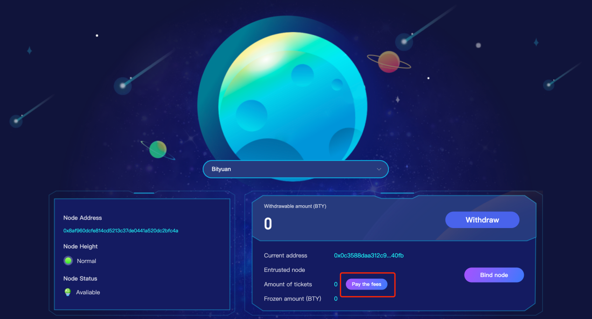

# Decentralized delegated voting

## How do users delegate voting?

### User Login

Official website login supports 2 login methods

-   Login with MetaMask
-   Login via mobile wallet

### Select the appropriate ticket pool

Users can select the appropriate ticket pool for delegated voting by searching

### Bind ticket pool node

After selecting the appropriate node, perform the binding node operation, sign the transaction, and wait for the binding to be completed.

### Number of delegated tickets

After the node is successfully bound, users can perform delegated voting operations.

-   1 ticket=3,000 BTY
-   If you entrust a node to vote, the node will charge 10% of the income from the vote as node maintenance and operation expenses.

### Withdraw earnings

After waiting for a period of time, the delegated ticket is selected and BTY is generated. The user can withdraw BTY to his current wallet address.

### Unbind

The user wants to exit and no longer continue to delegate voting, click the unbind button, sign the transaction, and wait for unbinding.

### Pay the commission fee

After unbinding the relationship, the amount of BTY required to be paid will be calculated based on the income obtained from the number of delegated votes, the transaction will be signed, and the payment will be completed.

-   After payment is completed, users need to wait 50 hours
-   What is paid is the income obtained from the tickets that have been issued. There may be immature tickets. Users need to wait for the immature tickets to mature and pay the corresponding fees again (It generally occurs when there are relative more votes).
-   The maximum number of tickets that can be closed each time is 100. If the number of tickets exceeds 100, the tickets need to be closed multiple times (Close tickets=Click close button + wallet signing).

## How to become a node?

### Maintain a stable operating device for BTY nodes

Stable operation standard：

-   The network link is normal.
-   The node height is normal.
-   Turn on automatic ticket purchase status.
-   The wallet is unlocked.
-   The node address used for application needs to have BTY to pay the blockchain fee (see below to import the 0x format BTY address).

### generate an 0x address

Use a mobile wallet or other wallet software to generate an ETH address, export the private key of the 0x address, import it into the BTY node, and complete the 0x format address to run in the node.

### Import ox format bty address

-   PC

Open Settings-Console, enter the command account import_key -k in the console and fill in your private key -l node_1 -t 2

-   Service-Terminal

Find the BTY node, enter the command account import_key -k and fill in your private key -l node_1 -t 2

### Fill out the application form and submit node information

-   If the number of tickets from the entrusted node reaches 300, the node will be shown for recommendation without searching.
-   The entrusted node obtains 10% of the revenue generated by the node’s entrustment tickets.

