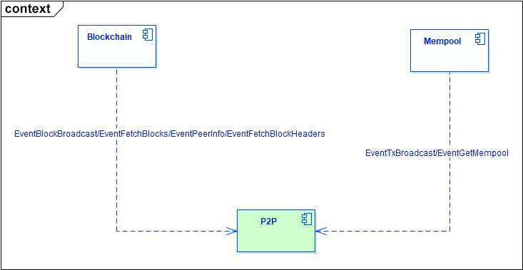

# P2P Module
>P2P module is a component that processes communication between nodes, including node discovery and connection establishment, broadcasting blocks and transactions, and block synchronization.

## P2P module interaction

- Interaction with the Mempool module: broadcast the transactions sent by the Mempool module and obtain the transactions in the Mempool module.
- Interactions with Blockchain module: broadcast blocks sent by Blockchain modules, process requests for peer information and requests for downloading blocks and block headers from peer node

## P2P Logical Structure

P2P module contains the following functional modules:

- Node discovery module: Discover the nodes in the network and try to establish a connection.
- Data download module: Download blocks from peer node to synchronization.
- Data filtering module: Filter duplicate transactions and blocks received.
- Node monitoring module: Dynamically monitor peer nodes.

### Node Discovery Module

After the P2P module starts, the last saved remote node information will be read from the local database into the cache. If the local database information is empty, start loading seed nodes into the cache and try to connect them.

After connecting these nodes, if the maximum number of connections is not met, start to make a GetAddrList request to these nodes. After receiving the request, the peer node will return the node information currently connected including block height to the requester. The request node can choose the node to be connected according to its own block height, for example, choose the node higher than itself.

See getAddrFromAddrBook，getAddrFromOnline and other functions for details.

### Data Download Module

When synchronizing blocks, Blockchain module send EventFetchBlocks message to P2P module, and then P2P module makes a request to the connected nodes to download blocks.

There are two modes to download data: the first is to download from the specified node, the second is to make a balanced download from all connected nodes, in which case the nodes with strong service capacity will receive more download requests.

See GetBlocks, DownloadBlock and other functions for details.

### Data Filtering Module

The node will receive the transactions and blocks broadcast by other nodes in the network, and duplicate data will appear after multiple reception, so it needs to be filtered. Here, P2P module uses LRU data structure to cache transactions and blocks, and make filter in the interface functions of client and server.

Unfiltered transactions are sent to Mempool module for caching and broadcasting to other nodes, and blocks are sent to Blockchain module for packaging and broadcasting to other nodes.

See ServerStreamRead， readStream，RegRecvData and other functions for details.

### Node Monitoring Module

In reality, the network environment is complex and changeable, and the nodes may be separated from P2P network due to machine failure or network environment impact. At this time, P2P modules are required to quickly find abnormal nodes, eliminate the nodes, and select new nodes to supplement.

P2P module also starts timing tasks to adjust the list of connection nodes in real time, including deleting the nodes with too many connections or too low connections, the nodes with too low block height, and seed nodes, etc.

See monitorErrPeer，monitorPeers， nodeReBalance and other functions for details.