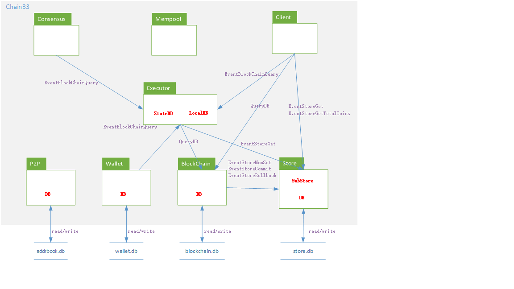
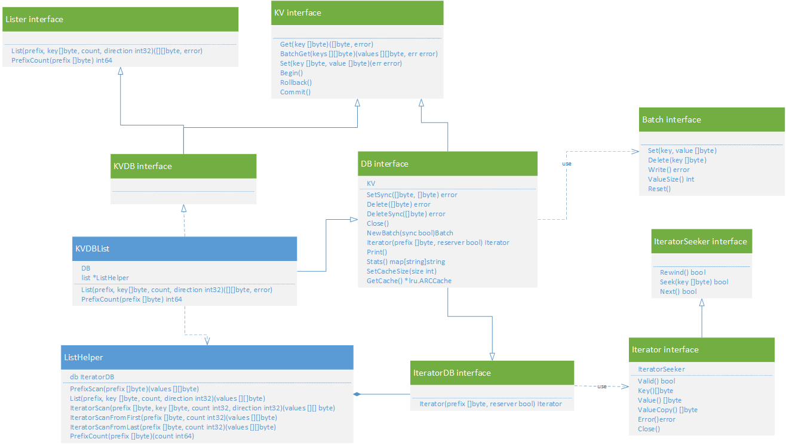
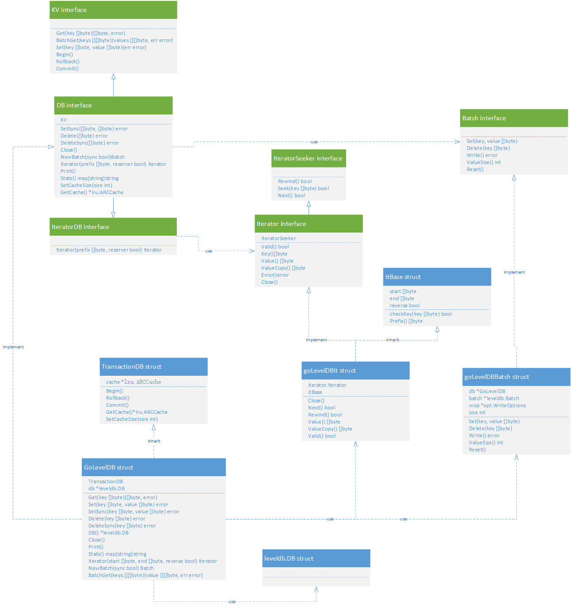
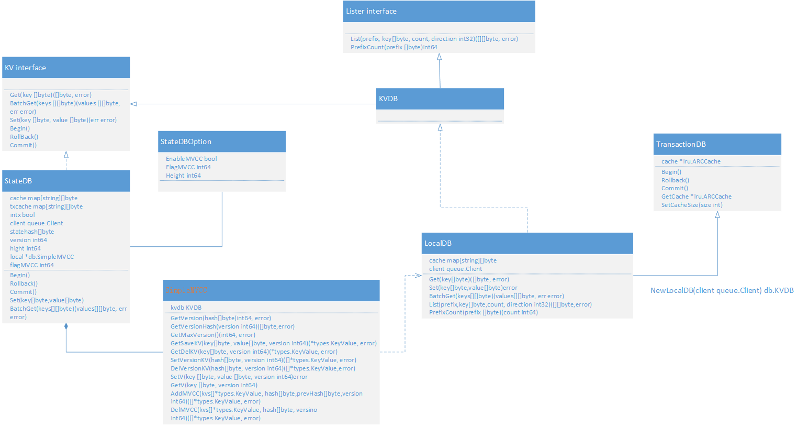
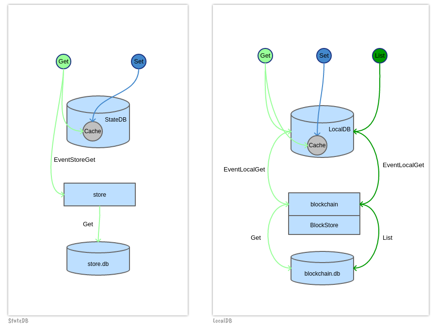

# Storage Module  
>比特元底层Chain33使用高性能、高可靠的KV数据库来进行区块链数据的存储，支持goleveldb、gobadgerdb、gomemdb、gossdb等KV数据库类型。区块链中的状态数据的的存储格式采用可配置、可插拔的方式，可以支持mavl、mpt、kvmvcc的存储格式。

## Module Introduction

Like the traditional blockchain implementation, chain33 uses the high performance and high reliability KV DB for data storage, and the DB interfaces provided by design are all defined for KV storage characteristics.  

On the chain33 system, there are currently four database instances, as follows: 

>fzm@fzm001:~/chain33 $ ls datadir  
addrbook blockchain.db mavltree wallet    

In Which:

- **addrbook**: The implementation capability is relatively single, mainly storing P2P nodes and related state information.
- **wallet**: Store local account information
- **blockchain.db**: Store the block header, block body, and additional information about the block, and the result information returned by the local execution of the transaction.
- **store**: Store the result of the transaction execution and the hash information of the block staus. 

For the storage module of chain33, there are several points:  

- The underlying storage and operation of chain33 supports many implementations by flexible configuration.
> The underlying layer can support various types of KV DB implementations based on configuration, such as goleveldb, gobadgerdb, gomemdb, gossdb, etc.
> The underlying storage operations of the above four database instances, addrbook, wallet, blockchain.db and store, are all implemented through specific KV DB configurations, such as the default configuration of goleveldb.

- In practical application, Excutor uses two abstract database concepts, StateDB and LocalDB, to query the storage message of blockchain.db respectively.
- Format of the data storage in Store module can also adopts configurable, pluggable way, and default support mavl tree storage format.

Chain33 also supports user extension of new storage formats, such as pure KVDB storage format, mvcc-based KVDB storage format, MPT storage format, etc.

But, ultimately the underlying operation of the data store is implemented through the specific KV DB configuration, such as goleveldb.
  
## Logical Architecture ##
### Storage Module Structure



- P2P, Wallet, Blockchain and Store all involve data storage, write and read data to KV DB instance through DB interface.  
- BlockChain and Store modules also provide data query interfaces, which is operated by StateDB and LocalDB abstract database objects using messages. 
- When BlockChain module generates blocks, it can write status information to the Store module by messages.  
- Wallet, Consensus, Client and other modules can use messages to initiate data query to Blockchain and Store respectively by StateDB and LocalDB objects through the actuator.
- The Client module can also launch a status data query directly to the Store through messages.


### Underlying Logical Architecture Storing KV DB



KV DB supported by the underlying data storage needs to adapt to the above interfaces.

Take goleveldb as an example:



You can see that when goleveldb implements the DB interface, Iterator interface, and Batch interface, it can be used in the chain33 system as an underlying database implementation of the Storage module. 

Different KV DB implementations, such as gobadgerdb, gomemdb and gossdb, are all similar, need to implement db interface, Iterator interface and Batch interface to meet the needs of upper logical functions.

### Logical Architecture of StateDB and LocalDB 
  




As you can see, the function of these two abstract databases is very simple. What is misleading is the usage scenario and storage content of the two DB, so the following table shows the differences between the two DBs. 

| DB | StateDB | LocalDB |
| :------| :------ | :------ |
| **write data purpose** | cache | cache |
| **read data source** | store | blockchain.db |
| **actuator corresponding method(data source) | KV returned by Exec | KV returned by ExecLocal |
| **whether data contains status** | yes (read and write data with StateHash) | no (Key index data only) |
| **which data to store** | Store the kvset for block trade execution（KV database direct storage; mavl database is stored as a StateHash construct tree） | all information in block |
| **whether to check data** | yes (recalculate StateHash check when executing block) | no (write directly) |

### Store Logical Architecture 


- The Store layer determines which format the state data will be organized in in the underlying KV DB.  
- By default, the system supports the implementation of mavl tree format. By loading plug-ins, it can also support the implementation of KV DB, KV DB based on MVCC, and MPT.
- Developers who want to extend their data organization format need to implement the SubStore interface, register it in the system, and configure it.

## Process Logic

### Main Interface of Underlying KV DB

#### Basic Data Interface
```go
    Get(key []byte) ([]byte, error)
    BatchGet(keys [][]byte) (values [][]byte, err error)
    Set(key []byte, value []byte) (err error)
    SetSync([]byte, []byte) error
    Delete([]byte) error
    DeleteSync([]byte) error    
    Close()
```

These are the basic read, write, and delete interfaces for data, plus the interface to close the database. Pure key-value operation, directly docking with specific database interface.
 
Some databases may not support asynchronous writes, so they have to be implemented synchronously (which has little impact on performance).


#### Range Finder Interface

```go
    List(prefix, key []byte, count, direction int32) ([][]byte, error)
    PrefixCount(prefix []byte) int64
```

These two interfaces need to implement the so-called prefix search. Actually, the realization of the KV, is not purely a prefix search, but a Range find, because the data KEY matching is carried out in accordance with the the Range of estimates based on the prefix search.

Here is an example(the search effect and * suffix fuzzy matching is the same).

Example1： prefix=0xab9876abcd77ff

At this time, the search scope is: 0xab9876abcd 77ff xxx ~ 0xab9876abcd 78ff xxx

Example2：prefix=0xab9876abcd77ab

At this time, the search scope is: 0xab9876abcd77 ab xxx ~ 0xab9876abcd77 ac xxx

Where count is the number of limited searches, because the number of possible matches is large, only the previous count is returned;

Direction is matching direction, positive direction is from start to end, and reverse direction is from end to start;

Special note: when count is 0 (or the PrefixCount interface), it means to return all the matching data, but in a specific database implementation, if the amount of data is too large, it can cause problems such as database hangs, network timeouts, memory overruns.
The safe way is to do some processing is only take a fixed number of records (such as 10,000) each time during internal search, and then search for several times, finally summarize the results.

#### Batch Data Interface

```go
    type Batch interface {
        Set(key, value []byte)
        Delete(key []byte)
        Write() error
    }
```

You can think of this as a transactional interface that can perform multiple Set and Delete operations, and eventually a Write commit, all or none of which succeed.

When implementing a database, especially one that does not support native transactions, tradeoffs may be considered. Take the implementation of SSDB as an example:

- When newBatch is performed, two cache objects are created to store the cache queue for modification and deletion respectively.
- When Set operation, check whether Delete queue has corresponding Key, if so, delete it from Delete queue, and let Set operation into Set queue;
- When Delete operation, check whether there is corresponding Key in Set queue, if so, delete from Set queue, and let Delete operation into Delete queue;
- When writing, insert all the keys of the Delete queue in the Set queue, set Value to null, and then call batch Set interface. If fail, then return; if successful, call batch Delete interface, then return success.

There are two reasons for this operation:

1. Normal transaction operation is to ensure the internal operation order, so when Set and Delete operation is performing, we need to check each other’s queue, to prevent the problem of Delete before Set;
2. When the transaction commits, the data to be deleted is left empty at the same time as the write operation, in order to prevent intermediate states where the write is successful but deletion fails

#### Iterator Interface

```go
    type IteratorSeeker interface {
        Rewind() bool
        Seek(key []byte) bool
        Next() bool
    }
    type Iterator interface {
        IteratorSeeker
        Valid() bool
        Key() []byte
        Value() []byte
        ValueCopy() []byte
        Error() error
        Close()
    }
```

The ability to wrap iterators in chain33, like Pointers in C or Cursors in SQL, interfaces in Iterator are easy to implement, mainly three methods in IteratorSeeker, and are difficult to implement for some databases. The following takes SSDB as an example to illustrate the implementation logic of the iterator.

The creation interface for the iterator is as follows:

```go
//Iterates through all key values in the prefix range, supporting reverse and forward iteration.
Iterator(prefix []byte, reserver bool) Iterator
```

When creating an iterator, the prefix lookup capability is wrapped, and the implementation logic in SSDB is as follows:

1. Use prefix to calculate the start and end KEYs of the match;
2. Use the generated command keys or rkeys to find all KEYs that satisfy this prefix (paged with 1024), and wrap this information into the object Iterator;
3. When the Next method is executed, the cursor +1 is used to get the corresponding KEY from the cache array, and then the Get interface of DB is called to obtain the data;

	If Cursor +1==1024, start with the last element KEY in the current cache array and continue to get the next KEY;
4. When the Seek method is executed, it continuously calls the pagination logic to get the KEYS, and then matches the key until it meets, or no data;

#### Other Specific Interfaces

```go
// Simulated transaction interface
Begin()
Rollback()
Commit()
```

The above three methods, which simulate transaction operations and are currently implemented only in StateDB, support only single-threaded memory transactions and were introduced in support of the TxGroup concept. When you add a new database implementation, you don’t need to consider support for these three interfaces. And don’t have to call these interfaces in your own code logic.

### The Relevant Main Interfaces for StateDB and LocalDB 

#### The interface related to data storage in the actuator

```go
    SetStateDB(dbm.KV)
    SetLocalDB(dbm.KVDB)
    Exec(tx *types.Transaction, index int) (*types.Receipt, error)
    ExecLocal(tx *types.Transaction, receipt *types.ReceiptData, index int) (*types.LocalDBSet, error)
    ExecDelLocal(tx *types.Transaction, receipt *types.ReceiptData, index int) (*types.LocalDBSet, error)
```

##### Exec 

The specific execution logic of the transaction, no matter what logic is executed, will eventually return a *types.receipt object containing two parts, KV and Logs, where KV will be written to StateDB (<font color=red>finally written to store</font>), and Logs will be passed as an input parameter when ExecLocal is called;

The default Exec method does not generate any data;

##### ExecLocal

The local execution logic of the transaction is an additional logic. And different execution results will not lead to block execution failure. The main logic here is using information generated by Exec, regenerate some additional information, convenient for other places to use;

The default ExecLocal method generates the transaction details data corresponding to the transaction hash;

<font color=red>related data will eventually be written to blockchain.db.</font>

##### ExecDelLocal  

This method corresponds to ExecDelLocal, which is called when dealing with forks. If one block has been executed and then another chain becomes the main chain, then the executed block will be pushed back and the logic of ExecDelLocal will be invoked. It should rollback data written to ExecLocal.

#### The Main Interface for StateDB

```go
     //Get the status data from the Store (corresponding to the Store in chapter 1) through the message EventStoreGet.
     Get(key []byte) ([]byte, error)  
```

#### The Main Interface for LocalDB   

```go
     //Get block data from the BlockStore database (corresponding to blockchain.db in chapter 1) via the message EventLocalGet.
     Get(key []byte) ([]byte, error)  

     //Query the list of data from the BlockStore database (corresponding to blockchain.db in chapter 1) via the message EventLocalList
     List(prefix, key []byte, count, direction int32) ([][]byte, error)  

     //Query the number of keys with the specified prefix from the BlockStore database (corresponding to blockchain.db in chapter 1) via the message EventLocalPrefixCount.
     PrefixCount(prefix []byte) (count int64)
```

### The Main Interface for SubStore  

```go
    type SubStore interface {
    //Write KV information to the corresponding StateHash.
    Set(datas *types.StoreSet, sync bool) ([]byte, error)
    
    //Get KV information corresponding to StateHash.
    Get(datas *types.StoreGet) [][]byte

    //When a Blockchain module generates a block,  set the corresponding KVSet corresponding to StateHash into memory.
    MemSet(datas *types.StoreSet, sync bool) ([]byte, error)

    //When a Blockchain module generates a block,  set the corresponding KVSet corresponding to StateHash into memory.
    Commit(hash *types.ReqHash) ([]byte, error)

    //When a Blockchain module generates a block, write the corresponding memory KVSet for StateHash to the store.
    Rollback(req *types.ReqHash) ([]byte, error)

    //When Blockchain module fails to generate blocks, the KVSet data corresponding to StateHash's memory will be cleared.
    Del(req *types.StoreDel) ([]byte, error)

    //In case of exception, the corresponding KV information of StateHash written to block is rolled back.
    IterateRangeByStateHash(statehash []byte, start []byte, end []byte, ascending bool, fn func(key, value []byte) bool)

    ////Reserved event handling interface
    ProcEvent(msg queue.Message)
    }
```
The newly added plug-in types of Store layer all need to implement the above interfaces, such as KV DB, KVMVCC DB, MPT, etc.
