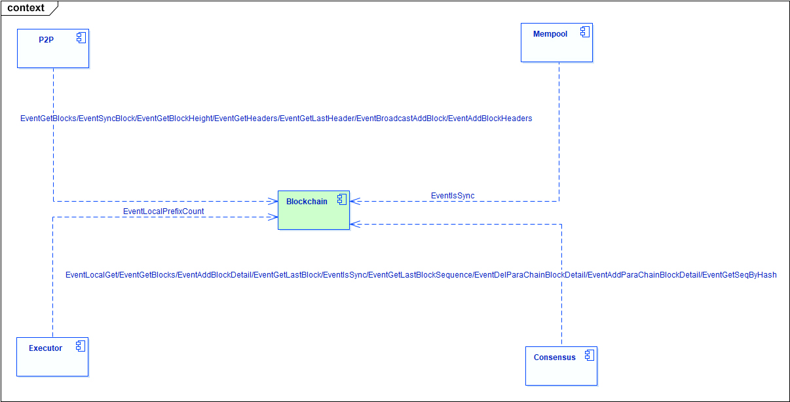

# Blockchain Module
>Blockchain module is a component that processes blocks, including storing block information, adding blocks to the main or side chains, and synchronizing blocks. At the same time, it provides interfaces to query block information and block chain status.

## Blockchain Module Structure

- Interaction with Consensus module: handle blocks the Consensus module packaged, and the request of Consensus module to query block information.
- Interaction with P2P module: deal with the broadcast blocks received by P2P modules, send blocks to P2P modules for broadcasting, and handle the requests of P2P modules to inquire block information.
- Interaction with Mempool and Executor modules: handle requests from these two modules to query the blockchain status.

## Blockchain Logical Construction

Blockchain module consists of three sub-modules: message receiving module, block synchronization module and block storage module.

- **Message receiving module**: Accept queries for information about blocks and blockchain status from other modules.
- **Block synchronization module**: After the node starts, compared the latest block height of peer nodes with its own height. If its own height is lower than the latest height of peer nodes, the block will initiate the synchronization request to catch up with the main chain.
- **Block storage module**: Store block information to the database in different types.

## Process Logic

### Message Receiving Module

Accept queries for information about blocks and blockchain status from other modules.

**block related information**

- EventGetBlocks: get block information
- EventGetHeaders: get block header information
- EventAddBlock: add blocks synchronized from peers
- EventAddBlockHeaders: add block headers synchronized from peers
- EventAddBlockDetail: add blocks from consensus module
- EventBroadcastAddBlock: add block broadcast from peers
- EventGetBlockHeight: get the latest block heigh
- EventGetLastHeader: get the latest block header information
- EventGetLastBlock: get the latest block information

**Blockchain browser related messages**

- EventGetTransactionByAddr: get hash values of all transactions at the address by the account address
- EventGetTransactionByHash: get corresponding information by transaction hash
- EventGetBlockOverview: get header information for this block and list of transaction hashes using block hash values
- EventGetAddrOverview: get the coins received by the account, the current balance of the account and the number of transactions involved by the account address
- EventGetBlockHash: get block hash from block height
- EventQueryTx: query specific transaction information including txproof proof by the transaction hash

**Parallel chain related messages**

- EventGetLastBlockSequence: get the sequence of the node corresponding to the latest block
- EventGetSeqByHash: get the sequence corresponding to the block hash
- EventAddParaChainBlockDetail: add consensus block from parallel chain
- EventDelParaChainBlockDetail: delete consensus block from parallel chain
- EventLocalGet: query for stored Key-Value pairs

**Other messages**

- EventIsSync: query the synchronization status of blockchain
- EventIsNtpClockSync: query the NTP network time synchronization status
- EventLocalPrefixCount: query the number of keys with a specified prefix

### Block Synchronization Module
After the node starts, compared the latest block height of peer nodes with its own height. If its own height is lower than the latest height of peer nodes, the block will initiate the synchronization request to catch up with the main chain.

Includes timing processing logic and immediate processing logic.

**Timing process**

- FetchPeerList: periodically fetch peer information in the network from the P2P module and save it to the local peerList.
- SynBlocksFromPeers: periodically request specified blocks from a peerList.
- CheckTipBlockHash: check periodically whether the latest height block hash of this node is consistent with the corresponding height block hash in the peerlist.
- CheckBestChain: periodically detect and obtain an optimal chain list, ensuring that block request peers and this node are all on the same chain.
- RecoveryFaultPeer: periodically detect the fault peer node’s and recove.

**Real-Time Processing**

Receive and process blocks from three sources: blocks packaged by consensus modules, broadcast blocks, and synchronized blocks

Process the entrance function `ProcessBlock()`, the process is as follows:

- check whether the block already exists on the main/side chain of the node.
- check whether the block already exists on the orphan chain of the node.
- check whether the parent block already exists on the main/side chain of the node.
- try to block to the main/side chain.
- try to the process orphaned blocks in an orphan chain whose parent block is this block.

### Block Storage Module
Store block information to the database in different types.

**Store data content**

All storage formats are in `Key-Value` form, including the following data contents:

> Block related

- key(“blockLastHeight”): store the latest block height
- key(“Hash:%v”, blockhash): store block height
- key(“Body:%v”, blockhash): store block body
- key(“Header:%v”, blockhash):store block header
- key(“TD:%v”, blockhash): store block body
- key(“Height:%v”, height): store block hash corresponding to the height of the block
- key(“HH:%v”, height): store block header corresponding to block height
- key(“LastSequence”): store the latest sequence
- key(“Seq:%v”, sequence): store sequence corresponding block hash
- key(“HashToSeq:%v”, blockhash): stores the sequence corresponding to block hash

> Transaction related

- key(“TxAddrHash:%s:%s”, addr, heightindex): store hash list of transactions related to the address
- key(“TxAddrDirHash:%s:%d:%s”, addr, flag, heightindex): store hash list of transactions for an address-related category
- key(“AddrTxsCount:%s”, addr): store number of transactions in which the address participates

**Data access interface**

> Get and store the information of the latest block

- UpdateHeight
- UpdateLastBlock
- LastHeader
- LastBlock

> Get and store block information

- LoadBlockByHeight
- LoadBlockByHash
- GetHeightByBlockHash
- GetBlockHashByHeight
- GetBlockHeaderByHeight
- GetBlockHeaderByHash
- GetTdByBlockHash
- SaveTdByBlockHash

> Store and delete blocks and transactions

- SaveBlock
- DelBlock
- GetTx
- AddTxs
- DelTxs