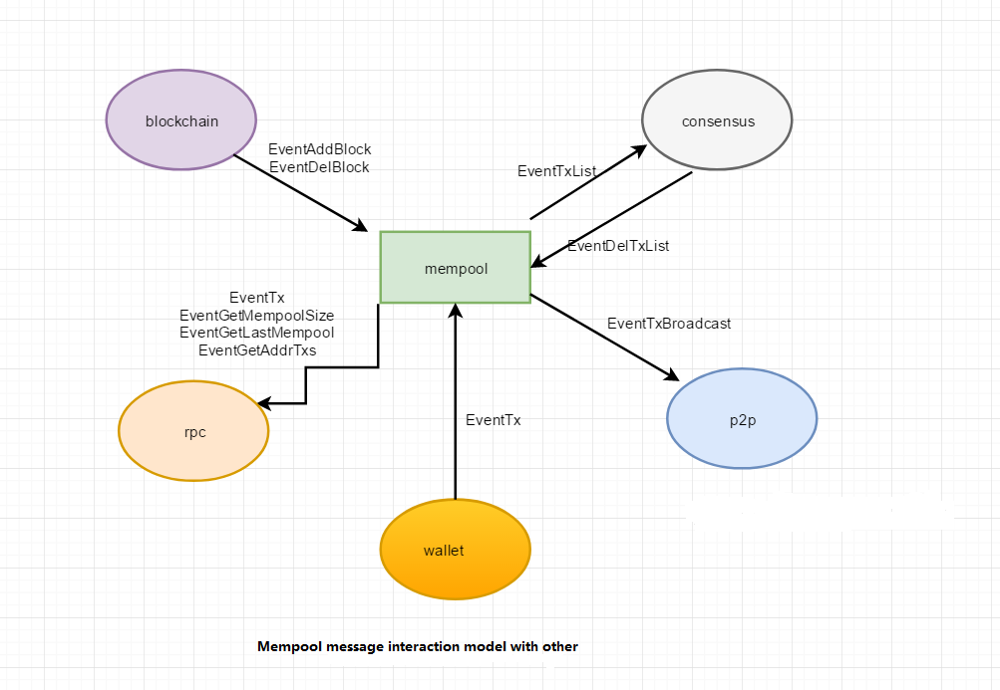

# Mempool模块
Mempool is a trading pool, a caching function for making transactions.The main purpose is to solve the problem that the consensus module may be slower than the RPC module.

The initial legitimacy of the received transactions will be verified to filter out some illegal transactions.Limit traffic to the sender to prevent the same address from being sent too often. 

## Mempool Module Interaction



> Interaction between Mempool and Clockchain:

- When a new block is written, blockchain will send Mempool the type.eventaddblock message event to tell Mempool that a block has been successfully written and Mempool receives it, which will trigger the mem.RemoveTxsOfBlock(block) method to remove the tx that has been packaged by blockchain in Mempool.
- When a block goes back, blockchain sends Mempool a message of message type, type.eventdelblock, telling Mempool that if a block needs to go back, the mem.setHeader () and mem.delBlock () methods will be triggered to add the transactions in the corresponding block back to Mempool.


> Interaction between Mempool and Consensus:

- When a block is packaged, the consensus will automatically send a types.Eventtxlist message to trigger the mem.GetTxList () method to get the list of trades to be packaged.
- In block packing, when consensus sends types.EventAddBlockDetail message events to blockchain, that a new block need to write, and if the new piece of writing successful, blockchain will return the corresponding blockdetail information to consensus, according to the original block and find the error transaction list, then send the Mempool types EventDelTxList message to delete the corresponding error transactions.

> Interaction between Mempool and P2P:

- If Mempool receives the tx sent by RPC, it will go through a series of verification checks. If it is verified, it will broadcast the legitimate tx through the P2P module

> Interaction between Mempool and RPC:

- In Mempool, RPC is provided with three interfaces, `GetLastMempool()`,`GetMempool()`,`SendTx()`, for external calls

## Mempool Transaction Verification

Transaction verification in Mempool is very strict, the main inspection places are:

- Check if the transaction is empty and whether the service fee meets the minimum service fee requirements set by the system.
- Check whether the transaction is a single transaction or a trading group.
- Check if the receiving address is valid.
- Check if the transaction is duplicate.
- Check if there are too many transactions in the transaction account in the Mempool.
- Check if the transaction has expired.

Please refer to the code of Mempool module for details: <a href="https://github.com/33cn/chain33/blob/master/mempool/check.go" target="_blank">Cleck Here</a>.

## Data Structure stored in Mempool

Three data structures are defined in Mempool: `txCache`, `Item` and `Mempool`.

```go
// Module txCache
type txCache struct {
    size       int                             //Cache size, default 10240
    txMap      map[string]*list.Element        //Key=string(txhash), Value= Item
    txList     *list.List                      //Link list
    txFrontTen []*types.Transaction            //Record the latest 10 transactions
    accMap     map[string][]*types.Transaction //Record the number of transactions have been made at the corresponding account address in Mempool, and where only 100 transactions is the maximum amount at the same address (tx.from)
}
```

```go
// Item is the data structure that wraps the transaction in the Mempool.
type Item struct {
    value     *types.Transaction
    priority  int64       //Priority, here is the classification according to the fee.
    enterTime int64       //Entry timestamp.
}
```

```go
// Mempool data structure
type Mempool struct {
    proxyMtx          sync.Mutex           //Mutex, supports concurrent operations between multiple coroutines in the Mempool later
    cache             *txCache             //Cache size, by default 10240
    in                chan queue.Message   //Serialization of received msg, used in conjunction with out, mainly processes EventTx message
    out               <-chan queue.Message //Same as above
    client            queue.Client         //Queue client for communication among various modules within Chain33
    header            *types.Header        //Store the latest block header information
    minFee            int64                //Minimum commission charge 
    addedTxs          *lru.Cache           //Store the latest block header information
    sync              bool                 //Determine if blockchain is synchronized. If blockchain is not synchronized, you cannot successfully send a new transaction to Mempool
    cfg               *types.Mempool       //Mempool configuration 
    poolHeader        chan struct{}        //Not used for the moment, reserve parameters
    isclose           int32                //1 represents close
    wg                sync.WaitGroup       //Used to implement coroutine synchronization
    done              chan struct{}        //Whether or not Mempool is finished is a signal of the end
    removeBlockTicket *time.Ticker         //Time to clean the packed tx timer, default to one minute
}
```
## Mempool Message Processing Logic

- The modules in Chain33 communicate with each other via queue.client, by sending Message to each other, '*Queue Module*' for detailed information
- The processing of messages sent from Mempool to other modules is in the `SetQueueClient()` method, and the following is an analysis in pseudo-code of how Mempool handles the received messages.

```go
func (mem *Mempool) SetQueueClient(client queue.Client) {
    mem.client = client
    mem.client.Sub("Mempool")
    mem.wg.Add(1)
    go mem.pollLastHeader()
    mem.wg.Add(1)
    go mem.getSync()
    //    go mem.ReTrySend()
    // Read bad messages from badChan and reply error messages
    mem.out = mem.pipeLine()
    mlog.Info("Mempool piple line start")
    mem.wg.Add(1)
    go func() {
        defer mlog.Info("piple line quit")
        defer mem.wg.Done()
        for m := range mem.out {
        ......
    }()
    mem.wg.Add(1)
    //Periodically remove packaged tx
    go mem.RemoveBlockedTxs()
    mem.wg.Add(1)
    go func() {
        defer mlog.Info("Mempool message recv quit")
        defer mem.wg.Done()
        for msg := range mem.client.Recv() {
            mlog.Debug("Mempool recv", "msgid", msg.Id, "msg", types.GetEventName(int(msg.Ty)))
            beg := types.Now()
            switch msg.Ty {
            case types.EventTx:
            // EventTx message type, sent by RPC, P2P, wallet module with a tx
            ......
            ......
            default:
            }
            mlog.Debug("Mempool", "cost", types.Since(beg), "msg", types.GetEventName(int(msg.Ty)))
        }
    }()
}
```

From the code, we can see that there are mainly several cordons to execute `pollLastHeader`(to get the latest block header information), `getSync`(to get the Mempool synchronization state), `pipeLine`(to serialize the task), and the other is used to process the msg received by the client

## Interface provided by Mempool
There are four interfaces in Mempool: `GetLastMempool()`,`GetMempool()`,`SendTx()`,`GetTxList()` for other modules to invoke.

```go
/**
* Get the latest 10 transactions in Mempool
* @param： none
* @return：*types.ReplyTxList
*/
// types.EventGetLastMempool
GetLastMempool() (*types.ReplyTxList, error)
```

```go
/**
* Get all tx in Mempool
* @param： none
* @return：*types.ReplyTxList
*/
// types.EventGetMempool
GetMempool() (*types.ReplyTxList, error)
```

```go
/**
* Send the transaction to Mempool
* @param： param *types.Transaction  Tx after signing
* @return：*types.Reply
*/
// Send the transaction information synchronously to the specified module to get the reply message types.EventTx
SendTx(param *types.Transaction) (*types.Reply, error)
```

```go
/**
*  Get Tx in Mempool by filtering the incoming txHash
* @param： param *types.TxHashList txhash
* @return：*types.ReplyTxList
*/
// types.EventTxList
GetTxList(param *types.TxHashList) (*types.ReplyTxList, error)
```