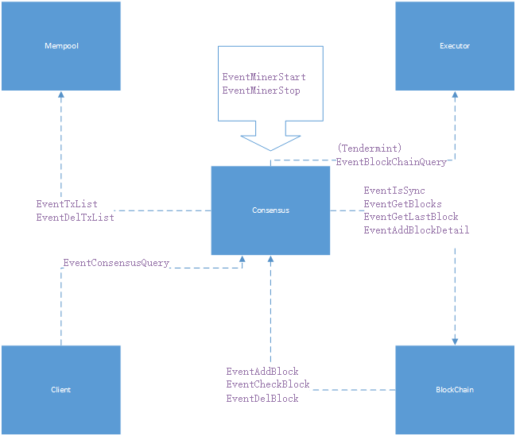
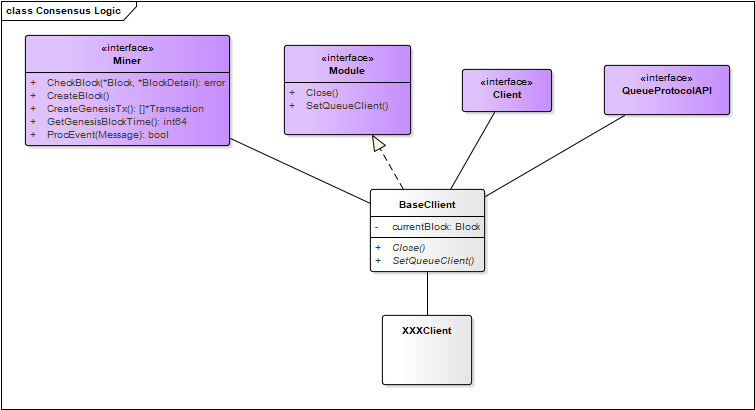

# Consensus Module
>Consensus module is a module to realize the consensus mechanism of blockchain, which is an important component of blockchain technology. 

## 模块介绍

共识模块是实现区块链共识机制的模块，是区块链技术中最重要的组件，区块链共识机制的目的是通过共识算法使得区块链网络中的所有节点对哪个节点生成新区块达成一致，从而保证整个系统的区块状态一致。

比特元主网的共识算法为SPOS，一种支持上万人一起挖矿做共识的安全POS算法。在比特元生态中的平行公链也可拥有各自独立的前置共识，采用强 一致性的拜占庭共识算法，并且引入了DPOS投票权的概念，超级节点必须将 交易信息打包进区块，然后把区块信息广播给其他节点，将交易信息储存在区块上，发挥共同治理社区的功能。

Currently, the consensus mechanism of blockchain can be roughly divided into PoW (Proof of Work) and PoS (Proof of Stack), DPoS (Delegated Proof) and distributed consistency algorithm.

## Consensus Module Structure


The consensus module is a bridge connecting the transaction and the block, and its role is mainly reflected in promoting the production of the block. All events emitted by the consensus module try to achieve this goal.

To achieve this goal, the process is divided into the following steps:

1. Synchronize block height: by sending EventIsSync event to Blockchain module, find out whether the current block height is consistent with the main chain height. If so, it can participate in the consensus process of new block. Otherwise, continue to wait for synchronization to the latest height.
2. Get transaction: get the transactions that need to be packaged into the block by sending an EventTxList event to the Mempool module.
3. Transaction consensus: validate the transactions to be packaged and determine which node is responsible for generating the new block.
4. Generate a new block: triggered by sending an EventAddBlockDetail event to the Blockchain module.
5. Remove the error transaction: triggered by sending an EventDelTxList event to the Mempool module.

<font color=red>caution</font>

- except EventBlockChainQuery event, this event in this module only relates to the dynamic adding and removing the Validator node in Tendermint consensus.
- EventGetBlocks用于向Blockchain模块获取指定高度范围的区块，EvEventGetBlocks is used to get blocks from Blockchain module with a specified height range, EventGetLastBlock event is used to get the latest block from Blockchain module.

## The internal logic of the consensus module ##



As shown in the figure above, the Consensus module implements the main logical functions: `Miner()` and `Module()`.

## Process Logic

### Module Interface

```go
// Module be used for module interface
type Module interface {
    //Load the Consensus module
    SetQueueClient(client Client)
    //Close the Consensus module and complete the cleanup
    Close()
}
```

The parameter Client of `SetQueueClient` interface implements the message queue Client interface. The main functions are as follows:

- Set up the message queue Client
- Initialize the local block
- Subscribe to the message and start the message loop
- Start the consensus process

### Minner Interface

```go
type Miner interface {
    //Create the transactions contained in the genesis block
    CreateGenesisTx() []*types.Transaction
    //Get the genesis block time
    GetGenesisBlockTime() int64
    //Get the transaction, package it to a new block
    CreateBlock()
    //Check the validity of the current block by comparing the parent block with the current block
    CheckBlock(parent *types.Block, current *types.BlockDetail) error
    //Handling customized events: handles customized events except those handled by BaseClient
    //* Note: if you do not need to handle customized events, return false directly. Return true on successful event processing.*
    ProcEvent(msg queue.Message) bool
}
```

## Secondary Development

To introduce the secondary development process of consensus module, assume that a blockchain network with constant number of nodes adopts the following consensus rules:


1. The configuration entry for each node contains the `NodeId` configuration, which is used to configure the unique number of the node, incrementing from 0 by 1 at a time.
2. The `NodeCount` configuration is contained in the configuration entry for each node to configure the total number of nodes in the network, all of which must have the same value.
3. If the MOD value of the height and the number of nodes are the same as the number of a certain node, this node will be chosen to generate the new block.

> Name the consensus rule NumberDecide.

### Overall Introduction

The secondary development directory of the consensus module is mainly under the `plugin/consensus` directory. Create numberdecide folder under that directory, and create numberdecide.go and numberdecide_test.go files under that folder.

### Architectural Definition

```go
type subConfig struct {
    //Genesis address
    Genesis                   string  `json:"genesis"`
    //Genesis block time
    GenesisBlockTime          int64   `json:"genesisBlockTime"`
    //NodeID
    NodeId                    int64   `json:"nodeId"`
    //Node information (IP, port number)
    Nodes                     []string   `json:"nodes"`
}
```

> Define the consensus module child configuration structure for obtaining configuration information from configuration files. The genesis address and genesis block time are used in the `CreateGenesisTx()` and `GetGenesisBlockTime()` of the Miner interface, either using the configuration in the consensus configuration or by adding a configuration to a child configuration, which is recommended.

```go
type Client struct {
    //pointer to a parent object
    *drivers.BaseClient
    //child config
    subcfg    *subConfig
}
```

> Define the Client structure that implements the Module interface.

### Configuration

- Modify the configuration file chain33.toml.
```
//modify name key in the [consensus] as “numberdecide”.
[consensus]
name=”numberdecide”
genesisBlockTime=1514533394
genesis=”14KEKbYtKKQm4wMthSK9J4La4nAiidGozt”

[consensus.sub.numberdecide]
genesis=”14KEKbYtKKQm4wMthSK9J4La4nAiidGozt”
genesisBlockTime=1514534444
nodeId=0
nodes=[“10.0.0.2:20181”,”10.0.0.3:20180”,”10.0.0.4:20180”,”10.0.0.5:20180”]
```

- Add the `init()` function to `numberdecide.go`, add the numberdecide directory to init.go in the init folder.

numberdecide.go

```go
func init() {
	drivers.Reg("numberdecide", New)
	drivers.QueryData.Register("numberdecide", &Client{})
}
func New(cfg *types.Consensus, sub []byte) queue.Module {
	c := drivers.NewBaseClient(cfg)
	var subcfg subConfig
	if sub != nil {
		types.MustDecode(sub, &subcfg)
	}
	client := &Client{c, &subcfg}
	c.SetChild(client)
	return client
}
```

init.go

```go
import (
    _ "github.com/33cn/plugin/plugin/consensus/para"
    _ "github.com/33cn/plugin/plugin/consensus/pbft"
    _ "github.com/33cn/plugin/plugin/consensus/raft"
    _ "github.com/33cn/plugin/plugin/consensus/tendermint"
    _ "github.com/33cn/plugin/plugin/consensus/ticket"
    //Add numberdecide directory
    _ "github.com/33cn/plugin/plugin/consensus/numberdecide"
)
```

### Implement Module Interface

```go
func (bc *Client) SetQueueClient(c queue.Client) {
    bc.InitClient(c, func() {
        //call init block
        bc.InitBlock()
    })
    go bc.EventLoop()
    //Start the consensus
    go bc.startConsensus()
}
func (client *Client) Close() {
    //Turn off the listening service and clear the associated storage
    slog.Info("consensus numberdecide closed")
}
func (client *Client) startConsensus() {
    client.connectNodes()
    client.CreateBlock()
}
func (client *Client) connectNodes() {
    //Create TCP services and listen to connections from other nodes
    go client.listenRoutine()
    for {
        //Connect the nodes in the configuration file
        for i:=0; i<len(client.subcfg.Nodes); i++ {
            //Skip if node IP is already connected
            //if ... {
            //    continue
            //} else {
            // Connect the node actively
            //}
        }
        //Return if all nodes are connected
        //if ... {
        //    return
        //}
        time.Sleep(time.Second)
    }
}
func (client *Client) listenRoutine() {
    //Start listening and processing connections to get nodeID and node
}
```

### Implement Miner Interface

```go
func (client *Client) CreateBlock() {
    issleep := true
    for {
        if !client.IsMining() || !client.IsCaughtUp() {
            time.Sleep(time.Second)
            continue
        }
        if issleep {
            time.Sleep(time.Second)
        }
        ...
        //Determine whether the mod value of the height and the number of nodes is equal to the ID of this node. If it is equal, package it; otherwise, do not package it and wait for the broadcast height update
        if (lastBlock.Height + 1) % int64(len(client.subcfg.Nodes)) == client.subcfg.NodeId {
            err := client.WriteBlock(lastBlock.StateHash, &newblock)
            //Determine if a transaction has been deleted and such transactions are to be deleted from the mempool
            if err != nil {
                issleep = true
                continue
            }
        } else {
            //Check if the height has been updated
            //client.checkHeightUpdate()
        }
    }
}
```
