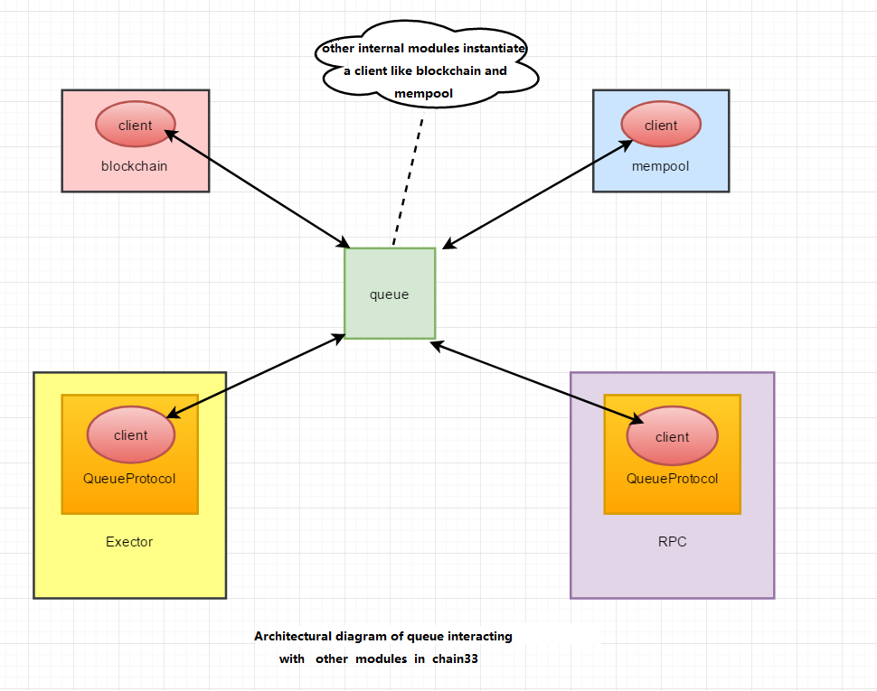

# Queue Module

##  Module Introduction
As the name implies, Queue Module implements the message queue function.

The main purpose is to reduce the coupling of the individual modules in Chain33. Queue Module was introduced so that each Module is relatively independent and the communication between modules is not through interface calls but messages.This is also convenient for us to break up Chain33 by module in the future, paving the way for micro-service of the later modules.

##  Queue module interaction



caution: 


- In Chain33, the system instantiates only one queue, and each module instantiates a queue.client.
- One queue can correspond to multiple subscription topics, which means that a queue can instantiate multiple queue.clients.
- One queue.client can only correspond to one subscription topic.
- Exector and RPC modules all instantiate an additional QueueProtocol respectively.


## data structure of Queue and Client

Three main data structures are defined in queue, queue, client, Message. Their data structures and interfaces are described below.

### data structure and Interface of Queue

The implementation of queue is mainly made use of the attributes of channel in the go language, using the cache channel feature “first in first out”.Defined chanSub defining channels, one subscription topic for one chanSub.

```go
// queue data structure
type queue struct {
    chanSubs map[string]*chanSub   // Channels subscribed in queue, key = subscription name，value is the subscription channel
    mu       sync.Mutex            // synchronized lock
    done     chan struct{}         // closure notification
    interupt chan struct{}         // When a program is interrupted, such as in Linux using CTRL +c to end the program, interupt will be triggered to close the queue
    isClose  int32                 // queue status, 1 is off
    name     string                // queue name
}
```

The queue interface is relatively simple, but the major point is the client() method, and everything else is executed as a client
Queue is a one-to-many relationship with client.

```go
// queue interface
type Queue interface {
    Close()                       // close queue
    Start()                       // start
    Client() Client               // Get the client of the queue, In chain33, all msg's send and receive are called by client.
    Name() string                 // get queue name
}
```

### ChanSub Channel Subscribing and Message
We set up synchronous and asynchronous channels based on the size of the channel cache in ChanSub Data processing has the highest priority in the synchronization channel.                                                                                                                                                                                                                                                                                                                                                                                                                                                                  

```go
// chanSub data structure
type chanSub struct {
    high    chan Message          // Synchronizes channels, default cache size 64
    low     chan Message          // Asynchronous processing channels, default cache size 40960
    isClose int32                 // Subscription channel status, 1 is closed
}
```

Here we’ve defined MSG, and we’ve cleverly used the channel property.
Return response data through the chReply response channel.

```go
// Message data structure
type Message struct {
    Topic   string                // topic, that is to whom
    Ty      int64                 // message type
    Id      int64                 // self-growing ID, each MSG has a unique ID corresponding to itself in the same queue
    Data    interface{}           // message data
    chReply chan Message          // msg response channel, which returns data about the receiver's response, makes some clever use of chan-specific properties
}
```

### Client Data Structure and Interface

All msg “send” and “receive” in the queue are sent through the client

```go
// Client data structure
type client struct {
    q          *queue             // queue instances
    recv       chan Message       // receive msg channel with default buffer of 5
    done       chan struct{}      // notify client to close
    wg         *sync.WaitGroup    // synchronization waiting
    topic      string             // subscription topic
    isClosed   int32              // client status, 1 is off
    isCloseing int32              // 1 indicates the client state is closed
}
```

Client implements the following methods to construct Msg, send, wait, Recv, etc.

```go
// Client interface
type Client interface {
    Send(msg Message, waitReply bool) (err error)                               //send message, the default main network timeout is 10 minutes
    SendTimeout(msg Message, waitReply bool, timeout time.Duration) (err error) //send message, customize the timeout
    Wait(msg Message) (Message, error)                                          //wait for the message processing to complete, the default main network timeout is 10 minutes
    WaitTimeout(msg Message, timeout time.Duration) (Message, error)            //wait for the message processing to complete, customize the timeout
    Recv() chan Message                                                         //get client receive message channel
    Sub(topic string)                                                           //subscribe message
    Close()                                                                     //close client
    CloseQueue() (*types.Reply, error)                                          //close queue
    NewMessage(topic string, ty int64, data interface{}) (msg Message)          //new one msg
}
```


### Module Interface

All modules implement Module interfaces in Chain33.
The main function of `SetQueueClient()` method is to set up subscription topics, process your own subscribed Msg according to the business and return it.

```go
// Module be used for module interface
type Module interface {
    SetQueueClient(client Client) //All modules will implement this interface, where the corresponding msg will be specifically processed
}
```


## Use of Queue in Chain33
The entire process will be presented in pseudo-code form with the code from chain33


### Initialize Queue, Assign Values, Start

```go
func main(){
    ......
    log.Info("loading queue")
    q := queue.New("channel")        //Instantiate a queue named channel
    log.Info("loading blockchain module")
    chain := blockchain.New(cfg.BlockChain)
    chain.SetQueueClient(q.Client()) //Pass q.cilient (), to SetQueueClient() is the actual processing logic for each module
    ......
    //jsonrpc, grpc, channel: three patterns
    rpcapi := rpc.New(cfg.Rpc)
    rpcapi.SetQueueClient(q.Client()) //Assign client to rpcapi
    ......
    q.Start()                        //start queue
}
```

### Implement Module Interface for Specific Business Processing

Here take the blockchain module as an example to how to handle msg received.

The method of blockchain to implement the SetQueueClient

```go
func (chain *BlockChain) SetQueueClient(client queue.Client) {
    chain.client = client
    chain.client.Sub("blockchain")  // the client will only receive messages whose topic is blockchain after setting up a subscription topic
    ......
    go chain.ProcRecvMsg()          //do something specific of received messages
}
```

blockchain processes receiving msg:

```go
//message reception processing for blockchain module
func (chain *BlockChain) ProcRecvMsg() {
    defer chain.recvwg.Done()
    reqnum := make(chan struct{}, 1000)  //flow control is done here, and the maximum processing is 1000 msg at one time
    for msg := range chain.client.Recv() { //take msg from the client
        chainlog.Debug("blockchain recv", "msg", types.GetEventName(int(msg.Ty)), "id", msg.Id, "cap", len(reqnum))
        msgtype := msg.Ty
        reqnum <- struct{}{}
        atomic.AddInt32(&chain.runcount, 1)
        switch msgtype {
        case types.EventLocalGet:
            go chain.processMsg(msg, reqnum, chain.localGet) // general approach to msg in blockchain
        ......
    }
}
```
The processMsg method processes the logic and calls the incoming func

```go
// processMsg
func (chain *BlockChain) processMsg(msg queue.Message, reqnum chan struct{}, cb funcProcess) {
    beg := types.Now()
    defer func() {
        <-reqnum 
        atomic.AddInt32(&chain.runcount, -1) //After processing one msg, the runcount counter is reduced by one
        chainlog.Debug("process", "cost", types.Since(beg), "msg", types.GetEventName(int(msg.Ty)))
    }()
    cb(msg) //Call the incoming function
}
```

The corresponding func is triggered based on the message type, in this case is the localGet method

```go
// localGet
func (chain *BlockChain) localGet(msg queue.Message) {
	keys := (msg.Data).(*types.LocalDBGet)
	values := chain.blockStore.Get(keys)
	msg.Reply(chain.client.NewMessage("rpc", types.EventLocalReplyValue, values))
}
```
Return the processed result

```go
// Reply method in Message
func (msg Message) Reply(replyMsg Message) {
    if msg.chReply == nil {
        qlog.Debug("reply a empty chreply", "msg", msg)
        return
    }
    msg.chReply <- replyMsg  //Plug replyMsg into the chReply channel of the msg receiving
    qlog.Debug("reply msg ok", "msg", msg)
}
```

### QueueProtocol Make Secondary Packaging to Client to Satisfy the External Call

From the above we can know that msg send and receive both need to go through the client of queue
In the internal modules of the system, such as block,mempool,consensus, etc., you can directly call the `client.send()` method. But if I’m outside the system, how do I call it? Let’s learn about the QueueProtocol first.

#### QueueProtocol Data Structure

QueueProtocol data structure, here is to wrap queue.client so that it can communicate with other modules without setting up subscription topics.

```go
// QueueProtocol data structure
type QueueProtocolOption struct {
    // request sending timeout
    SendTimeout time.Duration
    // Receiving and replying timeout
    WaitTimeout time.Duration
}
// Message channel protocol implementation
type QueueProtocol struct {
    // message queue
    client queue.Client
    option QueueProtocolOption
}
```

#### QueueProtocol Instantiation in RPC and Executor

Call it by instantiating the QueueProtocol.
A QueueProtocol object is instantiated here, `client.New(q.Client(), nil)`, jsonRPC and gRPC Share this QueueProtocol

The method of RPC module to implement the SetQueueClient

```go
// Rpc implements the Module interface
func (r *RPC) SetQueueClient(c queue.Client) {
    gapi := NewGRpcServer(c)
    japi := NewJSONRPCServer(c)
    r.gapi = gapi
    r.japi = japi
    r.c = c
    //Registration system RPC
    pluginmgr.AddRPC(r)
    go gapi.Listen()
    go japi.Listen()
}
```
The executor module also instantiates a QueueProtocol

```go
func (exec *Executor) SetQueueClient(qcli queue.Client) {
    exec.client = qcli
    exec.client.Sub("execs")
    var err error
    exec.qclient, err = client.New(qcli, nil)  //The executor module also instantiates a QueueProtocol
    if err != nil {
        panic(err)
    }
    //recv massage processing
    go func() {
        for msg := range exec.client.Recv() {
        .....
    }()
}
```

#### QueueProtocolAPI Interface Implemented by the QueueProtocolAPI

The QueueProtocolAPI defines and implements a few API methods to be used by other modules, primarily by converting the API method’s incoming parameters to the appropriate msg to be sent, receiving and processing the returned msg, and then converting MSG back to data structure required by API method.

```go
// Message channel interaction API interface definition
type QueueProtocolAPI interface {
    ......
    // +++++++++++++++ consensus interfaces begin
    // types.EventGetTicketCount
    GetTicketCount() (*types.Int64, error)
    // --------------- consensus interfaces end
    // +++++++++++++++ wallet interfaces begin
    // types.EventLocalGet
    LocalGet(param *types.LocalDBGet) (*types.LocalReplyValue, error)
    // types.EventLocalList
    ......
}
```

Here takes the LocalGet() as an example to show how to convert parameters to msg for processing

Call the LocalGet() method in QueueProtocol to trigger MSG that sends types.eventlocalget type to blockchain.

The LocalGet method triggers the query method

```go
func (q *QueueProtocol) LocalGet(param *types.LocalDBGet) (*types.LocalReplyValue, error) {
    ......
    msg, err := q.query(blockchainKey, types.EventLocalGet, param)  //Common query method of the QueueProtocol module
    if err != nil {
        log.Error("LocalGet", "Error", err.Error())
        return nil, err
    }
    if reply, ok := msg.GetData().(*types.LocalReplyValue); ok { 
        return reply, nil
    }
    ......
    return nil, types.ErrTypeAsset
}
```

Method “query” is to wrap related param into Msg and send it to the corresponding module.

```go
func (q *QueueProtocol) query(topic string, ty int64, data interface{}) (queue.Message, error) {
    client := q.client
    msg := client.NewMessage(topic, ty, data) //Convert the relevant parameters to msg
    var trace *tlog.TraceInfo
    if tlog.TraceOn() {
        if item, ok := data.(*types.Transaction); ok {
            trace = tlog.CreateTraceMsg(msg.Id, ty, hex.EncodeToString(item.Hash()), tlog.MsgCreate, tlog.RpcKey, "query")
            if trace != nil {
                trace.Begin()
            }
        }
    }
    err := client.SendTimeout(msg, true, q.option.SendTimeout) //synchronous sending
    if err != nil {
        if trace != nil {
            trace.Error(err)
        }
        return queue.Message{}, err
    }
    msg, errR := client.WaitTimeout(msg, q.option.WaitTimeout) //Wait for response after msg processed
    if trace != nil {
        trace.UpdateState(tlog.MsgProcessed)
        if errR != nil {
            trace.Error(errR)
        } else {
            trace.End()
        }
    }
    return msg, errR
}
```
WaitTimeout method in client, wait for MSG response results.

```go
// waitTimeout method in client
func (client *client) WaitTimeout(msg Message, timeout time.Duration) (Message, error) {
    if msg.chReply == nil {
        return Message{}, errors.New("empty wait channel")
    }
    t := time.NewTimer(timeout)
    defer t.Stop()
    select {
    case msg = <-msg.chReply:  //Reschedule the original msg from the chReply response channel
        return msg, msg.Err()
    case <-client.done:
        return Message{}, errors.New("client is closed")
    case <-t.C:
        return Message{}, types.ErrTimeout   //If timeout, a timeout error will be returned
    }
}
```
