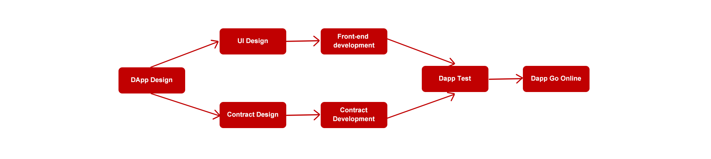
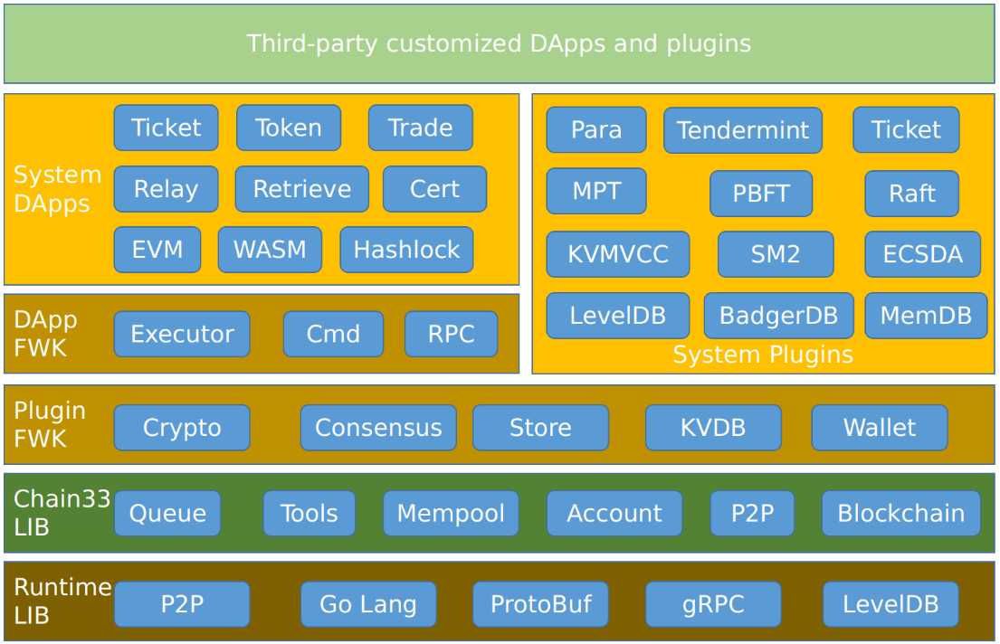

# Introduction to DApp Development
>去中心化应用（DAPP）是在去中心化网络上构建的应用程序，是相对于传统中心化应用的一种叫法。传统中心化应用部署在中心化的服务器上，数据由一家公司或机构拥有；去中心化应用运行在去中心化的区块链网络上，数据不受任何人控制，无法删除与篡改。
## DApp Design and Development
A typical DApp consists of the following:

- **Front End：**

    The client can be a mobile App, a webpage, or even a command line. Generally, it is the RPC service interface directly connected to the blockchain node.

- **Server(optional):**

    Similar to the service node of centralized application, it mainly encapsulates DApp’s own service interface, with the lower layer docking blockchain and the upper layer docking client.

- **Blockchain End:**

    Conventional blockchain nodes provide blockchain operation interface services to the front end or service end, such as sending transactions, query results and other actions.

**A Normal DApp Development Process is Shown in the Figure Below:**

In fact, it mainly includes the development of front-end and contract. The contract is deployed on the blockchain network, which is the main execution logic of DApp and the front-end is the user interface.

Even if the front end is not used, the command line interface of blockchain can still call the contract and realize the complete logic of DApp. However, the threshold for users is too high, so generally, formal DApp will provide the front end.

## Development of DApp in Chain33

Chain33 was designed as a highly extensible blockchain development platform that supports extension customization except very little inherent core logic.The expansion capability of the system can be divided into two major categories:

**The first category is the expansion and customization of system capabilities:**

    Chain33 provides the underlying plug-in management mechanism, basically all the capabilities of the system exist as a plug-in, the plug-in implementation can be replaced,Developers can use the system plugins provided by the system itself, or they can develop new functional plugins. These plugins' capabilities cover everything from encryption and decryption, consensus, storage, wallet, executor, command line, etc.

**The second category is the development of extended applications:**

    Chain33 also provides a separate framework for DApp, based on the plug-in mechanism, to facilitate DApp development by focusing developers on the core contract logic (that is, the executor logic) and adding RPC interfaces and command-line interfaces (the latter two are not required).

Check the position of DApp in the system of Chain33:

As shown in the upper left part of the figure above, Chain33 provides the DApp Framework with three elements: the executor, the command line, and RPC, where the executor is the contract logic of the DApp.

The command line provides command wrappers from the command line, which is optional.

RPC is the unique external service interface of packaging DApp.In general, Chain33 framework provides common interfaces for creating, sending, query. DApp can also develop its own RPC interface for special needs.

