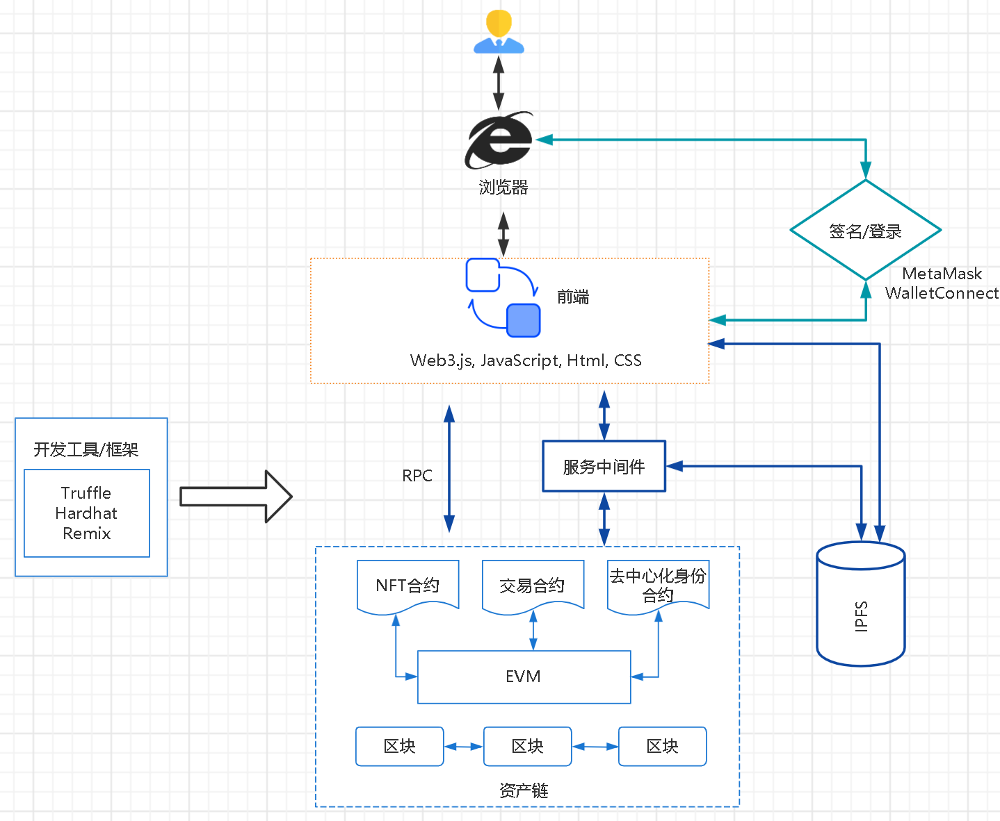

# 兼容以太坊 EVM

> Chain33 全面兼容以太坊，支持以太坊格式的地址，以太坊的签名方式， 可以通过 web3.js 库同 Chain33 节点进行交易，同太坊生态的开发者可以无缝对接。
> 区块链为 WEB3.0 应用开启了一个全新的方向，WEB3.0 消除了中间商的概念，无需数据库存储应用 APP 的状态，也不需要中心化的网络服务器来存储核心后端逻辑。 以下是一个基于 Chain33 的 WEB3 的 DAPP 架构图。

1. 前端定义了用户界面逻辑，前端会与智能合约中定义的应用逻辑进行交互。前端和区块链之间通过 JSON-RPC 通信。

2. Chain33 上的用户可以通过 MetaMask 或 WalletConnect 来管理自己的私钥和交易签名， 当需要用户签署交易来登录平台或发送交易时，就会调用 MetaMask 或使用 WallectConnect 来签署。

3. 为了节约区块链的存储成本，对于大文件（图片，音频，视频）采用分散的链外存储解决方案，如 IPFS。

4. 通过 web3.js 库来查询和监听智能合约事件。可以监听特定的事件，并在每次事件被触发时指定一个回调，来实现前端和区块链智能合约间的事件交互。

5. 智能合约完全兼容以太坊虚拟机（EVM）,支持以太坊（或以太坊生态）链上的合约无缝移植。

6. 支持使用以太坊生态的工具在 Chain33 上开发，比如可以通过 HardHat,truffle，remix 等开发框架或工具更容易建立，部署和测试智能合约。
