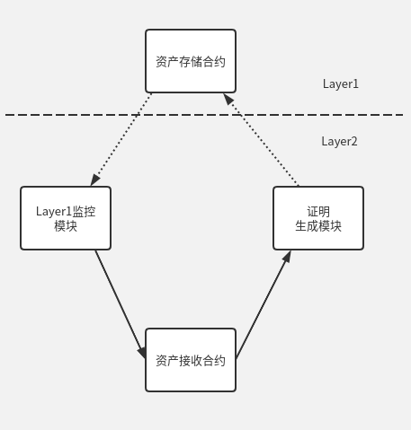
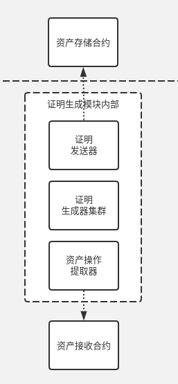

# 零知识证明

> 方案采用 ZKSync 方案来实现跨链和资产转移。整体结构如下图, 包括下面四个模块： 资产存储合约， 资产接收合约 ，Layer1 监控模块 ， 证明生成模块。方案中， 资产所在链称为 Layer1， 资产接收链和跨链模块统称为 Layer2。

## 模块功能介绍

### 1.资产存储合约

部署 Layer1 的智能合约, 用来记录转出到 Layer2 资产。

### 2.资产接收合约

部署 Layer2 的区块链上的智能合约，用来接收 Layer1 转出的资产, 以及在 Layer2 上资产移交等操作记录。

### 3.跨链模块

-   Layer1 监控模块: 监控 Layer1 资产存入资产存储合约的交易, 并在 Layer2 发起资产存入资产接收合约的交易。
-   证明生成模块: 监控 Layer2 上资产接收合约中资产的所有操作交易， 并使用零知识证明算法生成压缩后的证明数据，将压缩后的证明数据提交到 Layer1 的资产存储合约。即同步 Layer2 资产状态到 Layer1 的资产存储合约。

### 4.资产存储合约

-   合约事件， 实现资产的存入和转出。
-   合约事件， 验证跨链模块提交的证明，并更新资产状态。
-   合约事件， 实现在 Layer2 异常情况下， 支持强制取回 Layer2 的资产。
-   合约对接， 实现和资产合约对接。

### 5.资产接收合约

-   合约事件，实现接收 Layer1 资产存入。
-   合约事件，实现将资产取回到 Layer1。
-   合约对接，授权业务合约对资产进行处理。

### 6.Layer1 监控模块

-   集成 Layer1 区块链，通过配置管理 Layer1 上对接的资产存储合约。
-   事件处理，监控 Layer1 的资产存储合约的资产的操作，生产 Layer2 的资产接收合约的交易， 并监控其交易被正确执行。

### 7.证明生成模块

-   零知识证明计算量大，证明生成模块将被分为三个子模块， 资产操作提取器， 证明生成器， 证明发送器。
-   资产操作提取器从 Layer2 区块链上提取的资产接收合约中资产相关的操作， 并将其处理成证明生成器接收的数据格式， 发送到证明生成器集群。
-   证明生成器由于计算量大， 设计成集群， 他接收资产操作提取器发送的数据，进行链下的零知识证明验证， 并生产证明， 生产适合资产存储合约进行链上验证的数据。并将数据发送到证明发送器。
-   证明发送器接收证明生成器集群生成的验证数据， 以交易的形式将数据提交到 Layer1 的 资产存储合约中。
