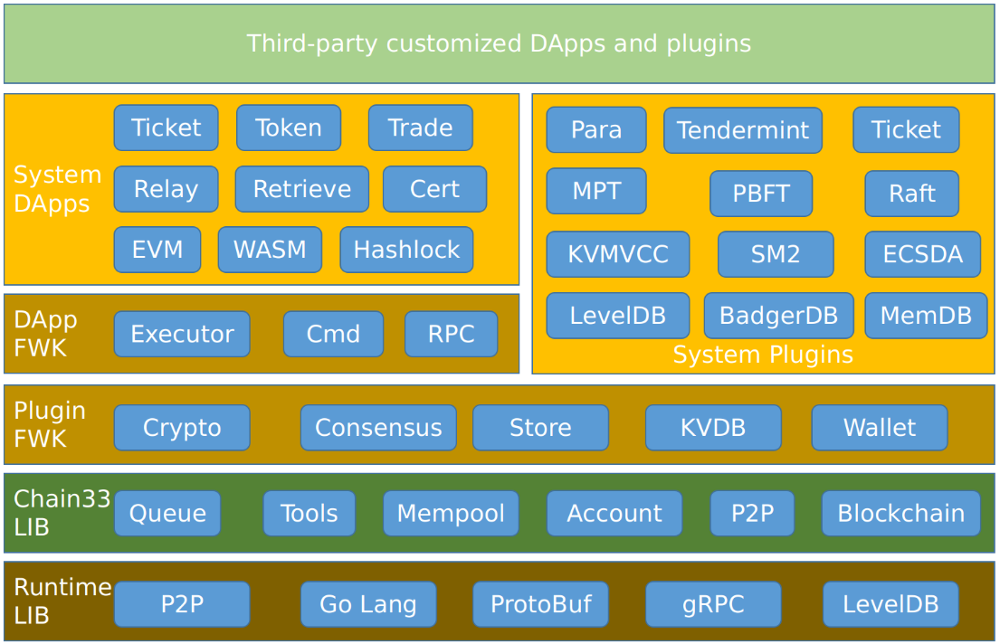

# DAPP 开发介绍

> 去中心化应用（DAPP）是在去中心化网络上构建的应用程序，是相对于传统中心化应用的一种叫法。传统中心化应用部署在中心化的服务器上，数据由一家公司或机构拥有；去中心化应用运行在去中心化的区块链网络上，数据不受任何人控制，无法删除与篡改。

## DApp 设计及开发

一个典型的 DApp 组成如下：

-   **前端：**

    用户端，可以是手机端 App，也可以是网页，甚至可以是命令行，一般是直连区块链节点的 RPC 服务接口。

-   **服务端（可选）：**

    类似中心化应用的服务节点，这里主要是封装 DApp 自己的服务接口，下层对接区块链，上层对接用户端，为了更好的用户体验，也可能会做一些数据状态缓存。

-   **区块链端：**

    常规区块链节点，对前端或服务端提供区块链的操作接口服务，如发送交易、调用合约、查询结果等动作。

**一个常规的 DApp 开发流程如下图所示：**

其实主要是包含前端和合约两部分内容的开发，合约最终是部署在区块链网络上的，为 DApp 的主要执行逻辑，前端为用户交互界面。

即使不用前端，使用区块链的命令行接口依然可以调用合约，实现 DApp 的完整逻辑，但是用户门槛太高，所以，一般正式的 DApp 都会提供前端。

## Chain33 中 DApp 的开发

Chain33 是一个支持高度扩展的区块链开发平台，除了极少部分固有核心逻辑外，基本全部支持扩展定制；系统的扩展能力主要可以划分为两大类：

**一类是对系统能力的扩充定制：**

    Chain33提供了底层的插件管理机制，基本上系统的所有能力都是作为一个插件存在，插件的实现本身可以被替换，开发者可以使用系统自身提供的系统插件，也可以自己开发新的功能插件，这些插件的能力覆盖到加解密、共识、存储、钱包、执行器、命令行等各方面内容。

**一类是扩展应用的开发：**

    Chain33基于插件机制之上，针对DApp也单独提供了一套框架，以方便开发者进行DApp的开发，将开发者的关注重点聚焦到核心的合约逻辑（即执行器逻辑），并增加RPC接口和命令行接口的辅助（后面两者不是必需）。

可以看一下 DApp 在整个 Chain33 体系内所处的位置：

如图中左上部分所示，Chain33 提供的 DApp Framework 中包含了三个元素：执行器、命令行和 RPC，其中执行器就是 DApp 的合约逻辑；

命令行是提供命令行下的命令包装，这个一般可以不提供；

RPC 是包装 DApp 特有的对外服务接口，一般情况下 Chain33 框架提供的交易的创建、发送、查询等通用接口，如果有特殊需要，DApp 也可以在这里开发自己专用的 RPC 接口。
