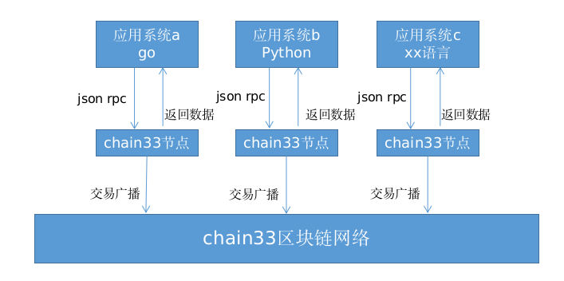

# RPC接口编程样例

>根据区块链底层Chain33的RPC接口定义，可以通过编程和区块链系统进行通信交互，提交交易、查询交易、调用智能合约和查询智能合约数据等。

本文分别针对Go语言和Python语言给出几个程序样例，用于展示如何对RPC接口进行编程。

## 准备工作  

### RPC接口编程操作区块链的说明  



需要和区块链进行交互（向区块链提交交易数据或者从区块链上查询交易信息等）的应用系统，可以使用不同的编程语言（Go、Python、C++等）进行符合rpc接口的编程，按接口定义构造json rpc请求，向比特元节点的json rpc服务端口发起请求。

比特元节点收到请求后，进行处理：  

- 如果是查询数据的请求，则从本地的区块信息、交易信息中获取相关信息，并返回给应用系统。
- 如果是提交交易的请求，则将交易信息广播到区块链网络中，被区块链网络进行共识、打包等处理，并把相关信息记录到区块链上，同时向应用系统返回交易hash，应用系统可以根据该hash查询交易的执行结果。  

### 区块链正常工作  

为了进行RPC接口编程测试，需要有一个提供json rpc接口服务的比特元节点。基于一个构建好的区块链，从中选择一个节点提供json rpc服务。  

从提供json rpc接口服务的比特元节点的配置文件chain33.toml中，可以找到如下配置项：  

```json
//[rpc]
//jrpc绑定地址
jrpcBindAddr="localhost:8801"
```

这表示该节点以ip地址：localhost和端口：8801对外提供json rpc服务。  
应用系统用不同语言编写的调用json rpc接口的程序可以向该ip和端口发起json rpc调用。  

### 3. 开发环境具备    
- 如果用go语言开发，则需要准备好go语言开发环境。
- 如果用python语言开发，则需要准备好python语言开发环境。  

## Chain33 RPC接口的Go语言编程样例

### go语言编程样例1：在不同账户间转账交易

将下列go代码保存到transfer.go文件中：  

```go
package main
import (
    "bytes"
    "encoding/json"
    "fmt"
    "io/ioutil"
    "net/http"
    "os"
    "strings"
    "strconv"
)
var (
    Jrpc_Url = "http://127.0.0.1:8801"   //对应于chain33.toml中的配置jrpcBindAddr
)
func main() {
    if len(os.Args) < 5 {
        return
    }
    amount, _ := strconv.Atoi(os.Args[4])
    transfer(os.Args[1], os.Args[2], os.Args[3], amount)
}
//获得json rpc服务的url信息
func getJrpc() string {
    return Jrpc_Url
}
//格式化打印json结构
func printJson(data []byte) {
    var str bytes.Buffer
    _ = json.Indent(&str, []byte(data), "", "    ")
    fmt.Println(str.String())
}
//解析JSON响应，获得result字段或错误信息
func parseJsonResult(data []byte)(string, error){
    var txdata = make(map[string]interface{})
    err := json.Unmarshal(data, &txdata)
    if err != nil {
        fmt.Println("err:", err.Error())
        return "", err
    }
    if hextx, ok := txdata["result"]; ok {
        return hextx.(string), nil
    }
    return "", fmt.Errorf("not have result!")
}
//创建原始交易
func createRawTx(toAddr string, amount int)(string, error){
    //按照“RPC接口>系统接口>交易接口”中的“构造交易 CreateRawTransaction”定义，来构造JSON RPC消息内容
    poststr := fmt.Sprintf(`{"jsonrpc":"2.0","id":0,"method":"Chain33.CreateRawTransaction","params":[{"to":"%v","amount":%v, "fee":2000000,"note":"transfer", "isToken":false}]}`,toAddr, amount)
    fmt.Println("---create tx request:")
    printJson([]byte(poststr))
    return constructTx(poststr)
}
//向比特元节点调用JSON RPC接口，构造交易。
func constructTx(poststr string) (string, error) {
    resp, err := http.Post(getJrpc(), "application/json", bytes.NewBufferString(poststr))
    if err != nil {
        panic(err)
    }
    defer resp.Body.Close()
    data, err := ioutil.ReadAll(resp.Body)
    if err != nil {
        panic(err)
    }
    fmt.Println("---create tx response:")
    printJson(data)
    return parseJsonResult(data)
}
//对原始交易，使用地址及私钥进行签名，得到签名后的交易。
func SignRawTx(rawTx, addr, privKey, expire string, index int32) (string, error) {
    client := http.DefaultClient
    //按照“RPC接口>系统接口>交易接口”中的“交易签名 SignRawTx”定义，来构造JSON RPC消息内容
    postdata := fmt.Sprintf(`{"jsonrpc":"2.0","id":1,"method":"Chain33.SignRawTx",
"params":[{"addr":"%v","privKey":"%v","txHex":"%v","expire":"%v","index":%v,"model":%v}]}`, addr, privKey, rawTx, expire, index, 0)
    //向比特元节点调用JSON RPC接口，签名交易。
    req, err := http.NewRequest("post", getJrpc(), strings.NewReader(postdata))
    if err != nil {
        fmt.Println("err:", err.Error())
        return "", err
    }
    fmt.Println("---sign tx request:")
    printJson([]byte(postdata))
    resp, err := client.Do(req)
    if err != nil {
        fmt.Println("err:", err.Error())
        return "", err
    }
    defer resp.Body.Close()
    data, err := ioutil.ReadAll(resp.Body)
    if err != nil {
        fmt.Println("err:", err.Error())
        return "", err
    }
    fmt.Println("---sign tx response:")
    printJson(data)
    return parseJsonResult(data)
}
//向区块链提交交易
func SendTx(hexTx string) {
    //按照“RPC接口>系统接口>交易接口”中的“发送交易 SendTransaction”定义，来构造JSON RPC消息内容
    poststr := fmt.Sprintf(`{"jsonrpc":"2.0","id":2,"method":"Chain33.SendTransaction","params":[{"data":"%v"}]}`, hexTx)
    fmt.Println("---send tx request:")
    printJson([]byte(poststr))
    //向比特元节点调用JSON RPC接口，发送交易。交易将被提交到区块链网络中。
    resp, err := http.Post(getJrpc(), "application/json", bytes.NewBufferString(poststr))
    if err != nil {
        panic(err)
    }
    defer resp.Body.Close()
    b, err := ioutil.ReadAll(resp.Body)
    if err != nil {
        panic(err)
    }
    //结果中包括本交易的hash值，后续可以根据该值查询交易详情。    
    fmt.Print("---send tx response:")
    printJson(b)
}
//从一个地址转账到另一个地址
func transfer(fromAddr, toAddr, privKey string, amount int) {
    hexCreateTx, err := createRawTx(toAddr, amount)  //构造原始交易。
    fmt.Println("---created tx:")
    fmt.Println(hexCreateTx)
    if err != nil {
        fmt.Println("testCreateGuess have a err:", err.Error())
        return
    }
    hexTx, err := SignRawTx(hexCreateTx, fromAddr, privKey, "3600s", 0)  //签名交易。
    if err != nil {
        fmt.Println("SignRawTx have a err:", err.Error())
        return
    }
    SendTx(hexTx)  //发送交易。
}
```

从代码中可以清楚的看到如何构造json rpc接口参数。 
 
从命令行对该文件进行编译：  

```json
go build transfer.go
```

得到执行程序：`transfer` 
使用该执行程序进行转账操作：  

```json
./transfer 1CbEVT9RnM5oZhWMj4fxUrJX94VtRotzvs 1QJ6WX4W8o8UhVwEapis1P4wyoB9PrD4Nx 3990969DF92A5914F7B71EEB9A4E58D6E255F32BF042FEA5318FC8B3D50EE6E8 1
```

其中参数`1CbEVT9RnM5oZhWMj4fxUrJX94VtRotzvs`为转出账户地址，`1QJ6WX4W8o8UhVwEapis1P4wyoB9PrD4Nx`为转入账户地址，`3990969DF92A5914F7B71EEB9A4E58D6E255F32BF042FEA5318FC8B3D50EE6E8`为转出账户地址私钥，可根据具体情况调整。  

得到类似如下结果，能清楚得看到JSON RPC的交互过程及相关数据：  

```json
---create tx request:
{
    "jsonrpc": "2.0",
    "id": 0,
    "method": "Chain33.CreateRawTransaction",
    "params": [
        {
            "to": "1QJ6WX4W8o8UhVwEapis1P4wyoB9PrD4Nx",
            "amount": 1,
            "fee": 2000000,
            "note": "transfer",
            "isToken": false
        }
    ]
}
---create tx response:
{
    "id": 0,
    "result": "0a05636f696e73123418010a3010011a087472616e73666572222231514a3657583457386f3855685677456170697331503477796f4239507244344e782080897a308790c4eeb0e2c5ae083a2231514a3657583457386f3855685677456170697331503477796f4239507244344e78",
    "error": null
}
---created tx:
0a05636f696e73123418010a3010011a087472616e73666572222231514a3657583457386f3855685677456170697331503477796f4239507244344e782080897a308790c4eeb0e2c5ae083a2231514a3657583457386f3855685677456170697331503477796f4239507244344e78
---sign tx request:
{
    "jsonrpc": "2.0",
    "id": 1,
    "method": "Chain33.SignRawTx",
    "params": [
        {
            "addr": "1CbEVT9RnM5oZhWMj4fxUrJX94VtRotzvs",
            "privKey": "3990969DF92A5914F7B71EEB9A4E58D6E255F32BF042FEA5318FC8B3D50EE6E8",
            "txHex": "0a05636f696e73123418010a3010011a087472616e73666572222231514a3657583457386f3855685677456170697331503477796f4239507244344e782080897a308790c4eeb0e2c5ae083a2231514a3657583457386f3855685677456170697331503477796f4239507244344e78",
            "expire": "3600s",
            "index": 0,
            "model": 0
        }
    ]
}
---sign tx response:
{
    "id": 1,
    "result": "0a05636f696e73123418010a3010011a087472616e73666572222231514a3657583457386f3855685677456170697331503477796f4239507244344e781a6d080112210289af2f9d5310971242402932ab50a985a21036716a356c2419253c247d28832e1a463044022040123189cc3569ca3b9a8a477de8b2096eb6525577b033cb0bd08bf22553f512022060847165257cba672f14eb3fe8f942fbe791bcff66c28528190069ead15a6c3b20a08d0628e6c6d2f205308790c4eeb0e2c5ae083a2231514a3657583457386f3855685677456170697331503477796f4239507244344e78",
    "error": null
}
---send tx request:
{
    "jsonrpc": "2.0",
    "id": 2,
    "method": "Chain33.SendTransaction",
    "params": [
        {
            "data": "0a05636f696e73123418010a3010011a087472616e73666572222231514a3657583457386f3855685677456170697331503477796f4239507244344e781a6d080112210289af2f9d5310971242402932ab50a985a21036716a356c2419253c247d28832e1a463044022040123189cc3569ca3b9a8a477de8b2096eb6525577b033cb0bd08bf22553f512022060847165257cba672f14eb3fe8f942fbe791bcff66c28528190069ead15a6c3b20a08d0628e6c6d2f205308790c4eeb0e2c5ae083a2231514a3657583457386f3855685677456170697331503477796f4239507244344e78"
        }
    ]
}
---send tx response:{
    "id": 2,
    "result": "0xda602f79fa4ff738441d1f53f56287bff8f48e9509d51a62be91e0fa664a8ed2",
    "error": null
}
```

### go语言编程样例2：查询具体的交易信息  

将下列go代码保存到queryTx.go文件中：  

```go
package main
import (
	"bytes"
	"encoding/json"
	"fmt"
	"io/ioutil"
	"net/http"
	"os"
)
var (
	Jrpc_Url = "http://127.0.0.1:8801"    //对应于chain33.toml中的配置jrpcBindAddr
)
func main() {
	if len(os.Args) < 2 {
		return
	}
    queryTx(os.Args[1])
}
func getJrpc() string {
	return Jrpc_Url
}
//格式化打印JSON数据
func printJson(data []byte) {
    var str bytes.Buffer
    _ = json.Indent(&str, []byte(data), "", "    ")
    fmt.Println(str.String())
}
//根据交易hash查询交易详情
func queryTx(txHash string) {
    //按照“RPC接口>系统接口>交易接口”中的“根据哈希查询交易信息 QueryTransaction”定义，来构造JSON RPC消息内容
    poststr := fmt.Sprintf(`{"jsonrpc":"2.0","id":0,"method":"Chain33.QueryTransaction","params":[{"hash":"%v"}]}`, txHash)
    fmt.Println("---query tx request:")
    printJson([]byte(poststr))
    //向比特元节点调用JSON RPC接口，查询交易。
    resp, err := http.Post(getJrpc(), "application/json", bytes.NewBufferString(poststr))
	if err != nil {
		panic(err)
	}
	defer resp.Body.Close()
	data, err := ioutil.ReadAll(resp.Body)
	if err != nil {
		panic(err)
	}
    fmt.Println("---query tx response:")
    printJson(data)
}
```

从代码中可以清楚的看到如何构造json rpc接口参数。  
从命令行对该文件进行编译：  

```json
go build queryTx.go
```

得到执行程序：`queryTx` 
使用该执行程序进行转账操作：  

```json
./queryTx 0xda602f79fa4ff738441d1f53f56287bff8f48e9509d51a62be91e0fa664a8ed2
```

其中参数`0xda602f79fa4ff738441d1f53f56287bff8f48e9509d51a62be91e0fa664a8ed2`为某一个交易的hash值，可根据具体情况调整。  

得到类似如下结果，能清楚得看到JSON RPC的交互过程及相关数据：  

```json
---query tx request:
{
    "jsonrpc": "2.0",
    "id": 0,
    "method": "Chain33.QueryTransaction",
    "params": [
        {
            "hash": "0x3f6ae8ec22e2ccd781d829c398ddbb94d18392374a55a43589d52f181abe3b57"
        }
    ]
}
---query tx response:
{
    "id": 0,
    "result": {
        "tx": {
            "execer": "coins",
            "payload": {
                "transfer": {
                    "cointoken": "",
                    "amount": "1",
                    "note": "transfer",
                    "to": "1QJ6WX4W8o8UhVwEapis1P4wyoB9PrD4Nx"
                },
                "ty": 1
            },
            "rawPayload": "0x18010a3010011a087472616e73666572222231514a3657583457386f3855685677456170697331503477796f4239507244344e78",
            "signature": {
                "ty": 1,
                "pubkey": "0x0289af2f9d5310971242402932ab50a985a21036716a356c2419253c247d28832e",
                "signature": "0x30440220430cec81deeffb0af94af43638417749477e7270aad236b24c434935f13b9bb1022015e614de876fe99f04fbbca26e100d088c59a805b27ac051ad0705e3735733b5"
            },
            "fee": 100000,
            "feefmt": "0.0010",
            "expire": 1582604545,
            "nonce": 3732636429708015499,
            "from": "1CbEVT9RnM5oZhWMj4fxUrJX94VtRotzvs",
            "to": "1QJ6WX4W8o8UhVwEapis1P4wyoB9PrD4Nx",
            "hash": "0x3f6ae8ec22e2ccd781d829c398ddbb94d18392374a55a43589d52f181abe3b57"
        },
        "receipt": {
            "ty": 2,
            "tyName": "ExecOk",
            "logs": [
                {
                    "ty": 2,
                    "tyName": "LogFee",
                    "log": {
                        "prev": {
                            "currency": 0,
                            "balance": "9999999999099991",
                            "frozen": "0",
                            "addr": "1CbEVT9RnM5oZhWMj4fxUrJX94VtRotzvs"
                        },
                        "current": {
                            "currency": 0,
                            "balance": "9999999998999991",
                            "frozen": "0",
                            "addr": "1CbEVT9RnM5oZhWMj4fxUrJX94VtRotzvs"
                        }
                    },
                    "rawLog": "0x0a2d10d788cdfda6dee111222231436245565439526e4d356f5a68574d6a34667855724a5839345674526f747a7673122d10b7fbc6fda6dee111222231436245565439526e4d356f5a68574d6a34667855724a5839345674526f747a7673"
                },
                {
                    "ty": 3,
                    "tyName": "LogTransfer",
                    "log": {
                        "prev": {
                            "currency": 0,
                            "balance": "9999999998999991",
                            "frozen": "0",
                            "addr": "1CbEVT9RnM5oZhWMj4fxUrJX94VtRotzvs"
                        },
                        "current": {
                            "currency": 0,
                            "balance": "9999999998999990",
                            "frozen": "0",
                            "addr": "1CbEVT9RnM5oZhWMj4fxUrJX94VtRotzvs"
                        }
                    },
                    "rawLog": "0x0a2d10b7fbc6fda6dee111222231436245565439526e4d356f5a68574d6a34667855724a5839345674526f747a7673122d10b6fbc6fda6dee111222231436245565439526e4d356f5a68574d6a34667855724a5839345674526f747a7673"
                },
                {
                    "ty": 3,
                    "tyName": "LogTransfer",
                    "log": {
                        "prev": {
                            "currency": 0,
                            "balance": "9",
                            "frozen": "0",
                            "addr": "1QJ6WX4W8o8UhVwEapis1P4wyoB9PrD4Nx"
                        },
                        "current": {
                            "currency": 0,
                            "balance": "10",
                            "frozen": "0",
                            "addr": "1QJ6WX4W8o8UhVwEapis1P4wyoB9PrD4Nx"
                        }
                    },
                    "rawLog": "0x0a261009222231514a3657583457386f3855685677456170697331503477796f4239507244344e781226100a222231514a3657583457386f3855685677456170697331503477796f4239507244344e78"
                }
            ]
        },
        "proofs": null,
        "height": 10,
        "index": 0,
        "blockTime": 1582600945,
        "amount": 1,
        "fromAddr": "1CbEVT9RnM5oZhWMj4fxUrJX94VtRotzvs",
        "actionName": "transfer",
        "assets": [
            {
                "exec": "coins",
                "symbol": "BTY",
                "amount": 1
            }
        ]
    },
    "error": null
}
```

### python语言编程样例：解锁钱包

将下列python代码保存到unlock.py文件中：  

```python
//!/usr/bin/python
// -*-coding:UTF-8 -*-
import requests
import sys
import json
def Unlock(passwd,walletorticket = False,timeout = 0):
    session = requests.session()
    json_payload = {"jsonrpc": "2.0", "id": 2, "method": "Chain33.UnLock", "params": [{"passwd":passwd,"walletorticket":walletorticket,"timeout":timeout}]}
    print("Unlock request:")
    print(json.dumps(json_payload, indent=4))
    reponse = session.post('http://localhost:8801', json = json_payload)
    dic = reponse.json()
    print("Unlock response:")
    print(json.dumps(dic, indent=4))
    if (dic['error'] == None):
        if (dic['result']['msg'] == ''):
            print ("钱包解锁成功：{}".format(dic['result']['isOK']))
        else:
            print ("钱包解锁失败：{}".format(dic['result']['msg']))
    else:
        print (dic['error'])
if len(sys.argv) != 2:
    print("usage:" + sys.argv[0] + " password")
    sys.exit(0)
Unlock(sys.argv[1])
```

从代码中可以清楚的看到如何构造json rpc接口参数。  

命令行模式进入到unlock.py文件所在目录中，使用该执行程序进行对钱包的解锁操作：  

```json
python unlock.py tech1234
```

其中参数`tech1234`为钱包密码，可根据具体情况调整。  

得到类似如下结果，能清楚得看到JSON RPC的交互过程及相关数据：  

```json
Unlock request:
{
    "jsonrpc": "2.0",
    "id": 2,
    "method": "Chain33.UnLock",
    "params": [
        {
            "passwd": "tech1234",
            "walletorticket": false,
            "timeout": 0
        }
    ]
}
Unlock response:
{
    "id": 2,
    "result": {
        "isOK": true,
        "msg": ""
    },
    "error": null
}
钱包解锁成功：True
```

通过以上几个样例，用户可以参考各个RPC接口格式定义，自行根据业务需要对JSON RPC接口进行编程，实现业务系统和区块链的交互和融合。  
