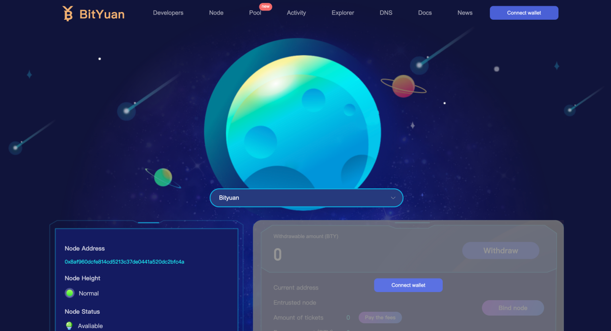
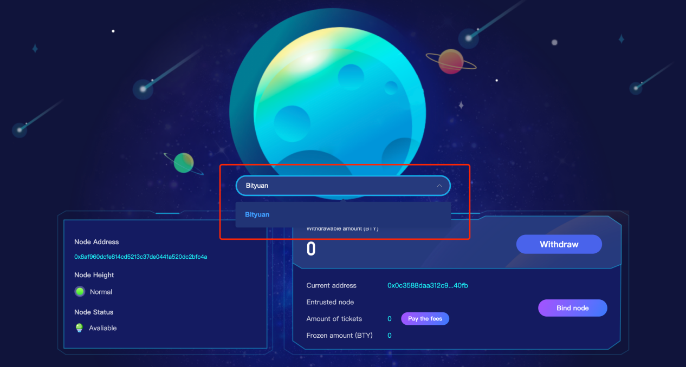
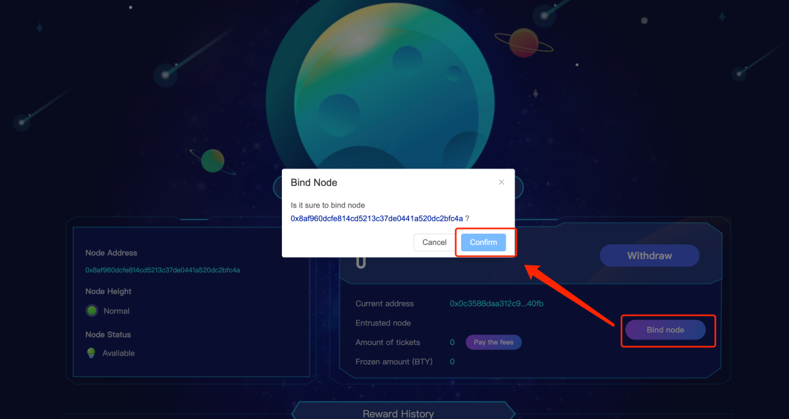
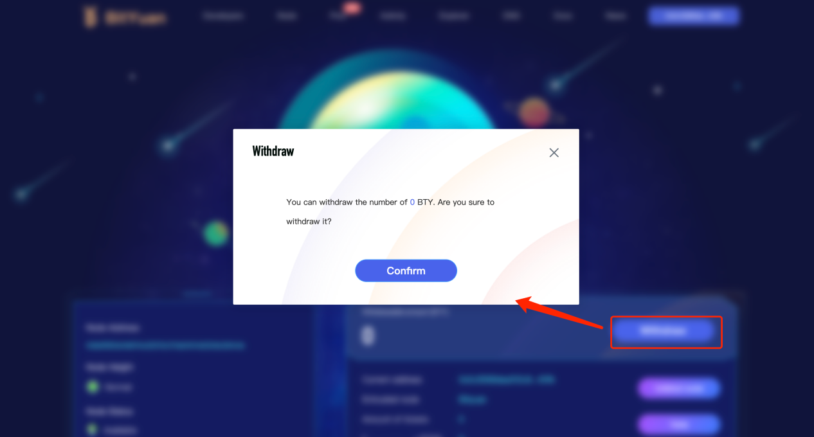
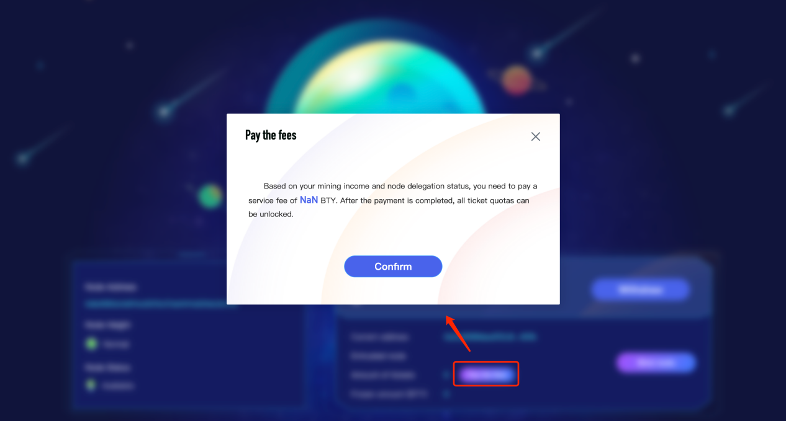
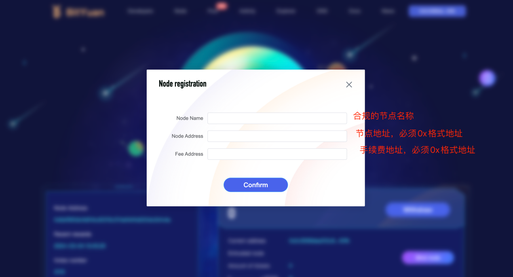

# 去中心化委托投票

## 用户如何去委托投票？

### 用户登录

官网支持两种登陆方式

-   通过 MetaMask 签名数据登陆
-   通过 手机钱包 签名数据登陆
    
    

### 选定合适的票池

用户可通过搜索选取合适的票池进行委托投票

### 绑定票池节点

选择完合适节点后，进行绑定节点操作，签名交易，等待绑定完成

### 委托票数

节点绑定成功后，用户可进行委托投票操作

-   1 票=3000bty
-   委托节点进行投票，节点将收取票数获得收益的 10%，作为节点维护运行费用

### 提取收益

等待一段时间，委托的票被选中，产出 bty，用户可提取 bty 至自己当前钱包地址

### 解除绑定

用户想要退出，不再继续委托投票，点击解绑按钮，签名交易，等待解绑

### 支付委托费用

解除绑定关系后，会根据委托票数所获收益，计算所需交纳 bty 数量，签名交易，完成交费

-   付费完成后，用户需等待 50 小时
-   用户支付的是已成熟的票数，可能存在还未成熟的票，需要等待未成熟的票成熟，需要再次支付相应费用。（票数较多情况）
-   每次关闭票数最大为 100 票，超过票数的，需多次关闭票数。（关闭票数=close 按钮，签名数据）

## 如何成为节点？

### 维护一台稳定运行 BTY 节点的设备

稳定运行标准：

-   网络链接正常
-   节点高度正常
-   开启自动购票状态
-   钱包处于解锁状态
-   用于申请的节点地址需要有 bty 用于支付区块链费用

### 生成 ox 格式地址

通过手机钱包或者其他钱包软件，生成 eth 地址，导出 ox 地址的私钥，导入到 bty 节点中，完成 ox 格式地址在节点中运行

### 导入 ox 格式 bty 地址

-   电脑端

打开设置-控制台，在控制台输入命令 account import_key -k 填入自己的私钥 -l node_1 -t 2

-   服务器端

找到 bty 节点，输入命令 account import_key -k 填入自己的私钥 -l node_1 -t 2

### 填写申请表单，提交节点信息

-   委托节点的票数达到 300 票将推荐展示，无需搜索
-   委托节点获得该节点委托票数产生收益的 10%

