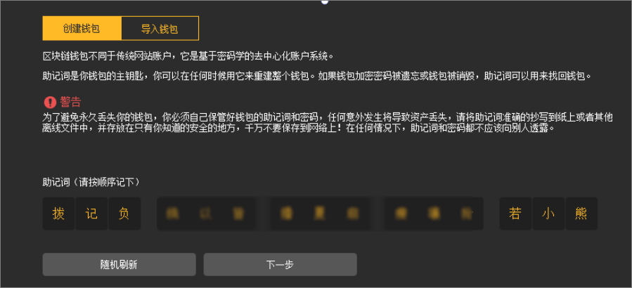
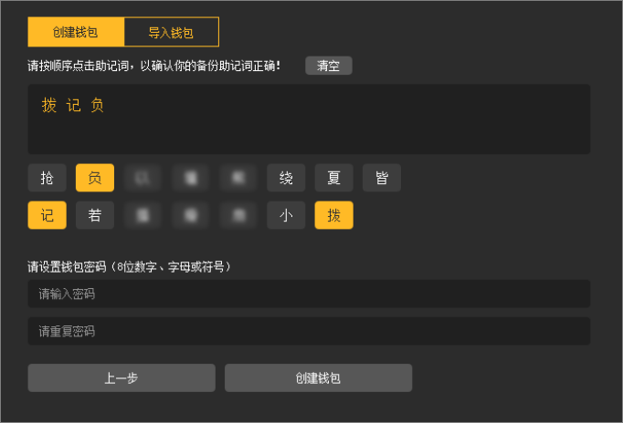
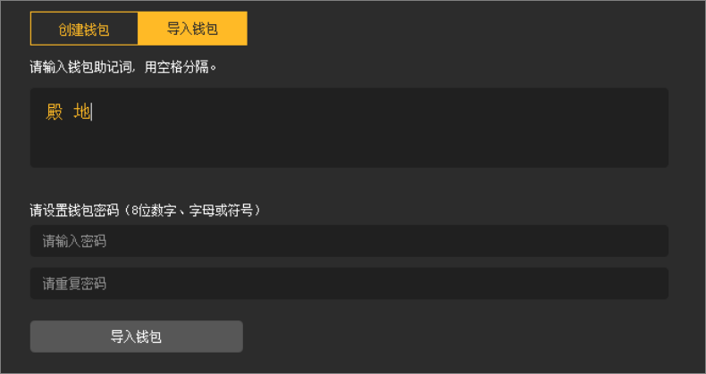

# 比特元钱包操作手册
>一种简单稳定、扩展性强的区块链网络。


## １．综述
比特元钱包是一款基于比特元开发的钱包客户端。使用比特元钱包可以实现比特元节点部署、比特元在线环保POS挖矿、比特元转账等功能，更多功能正在开发中。 


## 2. 钱包准备
通过[比特元钱包官网](https://bityuan.com/node)获得对应操作系统（目前有Windows、Linux、MAC三个版本）的安装包，下载并安装比特元钱包。  
<font color=Red>注意：</font>Windows系统尽量选择**非系统盘**安装，若选择系统盘安装，可能会出现无法启动的现象，这时可右键单击客户端使用**管理员权限**启动钱包。


## 3. 钱包配置
根据比特元钱包去中心化的特点，比特元钱包支持通过助记词来创建/导入钱包，**不存在**任何中心服务器窃取滥用用户信息。  
比特元钱包会根据用户的操作系统语言自动判断生成中文或英文的助记词，助记词为有序的**15**个中文字或英文单词。


### 3.1 创建钱包
初次使用比特元钱包需要创建一个钱包。   
在创建钱包界面，如图1。获得15个助记词并将其备份后（如手抄写于纸质材料或拷贝至离线电脑，注意助记词**切勿**保存于在线网络），单击“下一步”确认助记词，如图2。     
图1  
  
图2  
  
用户需要**按顺序点击**之前获得的助记词，核对无误后，设置钱包密码，单击“创建钱包”完成钱包的创建。 

### 3.2 导入钱包
已经拥有比特元钱包助记词的用户，可以选择导入钱包来恢复之前创建的钱包。同样地，在导入钱包界面**按序输入**已备份的15个助记词，如图3，输入密码后即可恢复之前的比特元钱包。  
图3  
 

## 4．节点部署
完成钱包配置后，即可进行比特元钱包节点部署。   
比特元节点需要运行在网络中，请保持网络通畅。首次完成钱包创建后需要等待区块同步，如图4。同步进度会在客户端底部显示。同步完成即成功部署比特元节点。  
<font color=Red>注意：</font>同步完成后比特元钱包仍需保持在线状态。   
图4   
 

### 4.1 节点状态
比特元钱包主页右下角为当前比特元钱包节点的状态，鼠标悬停于具体图标时，可以查看对应的状态，如图5。   
图5  
 
 
1为钱包状态，显示当前钱包是否处于锁定状态。 若锁定，则需要输入密码进行解锁，解锁后状态变成绿色。  
2为挖矿状态，显示当前钱包是否处于挖矿中。 开启自动购票之后会显示挖矿中。  
3为网络连接状态，显示当前钱包的网络连接状态。显示当前与比特元网络建立的连接数。  
4为同步状态，显示当前钱包的同步进度及状态。显示当前已下载的交易区块数。   
5为提供服务状态，显示当前钱包是否可对其他节点提供服务。  


## 5. 比特元转账
比特元钱包支持比特元转账、地址簿管理等相关功能。   
钱包同步完成后，可使用钱包进行比特元转账等操作，如图6。下文详细介绍各个模块的功能以及使用方法。   
图6    
 

### 5.1 钱包设置
钱包顶部设置栏，即图6中的**模块4**。   
“设置”下拉菜单可进行更改密码、锁定钱包、离线挖矿授权等操作；点击“帮助”下拉菜单可进行命令行操作、查看比特元钱包信息等操作。  
当前钱包中部分操作（如**离线授权挖矿**），需使用命令行操作完成。命令行操作一般用于问题排查。   
更改密码：需要先输入原密码，再输入修改后的密码。  
- 解锁钱包：需要使用密码解锁钱包，且可以设置钱包是否“仅用于挖矿”。  
- 开启/关闭自动购票：开启自动购票后才能开始挖矿。  
- 开启/关闭自动修复时间：同步修复由于网络或者其他原因导致存在时间误差，确保区块正常同步以及挖矿。  
- 打开数据目录：打开比特元钱包已下载的数据目录bityuanData。  
- 修改数据目录：选择新数据地址，将元数据迁移至指定目录。（即在目标目录下创建一个名为bityuanData的新目录。）  
- 离线挖矿授权：输入离线钱包地址、被授权钱包地址、以及授权比特元数量后生成绑定交易和转账交易。  
- 验证助记词：输入钱包助记词和密码进行验证。  
- 调试窗口：比特元RPC控制台，在输入框中输入命令，单击发送即可。使用help命令显示帮助信息。  
- 关于比特元：显示关于比特元的信息，包括客户端版本、官方网站、区块链浏览器地址等。

### 5.2 钱包资产显示
显示钱包中的比特元资产，即图6中的**模块1**。  
钱包中显示当前钱包中所有地址下的比特元资产**总和**，正处于挖矿冻结状态的比特元资产，以及当前可用的的比特元资产。  
同时钱包中会显示数据是否同步，以及是否存在时间误差。请保持网络畅通，并开启自动修复时间，确保区块正常同步以及后续的挖矿。

### 5.3 比特元转账
提供比特元转账功能，即图6中的**模块2**。   
若要进行比特元转账操作，首先要确保钱包处于解锁状态，然后按照以下步骤进行操作：   
1. 选择钱包中的某一地址，该地址中需要有<font color=Red>足额</font>的比特元用于转账，也可以单击“来源”后面的地址簿图标，从中选择一个地址。     
2. 在“付给”中输入想要转账的比特元地址，该地址支持复制粘贴，同样也可以单击地址簿体表，从中选择一个好友地址。   
3. （可选）备注中输入备注信息。  
4. 输入转账金额，金额支持四位小数。当前默认手续费为0.001比特元每kb，系统会根据发送的交易大小自动计算交易手续费。需保证钱包账户中的比特元数目<font color=Red>足够支付</font>转账金额以及手续费。  
5. 单击“发送”并“确认”该转账操作后，系统会发送交易。交易发送后将在<font color=Red>10分钟内</font>完成该交易的打包并广播至全网。若10分钟内未完成打包，该交易将**超时失效**，可重新发送交易。（不会出现重复发送的情况。）


### 5.4 交易记录
显示该钱包中所有地址的交易记录，即图6中的**模块3**。  
交易记录列表中显示每笔交易的交易金额、交易状态、目标地址、交易目标备注和交易时间。双击目标交易可以查看该交易详情。交易记录按时间顺序倒序排列。
 
### 5.5 地址簿
地址簿页签显示该钱包目前拥有的地址以及好友地址，如图7。  
图7  
   
左侧显示钱包本身拥有的地址，在此区域可新建、导出、隐藏地址。右键地址可进行复制、编辑、隐藏等操作。单击目标地址右侧的“详情”，可显示该地址的**二维码**，可拷贝地址并保存图片操作。 
钱包本身拥有的地址<font color=Red>无法删除</font>。  
右侧显示的是好友地址，在转账时可直接从地址簿中选择好友地址，无需反复输入。在此区域可新建、导出、删除地址。同样支持显示地址**二维码**。  


## 6. 比特元挖矿

### 6.1 挖矿说明

比特元挖矿基于POS挖矿机制，即权益证明挖矿。  
为了参与挖矿，持币人需要锁定一部分币来换取选票（ticket）。每**3000比特元**可以锁定并换取<font color=Red>1张ticket</font>。   
所有的在线ticket会参与新区块生成的挖矿，平均每张ticket被选中的时间是<font color=Red>6天</font>。拥有更多的ticket会获得更多的挖矿成功概率，每张ticket挖到矿的概率独立计算。  
平均每个区块生成时间为<font color=Red>5秒</font>，<font color=Red>每个区块只会由一张ticket挖到</font>。每个区块生成会产出8个比特元，其中5个比特元为挖矿者获得，另外3个比特元进入发展基金。  


### 6.2 ticket的生命周期

1. 保持比特元钱包**联网解锁**状态（单击“设置”页签中的解锁按钮并输入钱包密码即可解锁）。  
2. 持有的地址中有足够购买ticket的余额（因开启自动挖矿后钱包会预留2个比特元用于手续费，故至少需要3002个比特元）。每3000比特元可换取1张ticket，不足3000比特元的无法购票。即若用户持有6567个比特元准备开启自动挖矿，账户中会预留2个比特元用于挖矿手续费，其余6565个比特元中6000个会冻结并购票挖矿，565个比特元会转入挖矿合约地址等待后续达到3000个，再购票进入挖矿。这565个比特元没有冻结时间，关闭自动挖矿即可取回。   
3. 单击比特元钱包“设置”页签，开启自动购票，就会进入挖矿流程。挖矿需保持比特元钱包**全程联网**。  
4. 开启自动购票后，10分钟内会完成购买ticket的操作，并在钱包的操作记录中显示。若超过10分钟未完成购票，钱包将自动重试购票，直至完成购票。  
5. 购买ticket后，需等待12小时，才能进入挖矿。  
6. 刚完成购票的ticket，称为未成熟票，需等待48小时后才能成熟。（未成熟票无法解冻。）  
7. Ticket挖到矿后需要等待2小时，同时该选票需达到成熟时间，才能解冻。未成熟的选票挖矿成功后获得的5个比特元同样会被冻结，等待选票成熟后一起解冻。挖到矿的ticket需要重新开始购票，才能再次开始挖矿。


### 6.3 如何挖矿

完成节点部署后，保证钱包已同步至最高高度，按照以下流程即可开启自动挖矿。    
1. 检查账户可用余额，保证持有地址中有足够的余额：  
因自动挖矿开启后会预留2个比特元用于处理后续交易手续费，因此建议持有购票用的比特元外增加少量比特元（如100比特元）用于挖矿转币手续费。   
2. 解锁钱包仅用于挖矿：  
单击“设置”页签中的解锁按钮，输入钱包密码并勾选“仅用于挖矿”，完成钱包挖矿解锁，如图8。  
图8  
 
3. 开启钱包自动挖矿：  
单击比特元钱包“设置”页签，开启自动购票。开启自动购票后，10分钟内会完成购买ticket的操作，并在钱包的操作记录中显示。之后进入挖矿的正常生命周期。 


### 6.4 挖矿状态确认

若完成上述操作后依然长时间无法进行挖矿，可通过以下命令进行问题排查。请确保以下状态正常，部分状态查看可在导航栏-帮助-调试窗口中通过命令行查询。   
1. 保持比特元钱包联网。  
可通过查看右下角节点状态确认。（具体可查看4.1 节点状态。）   
2. 保持网络时间同步。  
查询网络时间是否同步：  
```
net is_clock_sync
```       
预期结果：true   
3. 保持区块同步。  
查询区块是否同步 ：  
```
net is_sync
```       
预期结果：true   
4. 保证持有地址中有足够的比特元余额。  
因自动挖矿开启后会预留2个比特元用于处理后续交易手续费，因此建议持有购票用的比特元外增加少量比特元（如100比特元）用于挖矿转币手续费。  
5. 保证比特元钱包解锁。  
查询比特元钱包状态：  
```
wallet status
```       
预期结果：  
```
{
    "iswalletlock": true,     
    "isautomining": false,   
    "ishasseed": true,  
    "isticketlock": false  
}
```  
或  
```
{
    "iswalletlock": false,    
    "isautomining": false,  
    "ishasseed": true,  
    "isticketlock": true/false  
}
```  
均为解锁状态。   


### 6.5 关闭挖矿

1. 检查钱包可用余额，保证持有地址中有足够的比特元余额。  
因关闭选票也需要扣除相应的手续费（0.001比特元/票），故建议至少保留两个以上比特元用于关闭挖矿手续费。  
2. 解锁钱包（取消“仅用于挖矿”）,如上图8。
3. 关闭自动购票。  
钱包左上角，“设置”栏中单击“关闭自动购票”。
4. 调试窗口输入以下命令，如图9：  
``` 
ticket close
```     
图9  
 

冻结的比特元会分以下几种情况释放：  
- 零散的比特元和未挖到矿的成熟票（购票满48小时）会立即释放到自己的钱包地址中。  
- 如果是48小时后挖到矿，比特元2小时后释放。  
- 如果是48小时内挖到矿，等待选票成熟后一起释放（即购票满48h）。  
- 除以上3种情况外，若还有未释放的比特元，请再次执行上述步骤4中的命令后就能全部释放。


## 7. 离线授权挖矿

出于安全性考虑，**强烈建议**采用离线授权挖矿的模式进行挖矿，以保证资产的安全。  
授权在线挖矿模式下，需要设置比较复杂的登录密码，且钱包所处的电脑平时尽量仅用于在线挖矿，以免感染病毒。
离线授权挖矿模式目前客户端还未实现，需要用户在比特元钱包客户端中使用**控制台命令行**操作，请根据以下步骤进行操作。  
注意：用户需要事先准备两个钱包，一个在离线电脑上操作，用于授权给其他地址挖矿（需拥有足额用于挖矿的比特元），记做钱包A。另外一个钱包需要在处于在线网络的电脑上操作，用于在线挖矿，记做钱包B。该钱包需要留有一定量比特元用于挖矿手续费，建议持有100个比特元，用于长期挖矿。钱包A的操作可全程离线，钱包B需保持在线并且已完成同步。钱包A的操作需开启比特元钱包节点，离线状态下也可运行。  
<font color=Red>钱包A的电脑切记永远不要联网！</font><br>
以下为具体步骤，请按照具体步骤操作。   
**步骤一**：解锁钱包A。（在钱包A的电脑上操作）  
```
wallet unlock -p 钱包A比特元钱包密码 -s wallet -t 0 
```       
预期结果：true  
**步骤二**：构造离线授权挖矿交易。（在钱包A的电脑上操作）   
获得钱包A中地址a的私钥后，需要完成对钱包B中地址b的授权，然后构造交易。   
```
ticket bind_miner -b 地址b -o 地址a
```       
预期结果：获得未签名交易的十六进制字符串。  
**步骤三**：对该交易进行签名。（在钱包A的电脑上操作）     
```
wallet sign -a 地址a -d 未签名交易的十六进制字符串 -e 0
```       
预期结果：获得已签名交易的十六进制字符串。  
**步骤四**：解锁钱包B。（在钱包B的电脑上操作）     
```
wallet unlock -p 钱包B比特元钱包密码 -s wallet -t 0  
```       
预期结果：ture  
**步骤五**：发送已签名的交易。（因需要发送该交易，需要在钱包B的电脑上操作，可使用U盘等离线方式将步骤四中已签名交易的十六进制字符串拷贝至钱包B的电脑）     
```
tx send -d 已签名交易的十六进制字符串  
```       
预期结果：返回该委托挖矿交易哈希，可使用该哈希值查询交易信息。   
**步骤六**：开启自动挖矿。（在钱包B的电脑上操作）  
确认发送的交易已在区块链上打包完成后，开启钱包B的自动挖矿。      
```
wallet auto_mine -f 1  
```       
预期结果：ture  
当前版本需要手动将地址a（存在于钱包A中）中用于挖矿的比特元打入到挖矿合约地址中，才能进行购票。同样的，需要经过构造交易、对交易签名、发送交易三步操作完成交易。  
**步骤七**：构造发送比特元至挖矿合约地址的交易。（在钱包A的电脑上操作）      
```
bty transfer -f 地址a -t 16htvcBNSEA7fZhAdLJphDwQRQJaHpyHTp -a 比特元数量 
```       
预期结果：获得未签名交易的十六进制字符串。  
**步骤八**：对未签名交易进行签名。（在钱包A的电脑上操作）      
```
wallet sign -a 地址a -d 未签名交易的十六进制字符串 -e 0 
```       
预期结果：获得已签名交易的十六进制字符串。  
**步骤九**：发送交易。（在钱包B的电脑上操作）      
```
tx send -d 已签名交易的十六进制字符串 
```       
至此完成委托挖矿的配置流程。此后钱包A可保持离线，只需钱包B保持在线挖矿即可，整个流程提高了安全性。  


## 8. 比特元区块链浏览器
比特元拥有自己的区块链浏览器，可根据区块高度、地址、哈希进行查询。   
比特元区块链浏览器地址：[http://mainnet.bityuan.com ](http://mainnet.bityuan.com ) 


## 9. Q&A
Q：比特元钱包同步和什么有关？   
 
A：比特元钱包同步和电脑配置有关，主要是硬盘和网络。使用**固态硬盘**可以提升同步速度。比特元开发组会定期提供已同步的数据库，用户可下载该数据库，避免新用户第一次使用钱包时同步时间过长的问题。   
 
Q：挖矿的概率和电脑配置有关系吗？    

A：没有关系，只和用户拥有的ticket数量有关。每张ticket的挖矿概率是独立计算的。**极少数**可能会因为电脑配置过低而遇到挖到比特元后，未及时广播，而被回滚的状况，正常配置下不会出现。配置推荐使用8G内存、i7处理器及固态硬盘，以获得更好的体验。    

Q：每次挖到的矿都是5个吗？那么更多的选票的优势在哪？    

A：是的，每个区块生成时，挖矿者可以获得的收益固定为5个比特元。持有更多的选票可以让你有更大的几率挖到矿。而挖到矿后的选票需要进入同样的解冻-购票周期，持有更多的ticket可以节省这部分时间。    

Q：每张票大概多久可以挖到一次矿？    

A：在大部分ticket都在线的情况下，平均大约6天（144小时）可以挖到一次矿。（不保证六天一定能挖到。）    

Q：平均的挖矿年化收益率是多少？    

A：8%。即投入3000个比特元用于挖矿，一年平均可获得额外的240个比特元。    
 
Q：购票后要等待12小时才会开始挖矿，这段时间可以离线吗？    

A：可以，包括成熟期的48小时和2小时冻结期，这些时间离线后同样会计算；但挖矿时必须是持续在线，保证正常联网节点。