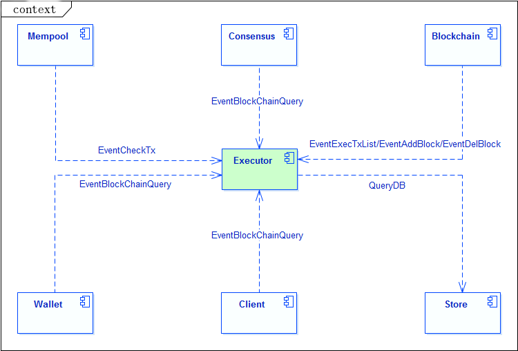
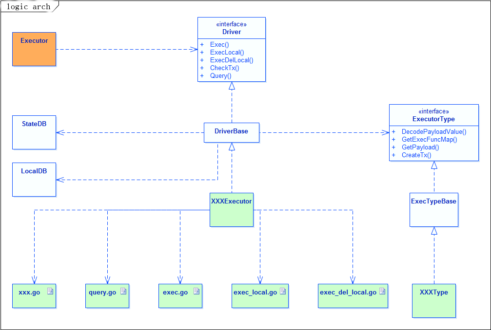
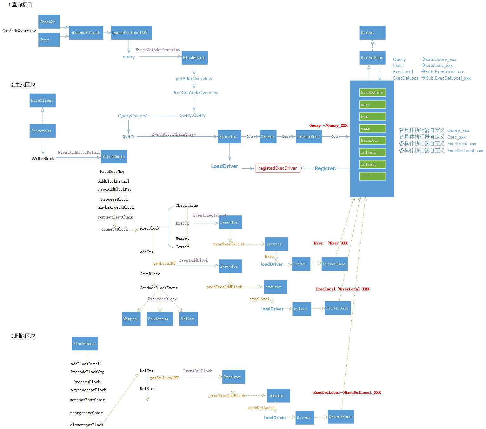
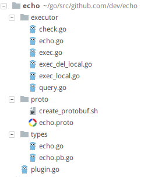

# 执行器模块

##  模块介绍
顾名思义，执行器模块主要是用于执行逻辑的。在区块链中，所有的数据都是通过交易生成的，这些数据按照一定的规则，组装成一个个区块，最终形成一个完整的区块链条。

而在一个完整的区块链系统中，交易的执行是核心，比如一次A到B的转账交易，A账户的余额会减少，B账户的余额会增加，这个账户余额变更的逻辑就是执行器要执行的内容。

拿智能合约来说，合约中包含的所有逻辑，就是执行器要执行的逻辑；只不过，合约只是一个具体的逻辑，而执行器则是一个容器，它可以执行数个合约，而不需要知道合约的具体内容。

所以说，执行器模块是一个容器，它支持各种合约的运行（包括系统合约以及各种扩展合约）；接收交易，并将交易分配给对应的合约具体执行；同时响应区块链上的各种事件（交易校验、查询请求、执行交易、新增区块、回滚区块），并将事件派发给具体的合约逻辑。


## 执行器模块交互 ##



执行器自身能力对外体现为5个接口：

两个只读接口：

- **交易校验**：通过EventCheckTx事件触发，对交易的有效性进行检查，请求来源于Mempool模块。
- **查询请求**：查询操作，从交易生成的数据中查询指定信息，具体查询内容不固定，因调用的查询方法而异，一般请求来源于Wallet/Client/Consensus模块。

三个写接口：

- **交易执行**：通过EventExecTxList事件触发，执行交易列表中的每一笔交易，并返回执行结果，请求来源于Blockchain模块。

- **区块新增**：通过EventAddBlock事件触发，执行区块写入链的后处理操作，生成一些本地数据并返回，请求来源于Blockchain模块。

- **区块回滚**：通过EventDelBlock事件触发，执行链中区块回滚的后处理操作，生成一些本地数据并返回，请求来源于Blockchain模块。

## 执行器内部逻辑结构 ##



如上图所示，执行器本身是一个容器框架，它本身只包含一些通用的调度处理逻辑，将请求分发给具体的执行器合约进行执行，然后收集结果返回。

从设计上来说，每一个具体的执行器（这里指合约，可以认为两者等价）都实现了Driver中的几个核心方法，容器在执行操作时，会根据交易中附带的执行器信息，调用具体的XXXExecutor执行逻辑。

每一个具体的执行器在实现时均分成两部分：

- **执行器对象(XXXExecutor)**：

    实现Driver接口，继承DriverBase基类。

    是执行器的主体，包含执行器的主要执行逻辑，一般根据功能划分成多个程序文件，分别执行对应的逻辑。

- **执行器对象类型(XXXType)**：

    实现ExecutorType接口，继承ExecTypeBase基类。

    包装执行器类型相关的一些通用能力，如方法列表、Payload结构等，辅助执行器框架完成定制化的处理逻辑。

## 处理逻辑
> 上面介绍了执行器实现的5个主要能力接口，下面分别介绍每个接口的具体功能以及实现逻辑。

### 交易校验
#### 接口定义
```go
type Driver interface {
    CheckTx(tx *types.Transaction, index int) error
}
```
此接口包含两个参数：
- `tx *types.Transaction`：为本次交易对象，里面包含了交易的所有信息
- `index int`：为本交易在本次打包区块中的索引位置。

> **实现功能**：对本次交易进行业务合法性检查（交易自身的合法性，签名校验等无需检查，已经在Mempool模块进行过滤），只允许满足本执行器要求的交易执行，否则返回具体的错误信息。

#### 通用处理逻辑

```go
//默认情况下，tx.To地址指向合约地址。
func (d *DriverBase) CheckTx(tx *types.Transaction, index int) error {
	execer := string(tx.Execer)
	if ExecAddress(execer) != tx.To {
		return types.ErrToAddrNotSameToExecAddr
	}
	return nil
}
```

在DriverBase基类中，仅实现了最基础的校验逻辑，就是检查交易的目标地址是否为本执行器合约的地址，其中：

- `ExecAddress(execer)`：实现的能力是从执行器名称获取执行器合约地址。

- `tx.To`：则是本次交易的目标地址。

#### 执行器实现
在实现具体的执行器交易校验逻辑时，需要根据自己的业务场景来确定对哪些内容进行检查，尽量确保通过校验的交易都可以正确执行。

如果，仅仅需要检查目标地址，则执行器可以不实现这个校验逻辑，系统会自动重用DriverBase的校验逻辑；

如果，本执行器不需要对交易的任何内容进行校验，则覆盖此方法，仅仅返回空即可，如下代码：

```go
func (x *XXXExecutor) CheckTx(tx *types.Transaction, index int) error {
    // 不需要执行任何校验逻辑。
    return nil
}
```

> **注意：** 在执行器开发时，一旦确定实行某一类校验规则，后面不能随意变更，否则可能会引起区块链分叉。如果实在需要变更，则需要对代码进行分叉逻辑处理，保证区块执行结果的一致性。
> 
> 二次开发时，如果存在校验逻辑，建议单独一个check.go实现。

### 交易执行
#### 接口定义

```go
type Driver interface {
	Exec(tx *types.Transaction, index int) (*types.Receipt, error)
}
```

此接口同样包含两个参数，和交易校验的方法参数含义相同，唯独返回值不同：
- `tx *types.Transaction`：为本次交易对象，里面包含了交易的所有信息
- `index int`：为本交易在本次打包区块中的索引位置
- `*types.Receipt`：返回值，可以参考Receipt的消息结构定义，其中ty用于填写本次交易执行的结果类型，如成功、失败类型；KV则是用来填写本次交易执行的结果，logs为本次交易执行生成的收据信息。如下代码：

```protobuf
message Receipt {
    int32    ty              = 1;
    repeated KeyValue KV     = 2;
    repeated ReceiptLog logs = 3;
}
```

> **实现功能：** 交易执行的核心逻辑，执行器合约的主要逻辑在这里体现，它将会解析交易对象中携带的相关信息，然后根据合约设计的规则，执行不同的业务逻辑分支，最终结果将体现在返回的数据中，而这些数据将会在区块内的所有交易执行完成后，写入到区块链上。

#### 通用处理逻辑

DriverBase基类的通用处理逻辑比较复杂，这里以伪代码加注释的方式来呈现。

其中xxx表示具体的执行器实现，xxxType表示具体的执行器类型对象。

```go
func (d *DriverBase) Exec(tx *types.Transaction, index int) (receipt *types.Receipt, err error) {
    if xxxType == nil {
        return nil, nil
    }
    // 获取具体执行器的消息结构。
    if xxx.GetPayloadValue() == nil {
        return nil, nil
    }
    // 使用类型对象解析交易中携带的合约相关请求信息。
    actionName, actionValue, err = xxxType.DecodePayloadValue(tx)
    // 约定方法名结构为固定前缀 + 合约的请求动作。
    funcName = "Exec_" + actionName
    // 获取本执行器实现的所有方法对象字典，其实本质调用的是。xxxType.GetExecFuncMap
    funcMap = xxx.GetFuncMap()
    // 定位到具体的方法对象。
    funcObj = funcMap[funcName]
    // 通过反射调用此方法对象。
    funcObj.Call(.....)
    // 获取反射调用结果并返回。
}
```

从上面的伪代码逻辑可以看出，在DriverBase基类中，实现的是一个框架逻辑，它会将交易载体对象的解析委托给具体的执行器类型去实现，然后按照约定的规则拼装方法名，最后通过反射的方式调用具体的执行方法。

所以，一般情况下开发者在进行执行器开发时，是不需要实现此方法的，只需要实现此框架逻辑依赖的几个相关方法即可。

#### 执行器实现
参考上面的分析，总共有几处和交易执行相关的地方需要具体执行器的开发者关注。

- 执行器类型方法：

```go
type ExecutorType interface {
    // 从交易中解析出action名称，action对象 （具体action信息只有具体执行器自己才认识）。
    DecodePayloadValue(tx *Transaction) (string, reflect.Value, error)
    // 获取本执行器的方法字典。
    GetExecFuncMap() map[string]reflect.Method
}        
```

- 执行器对象方法：

```go
type Driver interface {
    // 获取本执行器对应的Payload定义结构。
    // 这个方法其实是委托给ExecutorType.GetPayload()方法执行的。
    GetPayloadValue() types.Message
    // 获取本执行器可用的方法字典。
    // 此方法也是委托给ExecutorType.GetExecFuncMap()方法执行的。
    GetFuncMap() map[string]reflect.Method
}    
```

- 具体执行方法签名：

```go
func (c *XXX) Exec_Transfer(transfer *types.XXXAction, tx *types.Transaction, index int) (*types.Receipt, error) 
```

> **注意：** 在真正的执行器开发中，实现执行交易逻辑时，不需要去实现基类的Exec方法，只需要按照上面的规则，实现几个周边的依赖方法；并且根据自己的合约逻辑实现几个Exec_XXX方法即可（方法签名如上）。具体实现方式，在后面的二次开发章节会详细介绍。
> 
> 二次开发时，交易执行逻辑建议单独放在一个exec.go文件中。

### 历史查询
#### 接口定义

```go
type Driver interface {
	Query(funcName string, params []byte) (types.Message, error)
}
```

此接口包含两个参数：
- `funcName string`：为本次查询请求的具体方法名，系统会将本次请求自动路由到对应的方法实现。
- `params []byte`：为本次查询的具体参数信息，这里接收的为序列化之后的值，查询框架会进行反序列化后再调用具体的查询方法。

> **实现功能：** 实现任何查询操作（前提是此操作对应的方法存在），因为是只读的查询操作，不以交易的形式体现，不影响区块数据，不会写入区块链。

#### 通用处理逻辑
本逻辑实现代码，下面以伪代码形式呈现。其中xxx表示具体的执行器实现。

```go
func (d *DriverBase) Query(funcname string, params []byte) (msg types.Message, err error) {
    // 获取本执行器实现的所有方法对象字典，其实本质调用的是xxxType.GetExecFuncMap。
    funcMap = xxx.GetFuncMap()
    // 约定方法名结构为固定前缀 + 请求方法名。
    funcname = "Query_" + funcname
    // 定位到具体的方法对象。
    funcObj = funcMap[funcName]
    // 通过funcObj获取到查询方法参数类型，并将params反序列化。
    // 通过反射调用方法对象。
    funcObj.Call(.....)
    // 获取反射调用结果并返回。 
}
```

和执行交易的逻辑类似，在DriverBase基类中实现的也是一套框架逻辑，通过方法名定位到具体的方法对象，然后在根据方法类型中定义的参数类型信息，对传入的params参数进行反向序列化，从而得到具体的参数结构信息，最后再利用反射调用具体的查询方法逻辑并返回结果。

所以，一般情况下开发者在进行执行器开发时，也不需要实现此方法的，只需要实现此框架逻辑依赖的几个相关方法即可；
#### 执行器实现
参考上面的分析，总共有几处和查询相关的地方需要具体执行器的开发者关注。

- 执行器类型方法：

```go
type ExecutorType interface {
    // 获取本执行器的方法字典。
    GetExecFuncMap() map[string]reflect.Method
}        
```

- 执行器对象方法：

```go
type Driver interface {
    // 获取本执行器可用的方法字典。
    // 此方法也是委托给ExecutorType.GetExecFuncMap()方法执行的。
    GetFuncMap() map[string]reflect.Method
}    
```

- 具体查询方法签名：

```go
func (c *XXX) Query_XxxYyyZzz(in *types.XXXReq) (types.Message, error) 
```

> **注意：** 在真正的执行器开发中，实现查询逻辑时，不需要去实现基类的Query方法，只需要按照上面的规则，实现几个周边的依赖方法；并且根据自己的合约逻辑实现几个Query_XXX方法即可。具体实现方式，在后面的二次开发章节会详细介绍。
> 
> 二次开发时，查询逻辑建议单独放在一个query.go文件中。

### 新增区块
#### 接口定义
在一个区块内的全部交易都执行完成之后，会将此区块打包上链，在上链之前，会触发这个新增区块的逻辑，系统会遍历区块内的所有交易，逐个调用对应的ExecLocal逻辑。

```go
type Driver interface {
	ExecLocal(tx *types.Transaction, receipt *types.ReceiptData, index int) (*types.LocalDBSet, error)
}
```

此接口包含三个参数：
- `x *types.Transaction`：为本次交易对象，里面包含了交易的所有信息。
- `receipt *types.ReceiptData`：为本次交易执行时生成的结果信息，其结构定义如下：

```protobuf
message ReceiptData {
    int32    ty              = 1;
    repeated ReceiptLog logs = 3;
}
```  

- `index int`：为本次交易在打包区块中的索引位置

> **实现功能：** 根据交易执行生成的结果信息，增加自己的逻辑，生成一些新的数据，用于辅助合约逻辑。这些数据可以认为是本地数据，不会上链（但每个区块节点都会生成），一般用于做多重索引，保存中间数据等，具体视合约逻辑而定。

#### 通用处理逻辑
DriverBase基类的通用处理逻辑比较复杂，这里以伪代码加注释的方式来呈现。其中xxx表示具体的执行器实现，xxxType表示具体的执行器类型对象。

```go
func (d *DriverBase) ExecLocal(tx *types.Transaction, receipt *types.ReceiptData, index int) (*types.LocalDBSet, error) {
    // 使用类型对象解析交易中携带的合约相关请求信息。
    actionName, actionValue, err = xxxType.DecodePayloadValue(tx)
    // 约定方法名结构为固定前缀 + 合约的请求动作。
    funcName = "ExecLocal_" + actionName
    // 获取本执行器实现的所有方法对象字典，其实本质调用的是xxxType.GetExecFuncMap。
    funcMap = xxx.GetFuncMap()
    // 定位到具体的方法对象。
    funcObj = funcMap[funcName]
    // 通过反射调用此方法对象。
    funcObj.Call(.....)
    // 获取反射调用结果并返回。    
}
```

主体框架逻辑基本和前面的执行交易类似，使用到的相关方法前面也都介绍过，唯一不同的就是方法前缀，这里是"ExecLocal_"。

同样，一般情况下开发者在进行执行器开发时，也不需要实现此方法的，只需要实现此框架逻辑依赖的几个相关方法即可；

#### 执行器实现
本操作涉及到的具体执行器方法和执行器类型方法，和前面的重复，不再列举，这里仅列出ExecLocal_XXX的方法签名。

- 具体查询方法签名：

```go
func (c *XXX) ExecLocal_XYZ(action *types.XXXyz, tx *types.Transaction, receipt *types.ReceiptData, index int) (*types.LocalDBSet, error) 
```

> **注意：** 在真正的执行器开发中，实现本逻辑时，只需要根据自己的合约逻辑实现几个ExecLocal_XXX方法即可。具体实现方式，在后面的二次开发章节会详细介绍。
> 
> 二次开发时，本逻辑建议单独放在一个exec_local.go文件中。

### 回滚区块
#### 接口定义

```go
type Driver interface {
	ExecDelLocal(tx *types.Transaction, receipt *types.ReceiptData, index int) (*types.LocalDBSet, error)
}
```
本接口和新增区块相同，不再详细描述方法定义。

> **实现功能：** 本逻辑和新增区块刚好相反，新增区块中新增的数据，这里需要删除；新增区块中用新值代替旧值，这里需要用旧值代替新值；将数据恢复到原始状态。

#### 通用处理逻辑
和新增区块的逻辑相同，唯一不同的地方仅为方法前缀不同，这里的方法前缀为"**ExecDelLocal_**"；

#### 执行器实现
本操作涉及到的具体执行器方法和执行器类型方法，和前面的重复，不再列举，这里仅列出ExecDelLocal_XXX的方法签名。

- 具体查询方法签名：

```go
func (c *XXX) ExecDelLocal_XYZ(action *types.XXXyz, tx *types.Transaction, receipt *types.ReceiptData, index int) (*types.LocalDBSet, error) 
```

> **注意：** 在真正的执行器开发中，实现本逻辑时，只需要根据自己的合约逻辑实现几个ExecLocal_XXX方法即可。具体实现方式，在后面的二次开发章节会详细介绍。
> 
> 二次开发时，本逻辑建议单独放在一个exec_del_local.go文件中。

### 执行器整体处理逻辑



## 二次开发

本章节将会以一个简单的例子来介绍执行器的二次开发过程，例子实现的功能比较简单，但包含了实现一个执行器所需要的各方面的方法。

### Echo执行器整体介绍
本执行器实现一个简单的消息响应功能，支持ping和pang两种操作，交易执行时会往区块链上写入响应数据，本地执行时会记录同一个消息调用的次数，本执行器也支持对消息的调用次数进行查询操作。

执行器目录结构如下：



其中三个目录作用如下：

- executor

    执行器的逻辑主题，包含执行器的交易校验、交易执行、区块新增、区块回滚、历史查询的逻辑主体

- proto

    本执行器中使用到的消息结构定义，protobuf格式

- types

    执行器类型对象定义，以及protobuf生成的消息结构定义

#### 结构定义
执行器中用到的消息结构统一使用protobuf格式定义，本执行器用到的结构如下：
```protobuf
syntax = "proto3";
package types;
// ping操作action
message Ping {
    string msg     = 1;
}
// pang操作action
message Pang {
    string msg     = 1;
}
// 本执行器的统一Action结构
message EchoAction {
    oneof value {
        Ping       ping       = 1;
        Pang       pang       = 2;
    }
    int32 ty = 3;
}
// ping操作生成的日志结构
message PingLog {
    string msg     = 1;
    string echo    = 2;
    int32  count    = 3;
}
// pang操作生成的日志结构
message PangLog {
    string msg     = 1;
    string echo    = 2;
    int32  count    = 3;
}
// 查询请求结构
message Query {
    string msg     = 1;
}
// 查询结果结构
message QueryResult {
    string msg     = 1;
    int32  count   = 2;
}
```

同目录下的create_protobuf.sh会使用此文件生成go程序，放入到types目录下。
```bash
//!/bin/sh
protoc --go_out=plugins=grpc:../types ./*.proto --proto_path=.
```

#### 执行器类型和执行器对象

执行器类型用于定义类型相关的一些信息，本例实现如下：
```go
package types
import (
	"github.com/33cn/chain33/types"
	log "github.com/33cn/chain33/common/log/log15"
	"reflect"
)
// 定义本执行器支持的Action种类
const (
	ActionPing = iota
	ActionPang
)
// 定义本执行器生成的log类型
const (
	TyLogPing = 100001
	TyLogPang = 100002
)
var (
	// 本执行器名称
	EchoX = "echo"
	// 定义本执行器支持的Action对应关系
	actionName = map[string]int32{
		"Ping": ActionPing,
		"Pang": ActionPang,
	}
	// 定义本执行器的Log收据解析结构
	logInfo = map[int64]*types.LogInfo{
		TyLogPing: {reflect.TypeOf(PingLog{}), "PingLog"},
		TyLogPang: {reflect.TypeOf(PangLog{}), "PangLog"},
	}
)
var elog = log.New("module", EchoX)
func init() {
	// 将本执行器添加到系统白名单
	types.AllowUserExec = append(types.AllowUserExec, []byte(EchoX))
	// 向系统注册本执行器类型
	types.RegistorExecutor(EchoX, NewType())
}
// 定义本执行器类型
type EchoType struct {
	types.ExecTypeBase
}
// 初始化本执行器类型
func NewType() *EchoType {
	c := &EchoType{}
	c.SetChild(c)
	return c
}
// 返回本执行器的负载类型
func (b *EchoType) GetPayload() types.Message {
	return &EchoAction{}
}
// 返回本执行器名称
func (b *EchoType) GetName() string {
	return EchoX
}
// 返回本执行器中的action字典，支持双向查找
func (b *EchoType) GetTypeMap() map[string]int32 {
	return actionName
}
// 返回本执行器的日志类型信息，用于rpc解析日志数据
func (b *EchoType) GetLogMap() map[int64]*types.LogInfo {
	return logInfo
}
```

> 执行器对象则定义执行器的主体逻辑


```go
package executor
import (
	echotypes "github.com/33cn/plugin/plugin/dapp/echo/types"
	"github.com/33cn/chain33/system/dapp"
	"github.com/33cn/chain33/types"
)
var (
	// 执行交易生成的数据KEY
	KeyPrefixPing = "mavl-echo-ping:%s"
	KeyPrefixPang = "mavl-echo-pang:%s"
	// 本地执行生成的数据KEY
	KeyPrefixPingLocal = "LODB-echo-ping:%s"
	KeyPrefixPangLocal = "LODB-echo-pang:%s"
)
// 初始化时通过反射获取本执行器的方法列表
func init() {
	ety := types.LoadExecutorType(echotypes.EchoX)
	ety.InitFuncList(types.ListMethod(&Echo{}))
}
//本执行器的初始化动作，向系统注册本执行器，这里生效高度暂写为0
func Init(name string, sub []byte) {
	dapp.Register(echotypes.EchoX, newEcho, 0)
}
// 定义执行器对象
type Echo struct {
	dapp.DriverBase
}
// 执行器对象初始化包装逻辑，后面的两步设置子对象和设置执行器类型必不可少
func newEcho() dapp.Driver {
	c := &Echo{}
	c.SetChild(c)
	c.SetExecutorType(types.LoadExecutorType(echotypes.EchoX))
	return c
}
// 返回本执行器驱动名称
func (h *Echo) GetDriverName() string {
	return echotypes.EchoX
}
```

可以看到，这个执行器对象的实现逻辑中基本都是初始化相关的代码，没有真正的处理逻辑，这些逻辑被分散到各个具体的程序文件中实现，下面会详细介绍。

### 交易校验

> executor/check.go
> 
> 本执行器不对交易执行任何校验，实现逻辑如下：

```go
package executor
import "github.com/33cn/chain33/types"
// 本执行器不做任何校验
func (h *Echo) CheckTx(tx *types.Transaction, index int) error {
	return nil
}
```

### 交易执行

> executor/exec.go
> 
> 根据交易中携带的信息，执行对应的合约逻辑，实现逻辑如下：
> 
> 以Exec_Ping为例，它接收携带ping操作的交易，其中第一个参数ping即为我们在protobuf文件中定义的message Ping结构，本合约方法实现的逻辑是根据交易中的ping消息，生成对应的响应消息，如传递的ping msg为"hello"，则生成的响应消息为"hello, ping ping ping!"，而这个相应消息会以"mavl-echo-ping:hello"为KEY，写入到区块数据中，并且生成对应的PingLog写入交易收据中。

```go
package executor
import (
	echotypes "github.com/33cn/plugin/plugin/dapp/echo/types"
	"github.com/33cn/chain33/types"
	"fmt"
)
func (h *Echo) Exec_Ping(ping *echotypes.Ping, tx *types.Transaction, index int) (*types.Receipt, error) {
	msg := ping.Msg
	res := fmt.Sprintf("%s, ping ping ping!", msg)
	xx := &echotypes.PingLog{Msg:msg, Echo:res}
	logs := []*types.ReceiptLog{{echotypes.TyLogPing, types.Encode(xx)}}
	kv := []*types.KeyValue{{[]byte(fmt.Sprintf(KeyPrefixPing, msg)), []byte(res)}}
	receipt := &types.Receipt{types.ExecOk, kv, logs}
	return receipt, nil
}
func (h *Echo) Exec_Pang(ping *echotypes.Pang, tx *types.Transaction, index int) (*types.Receipt, error) {
	msg := ping.Msg
	res := fmt.Sprintf("%s, pang pang pang!", msg)
	xx := &echotypes.PangLog{Msg:msg, Echo:res}
	logs := []*types.ReceiptLog{{echotypes.TyLogPang, types.Encode(xx)}}
	kv := []*types.KeyValue{{[]byte(fmt.Sprintf(KeyPrefixPang, msg)), []byte(res)}}
	receipt := &types.Receipt{types.ExecOk, kv, logs}
	return receipt, nil
}
```

### 新增区块

> executor/exec_local.go
> 
> 根据交易执行生成的收据信息，执行对应的本地附加逻辑，实现逻辑如下：
> 
> 以ExecLocal_Ping为例，它根据ping操作的交易执行生成的PingLog，获取到msg信息(还是以hello为例)，然后组装成固定的KEY "LODB-echo-ping:hello"，然后从LocalDB中读取此KEY数据，并将此消息的调用次数加1，最后将新的KV信息返回；系统会将新的KV写入LocalDB中。

```go
package executor
import (
	"fmt"
	echotypes "github.com/33cn/plugin/plugin/dapp/echo/types"
	"github.com/33cn/chain33/types"
)
// 交易执行成功，将本消息对应的数值加1
func (h *Echo) ExecLocal_Ping(ping *echotypes.Ping, tx *types.Transaction, receipt *types.ReceiptData, index int) (*types.LocalDBSet, error) {
	// 这里简化处理，不做基本的零值及错误检查了
	var pingLog echotypes.PingLog
	types.Decode(receipt.Logs[0].Log, &pingLog)
	localKey := []byte(fmt.Sprintf(KeyPrefixPingLocal, pingLog.Msg))
	oldValue, err := h.GetLocalDB().Get(localKey)
	if err != nil && err != types.ErrNotFound {
		return nil, err
	}
	if err == nil {
		types.Decode(oldValue, &pingLog)
	}
	pingLog.Count += 1
	kv := []*types.KeyValue{{localKey, types.Encode(&pingLog)}}
	return &types.LocalDBSet{kv}, nil
}
// 交易执行成功，将本消息对应的数值加1
func (h *Echo) ExecLocal_Pang(ping *echotypes.Pang, tx *types.Transaction, receipt *types.ReceiptData, index int) (*types.LocalDBSet, error) {
	// 这里简化处理，不做基本的零值及错误检查了
	var pangLog echotypes.PangLog
	types.Decode(receipt.Logs[0].Log, &pangLog)
	localKey := []byte(fmt.Sprintf(KeyPrefixPangLocal, pangLog.Msg))
	oldValue, err := h.GetLocalDB().Get(localKey)
	if err != nil && err != types.ErrNotFound {
		return nil, err
	}
	if err == nil {
		types.Decode(oldValue, &pangLog)
	}
	pangLog.Count += 1
	kv := []*types.KeyValue{{localKey, types.Encode(&pangLog)}}
	return &types.LocalDBSet{kv}, nil
}
```


### 回滚区块

> executor/exec_del_local.go
> 
> 根据交易执行生成的收据信息，执行对应的本地附加逻辑，实现逻辑如下：
> 
> 以ExecLocal_Ping为例，和上面新增区块逻辑相反，这里会将消息的调用计数减1，如果减到0，则会删除此条数据。

```go
package executor
import (
	"fmt"
	echotypes "github.com/33cn/plugin/plugin/dapp/echo/types"
	"github.com/33cn/chain33/types"
)
// 交易执行成功，将本消息对应的数值减1
func (h *Echo) ExecDelLocal_Ping(ping *echotypes.Ping, tx *types.Transaction, receipt *types.ReceiptData, index int) (*types.LocalDBSet, error) {
	// 这里简化处理，不做基本的零值及错误检查了
	var pingLog echotypes.PingLog
	types.Decode(receipt.Logs[0].Log, &pingLog)
	localKey := []byte(fmt.Sprintf(KeyPrefixPingLocal, pingLog.Msg))
	oldValue, err := h.GetLocalDB().Get(localKey)
	if err != nil {
		return nil, err
	}
	types.Decode(oldValue, &pingLog)
	if pingLog.Count > 0 {
		pingLog.Count -= 1
	}
	val := types.Encode(&pingLog)
	if pingLog.Count == 0 {
		val = nil
	}
	kv := []*types.KeyValue{{localKey, val}}
	return &types.LocalDBSet{kv}, nil
}
// 交易执行成功，将本消息对应的数值减1
func (h *Echo) ExecDelLocal_Pang(ping *echotypes.Pang, tx *types.Transaction, receipt *types.ReceiptData, index int) (*types.LocalDBSet, error) {
	// 这里简化处理，不做基本的零值及错误检查了
	var pangLog echotypes.PangLog
	types.Decode(receipt.Logs[0].Log, &pangLog)
	localKey := []byte(fmt.Sprintf(KeyPrefixPangLocal, pangLog.Msg))
	oldValue, err := h.GetLocalDB().Get(localKey)
	if err != nil {
		return nil, err
	}
	types.Decode(oldValue, &pangLog)
	if pangLog.Count > 0 {
		pangLog.Count -= 1
	}
	val := types.Encode(&pangLog)
	if pangLog.Count == 0 {
		val = nil
	}
	kv := []*types.KeyValue{{localKey, val}}
	return &types.LocalDBSet{kv}, nil
}
```

### 历史查询

> executor/query.go
> 
> 查询交易生成的数据，本合约实现了两个查询方法，分别查询ping操作和pang操作，针对某一个msg的调用次数，实现逻辑如下：
> 
> 以Query_Ping为例，根据查询请求传入的msg，使用同样的规则拼装KEY，然后从LocalDB中查询新增区块时写入的数据，然后返回此消息的调用次数信息。

```go
package executor
import (
	echotypes "github.com/33cn/plugin/plugin/dapp/echo/types"
	"github.com/33cn/chain33/types"
	"fmt"
)
func (h *Echo) Query_GetPing(in *echotypes.Query) (types.Message, error) {
	var pingLog echotypes.PingLog
	localKey := []byte(fmt.Sprintf(KeyPrefixPingLocal, in.Msg))
	value, err := h.GetLocalDB().Get(localKey)
	if err != nil {
		return nil, err
	}
	types.Decode(value, &pingLog)
	res := echotypes.QueryResult{Msg:in.Msg, Count:pingLog.Count}
	return &res, nil
}
func (h *Echo) Query_GetPang(in *echotypes.Query) (types.Message, error) {
	var pangLog echotypes.PangLog
	localKey := []byte(fmt.Sprintf(KeyPrefixPangLocal, in.Msg))
	value, err := h.GetLocalDB().Get(localKey)
	if err != nil {
		return nil, err
	}
	types.Decode(value, &pangLog)
	res := echotypes.QueryResult{Msg:in.Msg, Count: pangLog.Count}
	return &res, nil
}
```

### 创建交易逻辑
> types/echo.go
> 
> 前面基本已经实现了执行器的大部分逻辑，但是如果想要在区块链上调用此执行器，还需要创建本执行器合约相关的交易，创建交易的逻辑在执行器类型对象中实现。
> 
> 需要实现CreateTx接口方法，示例如下：

```go
package types

import (
	"encoding/json"
	"math/rand"
	"strings"
	"time"
	"github.com/33cn/chain33/types"
	"github.com/33cn/chain33/common/address"
)
func (e EchoType) CreateTx(action string, message json.RawMessage) (*types.Transaction, error) {
	elog.Debug("echo.CreateTx", "action", action)
	// 只接受ping/pang两种交易操作
	if action == "ping" || action == "pang" {
		var param EchoTx
		err := json.Unmarshal(message, &param)
		if err != nil {
			elog.Error("CreateTx", "Error", err)
			return nil, types.ErrInvalidParam
		}
		return createPingTx(action, &param)
	} else {
		return nil, types.ErrNotSupport
	}
}
func createPingTx(op string, parm *EchoTx) (*types.Transaction, error) {
	var action *EchoAction
	var err error
	if strings.EqualFold(op, "ping") {
		action, err = getPingAction(parm)
	} else {
		action, err = getPangAction(parm)
	}
	if err != nil {
		return nil, err
	}
	tx := &types.Transaction{
		Execer:  []byte(types.ExecName(EchoX)),
		Payload: types.Encode(action),
		Nonce:   rand.New(rand.NewSource(time.Now().UnixNano())).Int63(),
		To:      address.ExecAddress(types.ExecName(EchoX)),
	}
	return tx, nil
}
func getPingAction(parm *EchoTx) (*EchoAction, error) {
	pingAction := &Ping{Msg: parm.Message}
	action := &EchoAction{
		Value: &EchoAction_Ping{Ping: pingAction},
		Ty:    ActionPing,
	}
	return action, nil
}
func getPangAction(parm *EchoTx) (*EchoAction, error) {
	pangAction := &Pang{Msg: parm.Message}
	action := &EchoAction{
		Value: &EchoAction_Pang{Pang: pangAction},
		Ty:    ActionPang,
	}
	return action, nil
}
```
> types/tx.go
> 定义消息结构体

```go
package types

type EchoTx struct {
	Message   string `json:"msg"`
}
```

### 注册执行器

> plugin.go
> 
> 向系统注册本dapp插件，实现逻辑如下：
> 
> 一般情况下一个完整的dapp至少还要包含对应的命令行和rpc接口，可参考对应的章节进行实现。

```go
package echo

import (
	"github.com/33cn/chain33/pluginmgr"
	"github.com/33cn/plugin/plugin/dapp/echo/executor"
	echotypes  "github.com/33cn/plugin/plugin/dapp/echo/types"
)
func init() {
	pluginmgr.Register(&pluginmgr.PluginBase{
		Name:     "echo",
		ExecName: echotypes.EchoX,
		Exec:     executor.Init,
		Cmd:      nil,
		RPC:      nil,
	})
}
```

> plugin/init/init.go
> 
> 在init.go中导入本执行器：

```go
	_ "github.com/33cn/plugin/plugin/dapp/echo"
```

### 测试执行器
经过上面几个步骤，执行器已经构建完成，使用chain33自带的部署工具部署完成后，可以测试下我们开发的执行器运行效果。

- 执行Ping操作

```bash
curl --data-binary '{"jsonrpc":"2.0", "id": 1, "method":"Chain33.CreateTransaction","params":[{"execer":"echo", "actionName":"ping", "payload":{"msg": "hello"}}] }' \
    -H 'content-type:text/plain;' \
    http://localhost:8801
```
其中，msg属性即为我们要发送的ping消息内容，可自行更改。

输出结果如下：
```json
{"id":2,"result":"0a046563686f12090a070a0568656c6c6f3081ec84bab6b28bbe6c3a223145414b6f7252777837426b51536e575155594b725558594e716f6d31473154366b","error":null}
```
其中，result内容即为未签名的交易原始内容。


- 对交易进行签名

```bash
 curl --data-binary '{"jsonrpc":"2.0", "id": 1, "method":"Chain33.SignRawTx","params":[{"addr":"1KhZDqKCFWgmCnWzmYhfBkjnW1AZ1SEdDn", "expire":"2h", "txHex":"0a046563686f12090a070a0568656c6c6f3081ec84bab6b28bbe6c3a223145414b6f7252777837426b51536e575155594b725558594e716f6d31473154366b"}] }' \
    -H 'content-type:text/plain;' \
    http://localhost:8901
```
其中，txHex内容为上一步输出的结果，未签名的交易内容。addr为发送此交易的地址，可更改为自己的地址信息。

输出结果如下：
```json
{"id":2,"result":"0a046563686f12090a070a0568656c6c6f1a6d0801122102114453cbc6043184f17c106a21d65898c844e0b10bac38d9097229f537d09d331a46304402204f64f315637bf7bcdf82ef321c4516f7e77582ca854b301d2374d9248fa373d502202f1f24d769636a006652a0e96eee4579b7b6ae74295f0b8b3a912521cd71c3a328a9e6ffde053081ec84bab6b28bbe6c3a223145414b6f7252777837426b51536e575155594b725558594e716f6d31473154366b","error":null}
```
其中，result为经过签名的交易内容。 

- 发送交易

```bash
 curl --data-binary '{"jsonrpc":"2.0", "id": 1, "method":"Chain33.SendTransaction","params":[{"data":"0a046563686f12090a070a0568656c6c6f1a6d0801122102114453cbc6043184f17c106a21d65898c844e0b10bac38d9097229f537d09d331a46304402204f64f315637bf7bcdf82ef321c4516f7e77582ca854b301d2374d9248fa373d502202f1f24d769636a006652a0e96eee4579b7b6ae74295f0b8b3a912521cd71c3a328a9e6ffde053081ec84bab6b28bbe6c3a223145414b6f7252777837426b51536e575155594b725558594e716f6d31473154366b"}] }' \
    -H 'content-type:text/plain;' \
    http://localhost:8901 
```
其中，data为签名后的交易内容。

输出结果如下：
```json
{"id":2,"result":"0xe912cdf7b7d132bf7915e0db80bad8be6ce2510c60c25b66fa96dff7cec89404","error":null}
```
其中，result为发送交易的哈希，可以使用下面命令查看具体的交易发送信息：
```bash
./chain33-cli tx query -s 0xe912cdf7b7d132bf7915e0db80bad8be6ce2510c60c25b66fa96dff7cec89404
```

- 查询历史数据

重复测试几次，然后调用下面的命令，来查询携带hello消息的ping操作被调用了多少次：
```bash
 curl --data-binary '{"jsonrpc":"2.0", "id": 1, "method":"Chain33.Query","params":[{"execer":"echo", "funcName":"GetPing", "payload":{"msg": "hello"}}] }' \
    -H 'content-type:text/plain;' \
    http://localhost:8901
```

输出结果如下：
```json
{"id":2,"result":{"msg":"hello","count":3},"error":null}
```