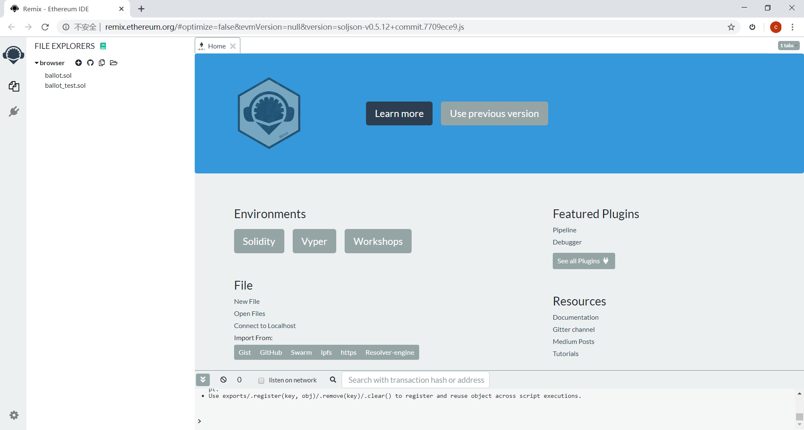
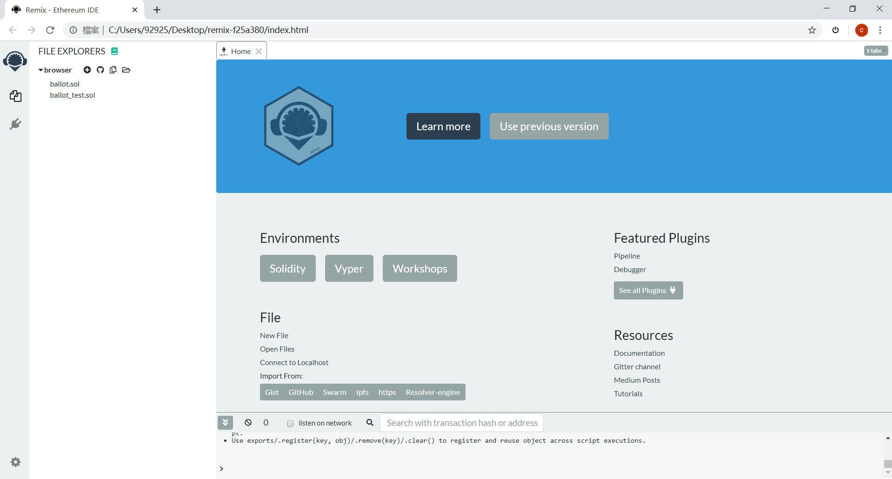
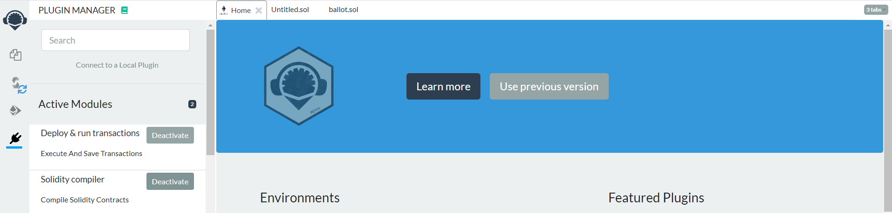
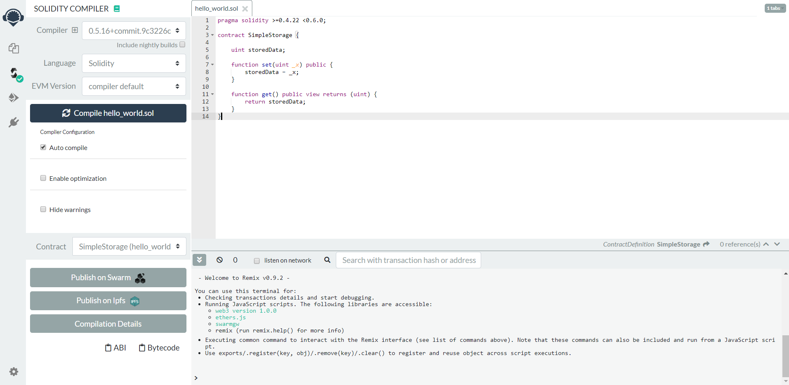
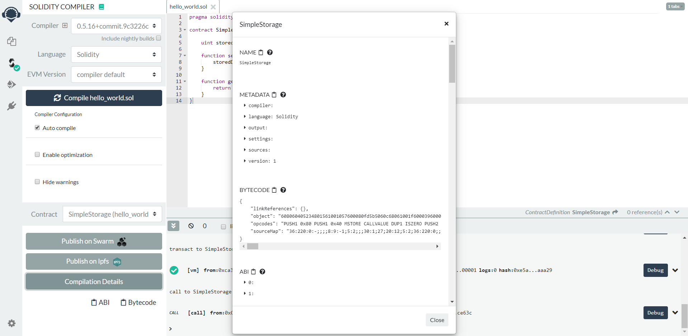
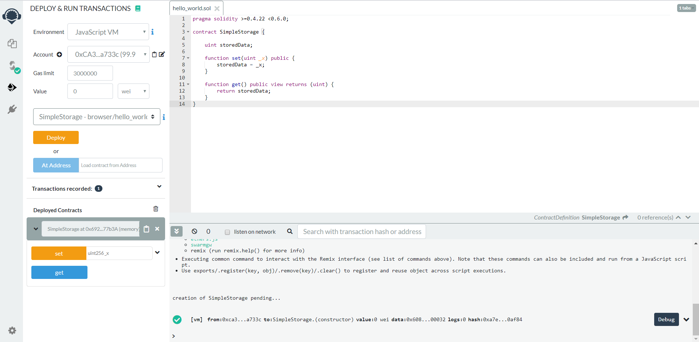
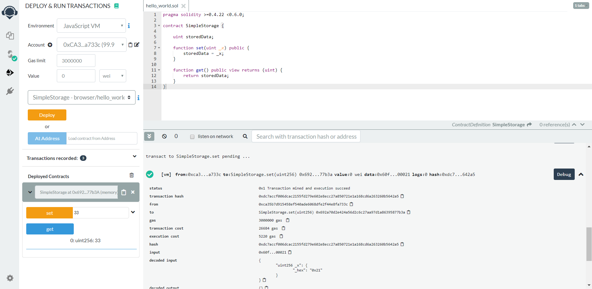

# Solidity语言开发DAPP
>Remix是一个Open Source的Solidity智能合约开发环境，提供基本的编译、部署至本地或测试网络、执行合约等功能。Solidity是Ethereum官方设计和支持的程序语言，专门用于编写智能合约。


## Remix环境搭建

### 使用在线环境  

<a href=" http://remix.ethereum.org/#optimize=false&evmVersion=null&version=soljson-v0.5.12+commit.7709ece9.js" target="_blank" title="在线Remix网址">在线Remix网址</a>：使用在线IDE进行开发，如果网络条件允许，这种方法最简单。



### 本地搭建离线环境

下载官方打包好的<a href="https://github.com/ethereum/browser-solidity/blob/gh-pages/remix-7013ed1.zip" target="_blank" title="离线版本">离线版本</a>，在本地解压缩后，使用浏览器打开index.html。



### 本地搭建在线环境

使用npm命令进行安装本地在线环境。

**安装命令:**
安装npm和node.js（详见[https://docs.npmjs.com/getting-started/installing-node](https://docs.npmjs.com/getting-started/installing-node)），Remix-ide已经作为npm的模块：

```
npm install remix-ide -g
remix-ide
```

或者也可以克隆整个github的库（需要先安装wget）：
```
git clone https://github.com/ethereum/remix-ide.git
cd remix-ide
npm install
npm run setupremix  # this will clone https://github.com/ethereum/remix for you and link it to remix-ide. Only execute this step if you want to contribute on Remix development
npm start
```
具体操作可以参照：[https://github.com/ethereum/remix-ide](https://github.com/ethereum/remix-ide)


## 实例介绍和环境使用  


### 编写合约代码

1. 点击在线remix左上角的`+`号，创建一个新的合约文件，名称任意，扩展名是 “xxx.sol”。

   
2.这里引入一个名为hello_world的简单的合约代码，内容如下:

```
pragma solidity >=0.4.22 <0.6.0;
contract SimpleStorage {
    uint storedData;
    function set(uint _x) public {
        storedData = _x;
    }
    function get() public view returns (uint) {
        return storedData;
    }
}
```
更多solidity合约开发相关内容，请参看solidity官方文档
[https://solidity.readthedocs.io/en/v0.5.12/](https://solidity.readthedocs.io/en/v0.5.12/ "https://solidity.readthedocs.io/en/v0.5.12/")

3.单击remix页面左边的plugin manager，激活Deploy&run transactions和Solidity compiler模块。



### 编译和部署智能合约

1.选择编辑好的合约`hello_world.sol`，点击已激活的编译模块，再点击`Compile hello_world.sol`按钮。

如果没有错误，如下截图显示：



> 点击左下角的`Comliation Details`按钮可以看到如下截图的合约编译信息，其中BYTECODE中的object是后面将合约部署到chain33需要用到的。



2.单击已激活的合约部署模块，然后点击`Deploy`，此时合约已经部署在了remix提供的测试环境上。

合约部署成功，如下截图所示：



### 调用合约

这个合约中只有两个合约方法，set方法和get方法，其中set方法有参数，get方法无参数。

如要调用合约的set方法，只需要将参数值填写到右侧，然后点击方法名`set`即可调用方法。在下方的控制台中会显示调用合约方法的transaction的详细信息。

同理点击`get`方法名调用get方法。合约方法调用如下截图所示：




## 使用cli调试工具部署智能合约

cli为我们的调试命令，使用cli命令可以方便的完成一些操作，下面演示使用cli命令部署智能合约到链上以及调用智能合约中的方法。


1.使用cli命令将智能合约部署到c链上:(其中合约代码是合约编译信息的object)。

```
./chain33-cli evm create -i "合约代码" -c "合约拥有者地址" -s "合约别名"
```
例子：

```
./chain33-cli evm create -i 608060405234801561001057600080fd5b5060c68061001f6000396000f3fe6080604052348015600f57600080fd5b506004361060325760003560e01c806360fe47b11460375780636d4ce63c146062575b600080fd5b606060048036036020811015604b57600080fd5b8101908080359060200190929190505050607e565b005b60686088565b6040518082815260200191505060405180910390f35b8060008190555050565b6000805490509056fea265627a7a72315820d4df27010b6a834bd33c5ffe98b8b9502bad314767b3e9afa5127dfa8272214364736f6c63430005100032 -c 1E1wEVbTmREYv8ehKD4kcqrETz6NdFE3zo   -s "hello_word"
```

2.上面的合约代码即为在Remix中部署生成的二进制代码，命令调用成功后，会生成一个交易哈希，然后使用此哈希查询交易。
```./chain33-cli tx query -s "交易哈希"```
    
例子：

```
./chain33-cli tx query -s 0x6343f4dfb6a4396fe50267e4d1803c63069ea1908241b89ff2b83630e451ff97
```
在返回的结果可以看到如下：其中name合约名称，涉及到合约转账或取回操作时要使用此名称；addr合约地址，后面对合约的所有操作都是对此地址的操作.

```
{
    "ty": 601,
    "tyName": "LogContractData",
    "log": {
        "creator": "1E1wEVbTmREYv8ehKD4kcqrETz6NdFE3zo",
        "name": "user.evm.0x6343f4dfb6a4396fe50267e4d1803c63069ea1908241b89ff2b83630e451ff97",
        "alias": "hello_word",
        "addr": "1Lva9isGc6fshvhfYEYX4XHkkKbSoJg8hW",
        "code": "0x6080604052348015600f57600080fd5b506004361060325760003560e01c806360fe47b11460375780636d4ce63c146062575b600080fd5b606060048036036020811015604b57600080fd5b8101908080359060200190929190505050607e565b005b60686088565b6040518082815260200191505060405180910390f35b8060008190555050565b6000805490509056fea265627a7a72315820d4df27010b6a834bd33c5ffe98b8b9502bad314767b3e9afa5127dfa8272214364736f6c63430005100032",
        "codeHash": "0x86caa23642eb6f934ff1592232a27b04caa8520accb42e19ffa089f01e895447",
        "abi": ""
    }
}
```

3.调用合约方法set(其中命令参数input为调用合约set方法的transaction详细信息中的input)。
```
./chain33-cli evm call -i "Remix中生成的Input" -e "合约名称" -c "调用者地址"
```
例子：

```
./chain33-cli evm call -i 0x60fe47b10000000000000000000000000000000000000000000000000000000000000021 -e "user.evm.0x6343f4dfb6a4396fe50267e4d1803c63069ea1908241b89ff2b83630e451ff97" -c 1E1wEVbTmREYv8ehKD4kcqrETz6NdFE3zo
```

4.调用set完成后，会返回交易哈希，使用此哈希查询调用结果，会包含如下信息，可以看到合约创建者“"caller"，消耗了"usedGas",以及solidity中定义的storedData初始值null。

```./chain33-cli tx query -s 0x443a8d81d6cc172aed9fd594ad86a9c8cec7500579ce4f81228c89b4644693b9
```
    
返回信息
```
{
    "ty": 603,
    "tyName": "LogCallContract",
    "log": {
        "caller": "1E1wEVbTmREYv8ehKD4kcqrETz6NdFE3zo",
        "contractName": "",
        "contractAddr": "1Lva9isGc6fshvhfYEYX4XHkkKbSoJg8hW",
        "usedGas": "20220",
        "ret": null,
        "jsonRet": ""
     },
    "rawLog": "0x0a2231453177455662546d524559763865684b44346b63717245547a364e644645337a6f1a22314c7661396973476336667368766866594559583458486b6b4b62536f4a6738685720fc9d01"
}
    
```


5.调用合约方法get

```./chain33-cli evm call -i 0x6d4ce63c -e "user.evm.0x6343f4dfb6a4396fe50267e4d1803c63069ea1908241b89ff2b83630e451ff97" -c 1E1wEVbTmREYv8ehKD4kcqrETz6NdFE3zo
```

6.查询结果值变化,可以看到storedData的ret值经过set方法传入参数后，变为"0x0000000000000000000000000000000000000000000000000000000000000021".

```./chain33-cli tx query -s 0xaef9b0dc0b5a8e7579fd7b916ba958687f7e1d77bbcce9159a1059c5c7d4177d
```
返回信息
```
{
    "ty": 603,
    "tyName": "LogCallContract",
    "log": {
        "caller": "1E1wEVbTmREYv8ehKD4kcqrETz6NdFE3zo",
        "contractName": "",
        "contractAddr": "1Lva9isGc6fshvhfYEYX4XHkkKbSoJg8hW",
        "usedGas": "263",
        "ret": "0x0000000000000000000000000000000000000000000000000000000000000021",
        "jsonRet": ""
     },
     "rawLog": "0x0a2231453177455662546d524559763865684b44346b63717245547a364e644645337a6f1a22314c7661396973476336667368766866594559583458486b6b4b62536f4a673868572087022a200000000000000000000000000000000000000000000000000000000000000021"
}
```


## 调用JSON RPC接口部署智能合约  

1.使用solidity创建合约时生成的input code，调用相关JSON RPC接口，将合约部署到链上。

下面介绍相关JSON RPC接口，其中解锁钱包Chain33.Unlock使用python调用接口。
1）首先判断钱包的状态，调用Chain33.GetWalletStatus接口，如果钱包是锁定状态，调用Chain33.Unlock接口将钱包解锁。
```
request: http.post
{
    "jsonrpc":"2.0",
    "id":int32,
    "method":"Chain33.UnLock",
    "params":[{"passwd":"string","walletorticket":bool,"timeout":int32}]
}
```

- timeout: 解锁时间，默认0，表示永远解锁；非0值，表示超时之后继续锁住钱包，单位：秒。  
- walletorticket： true，只解锁ticket买票功能，false：解锁整个钱包。  

下面展示的具体python的写法，json_payload里面是接口的方法，session.post('http://localhost:8901', json = json_payload)是调用了requests模块构造了post数据传递给端口8901的网络节点。

```
#!/usr/bin/python
# -*-coding:UTF-8 -*-
import requests
def Unlock(passwd,walletorticket = False,timeout = 0):
session = requests.session()
json_payload = {"jsonrpc": "2.0", "id": 2, "method": "Chain33.UnLock", "params": [{"passwd":passwd,"walletorticket":walletorticket,"timeout":timeout}]}
reponse = session.post('http://localhost:8901', json = json_payload)
dic = reponse.json()
if (dic['error'] == None):
    if (dic['result']['msg'] == ''):
        print "钱包解锁成功：{}".format(dic['result']['isOK'])
    else:
        print "钱包解锁失败：{}".format(dic['result']['msg'])
else:
    print dic['error']
```
2）构造部署合约对应的交易，调用接口"method": "Chain33.CreateTransaction",生成用于签名的hash。
```
http.post
 {"jsonrpc": "2.0",
"id": int32,
"method": "Chain33.CreateTransaction", 
"params": [{"execer": "evm", "actionName": "CreateCall", "payload": {"code": "string","note": "string",  "Fee":int64, "isCreate": bool}}]
}
```
- code: remix编译得到的input代码(上述step4中)  
- note: 备注   
- fee 手续费　1000000，防止Gas不足  
- isCreate: 是否创建，此处是创建合约，要填成true  


3）签名上一步生成的交易，调用Chain33.SignRawTx接口（用自己主链上对应合约部署者），生成签名完用于发送到chain33链上的hash
```
http.post
{"jsonrpc":"2.0",
"id":int32,
"method":"Chain33.SignRawTx",
"params":[{"addr":"string", "key":"string","txhex":"string","expire":"string", "index":int32}]
}
```

- addr与key可以只输入其一  
- expire：过期时间可输入如"300ms"，"-1.5h"m"的字符串，有效时间单位为"ns", "us" (or "µs"), "ms", "s", "m", "h"    
- index: 若是签名交易组，则为要签名的交易序号，从1开始，小于等于0则为签名组内全部交易  
- txhex：为上一步生成的hash串  


4）发送上一步签完名的交易，调用Chain33.SendTransaction接口，
执行完返回一串hash值。

这个hash值，加上user.p.developer.user.evm.这个前缀构成了这个游戏合约的地址，如下所示：
user.p.developer.user.evm.0x318638f8b0a53b4145605215a15fd33714084f6776c854634fbe9c3cd043bf47
    
```
 http.post
  {"jsonrpc":"2.0",
    "id":int32,
    "method":"Chain33.SendTransaction",
    "params":[{"data":"string"}]
  }
```
    
- data: 为签名后的数据  


5）这一步完成后，合约已经在区块链上部署完成。可以调用Chain33.GetTxByHashes接口查询结果。

```
http.post
{
    "jsonrpc":"2.0",
    "id":int32,
    "method":"Chain33.GetTxByHashes",
    "params":[{"hashes":["hashId0","hashId3","hashId2"]}] 
}
```

2.使用solidity调用合约方法生成的input code，调用相关JSON RPC接口，在chain33链上调用已部署的合约中的方法

1）首先判断钱包的状态，调用Chain33.GetWalletStatus接口，如果钱包是锁定状态，调用Chain33.Unlock接口将钱包解锁。


2）构造调用合约方法对应的交易，调用接口"method": "Chain33.CreateTransaction",生成用于签名的hash。

```
http.post
{"jsonrpc": "2.0", 
           "id": 2, 
           "method": "Chain33.CreateTransaction", 
           "params": [{"execer": "evm", "actionName": "CreateCall", "payload": {"code": evm_call_code, "isCreate": False,  "name": user_evm_name, "amount": 0}}]
           }
```

- evm_call_code：方法对应input code 
- "isCreate"：是否创建，此处是合约调用，要填成false  
- "name":创建合约生成调用者名称，例如：user.p.developer.user.evm.0x318638f8b0a53b4145605215a15fd33714084f6776c854634fbe9c3cd043bf47

>调用上面"method"："Chain33.CreateTransaction"：生成的hash：
```0a54757365722e65766d2e757365722e65766d2e30783635326439356634303566363536323562636163616330626132323666323866333766396638623465656135663431353034616164663462616538376664373812462244095ea7b30000000000000000000000000000000000000000000000000000000000000021000000000000000000000000000000000000000000000000000000000000006420a08d0630eeccfec4f8c5a4fd093a2231444b5054554354704e7a5774743968476e62416d3547737462726767746f454234```
    

3）签名上一步生成的交易，调用Chain33.SignRawTx接口（用自己主链上对应的合约部署者），生成签名完用于发送到chain33链上的hash.

>   调用签名接口， "method":"Chain33.SignRawTx"，生成签名后的hash： 
```   0a54757365722e65766d2e757365722e65766d2e30783635326439356634303566363536323562636163616330626132323666323866333766396638623465656135663431353034616164663462616538376664373812462244095ea7b3000000000000000000000000000000000000000000000000000000000000002100000000000000000000000000000000000000000000000000000000000000641a6e080112210239522964b148480e65ce1965a18fd47e405b48596fac0f03e5e9e5a7cbe0b15f1a473045022100fd948c4d425d0052a652aa88e559df73380cda0215403853e2be028a5ba556240220077be7c71cb374868e3313896e36d8a43367cc421f5c13e8725683cec2fba15a20a08d0628d5ecd8dc0530eeccfec4f8c5a4fd093a2231444b5054554354704e7a5774743968476e62416d3547737462726767746f454234
```

4）发送上一步签完名的交易，调用Chain33.SendTransaction接口，执行完返回一串hash值。  

>调用"method":"Chain33.SendTransaction"，生成发送后的交易hash，便于在chain33链上查询结果，也可以在区块链浏览器上查询结果。

```0x54eb29276e923d1dcea8f569ef5279302f823376a3a7bb3de23ef25c6a855c43``` 

5）这一步完成后，合约已经在区块链上部署完成。 可以调用Chain33.GetTxByHashes接口查询结果。